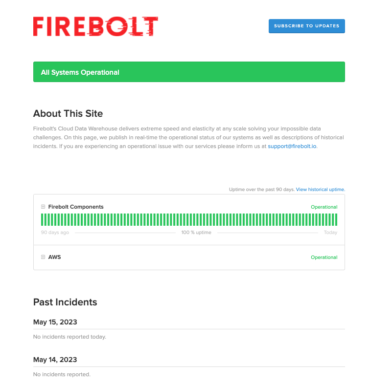
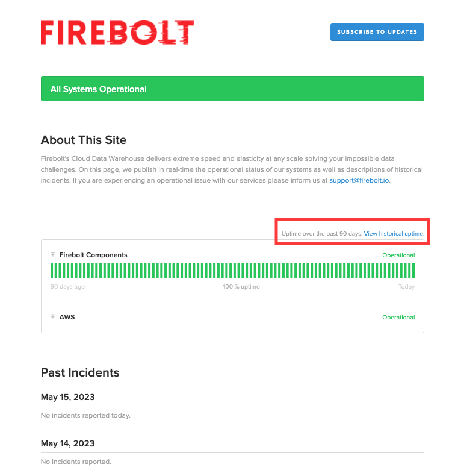
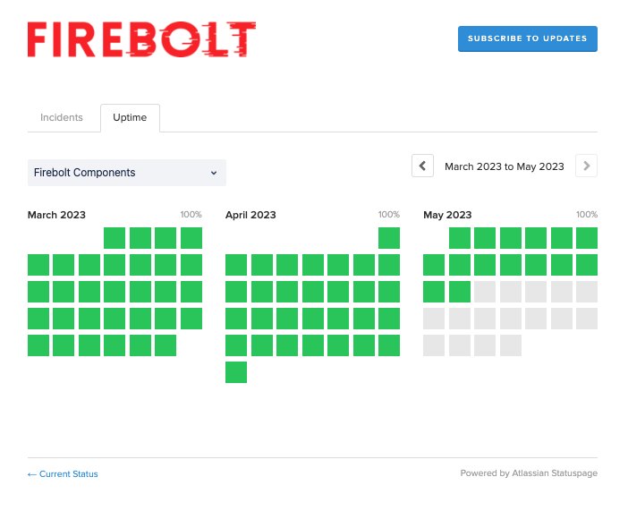
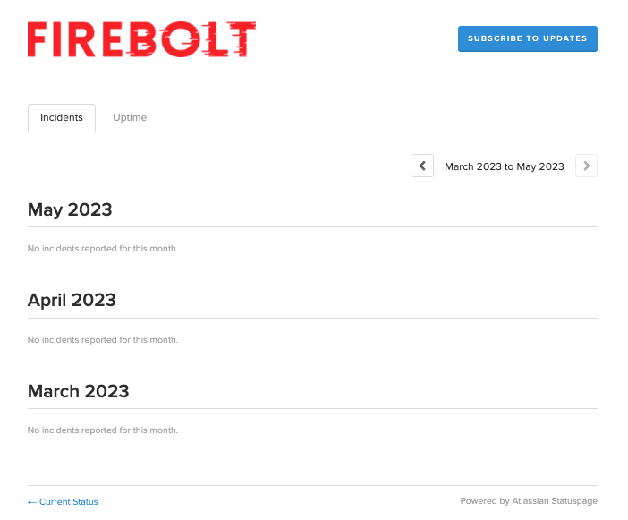

# Firebolt Help Button
{:.no_toc}

This topic describes the options of the Firebolt "Help" button.

## Getting to the Help Button
Firebolt Help button is found in the bottom right corner of Firebolt's screen, appearing as a ```?``` sign.


## Menu Options

The menu has four different options. 


### Status Page
The status page allows you to view in real-time the operational status of our systems and descriptions of historical incidents. 

You can also access the status page by browsing directly to it through https://firebolt.statuspage.io

#### Main Page



The main page shows you two element groups. Clicking on the expand button will allow you to 
1. **Component Status** - the status of different components in the last 90 days. The component status is split into two sections:
    1. **Firebolt components**- the status of the following Firebolt elements:
        * *Firebolt's Web Application* - availability of Firebolt's web application 
        * *Firebolt's API*  - availability of Firebolt's API interface
        * *Firebolt's Engines* - availability of the elements responsible for Engines create, read, and delete related actions
        * *Firebolt Databases* - availability of the elements responsible for Database creation, read, update and delete related actions
        * *Firebolt Tenant Account Creation* - availability of the elements responsible for provisioning Firebolt's accounts in AWS
    2. **AWS components** - the status of the following AWS components, as related to Firebolt availability:
        * *EC2* - availability of [AWS EC2](https://docs.aws.amazon.com/AWSEC2/latest/UserGuide/concepts.html)  
        * *S3* - availability of [AWS S3](https://docs.aws.amazon.com/AmazonS3/latest/userguide/Welcome.html)
        * *Auto Scaling Group (ASG)* - availability of [Auto Scaling Group](https://docs.aws.amazon.com/autoscaling/ec2/userguide/auto-scaling-groups.html)
        * *AWS regions (ec2-us-east1, ec2-us-east-2, ec2-eu-west-1, etc.)* - availability of different [AWS regions](https://docs.aws.amazon.com/AWSEC2/latest/UserGuide/using-regions-availability-zones.html)

2. **Past Incidents** - present critical incidents and their status

#### Historical Uptime



The historical uptime page presents historical information on availability and incidents. Click on the **View Historical Uptime** link in the **Status page** to access the page. 

The page contains two tabs:
1. **Uptime** - allows you to view availability across different timelines. You can click on a particular day to dive deep into components availability at that date. 



2. **Incidents** - allows you to view past incidents across different timelines. You can click on a particular incident to dive deep into the status of that incident.




#### Subscribe
You can subscribe to notifications whenever Firebolt **creates**, **update** or **resolve** incidents. You can subscribe to notifications via the following options:
1. **Email notification** - by providing your email address
2. **Text notifications** - by providing your phone number. 
*Please note that text messages will only notify you when Firebolt creates or resolves an incident.*
3. **Slack notifications** - by connecting via Slack.
*Please note - you can also get maintenance status through Slack* 
4. **RSS updates** - by connecting via your RSS/Atom application

### Contact Support
Contact Support allows you to create a support case for Firebolt's support team.


1. Click on "Contact Support"
2. A Support Form pop-up will appear
3. The following will populate **automatically**:
    1. **First Name**
    2. **Last Name**
    3. **Company** - this is the name of your Firebolt account
    4. **Email**
4. Fill in the following:
    1. **Severity** - please choose the severity of your case according to the following severity categories:
        1. *Critical*: Complete failure or loss of critical functionality impacting a business-critical workload
        2. *Urgent*: The Services are operative but degraded, causing a significant impact on a key dataset
        3. *Tolerable*: The Services are usable, non-critical functionality or components are affected, and most operations are unaffected
        4. *Question*: Includes general questions, requests for documentation, or other non-critical system-related issues. Operations are not affected
    2. **Engine name** - please fill in the name of the engine you have experienced the issue. 
    3. **Subject** - please try to be as clear and descriptive as possible
    4. **Description** - please include any relevant information for the case. Especially:
        1. What were you doing?
        2. What have you expected to happen?
        3. What has happened?
        4. Any error code or message. 
5. Click "Submit"
6. The case will be sent to our Support team, and you will receive a confirmation email for your case. 

### Release Notes
The Release Notes page lets you view Firebolt's latest version release notes.

You can also access the release notes page by browsing directly to it through https://docs.firebolt.io/release-notes/release-notes.html

### Documentation
The Documentation page lets you view Firebolt's documentation (You are already here, by the way!)

You can also access Firebolt Documentation by browsing directly to it through https://docs.firebolt.io/ 