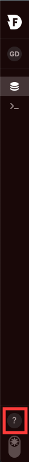
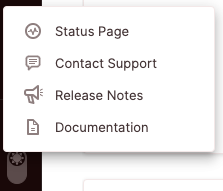
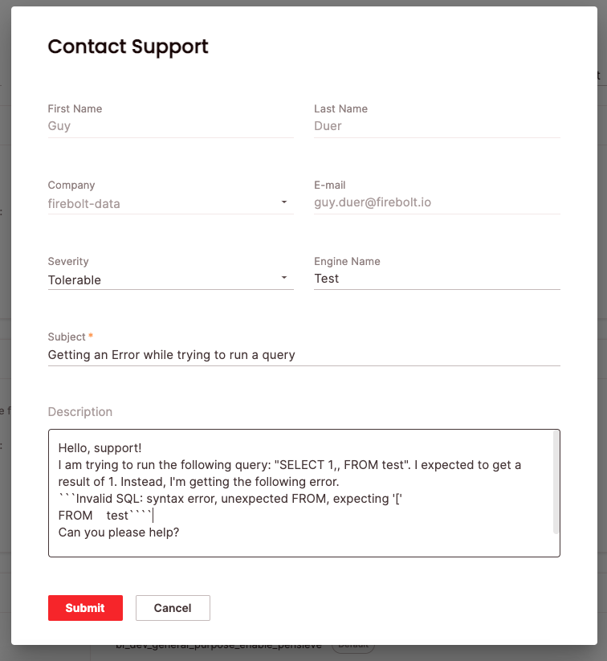

# Firebolt help menu
{:.no_toc}

The Firebolt help menu is found in the bottom left corner of the screen, appearing as a ```?``` sign.



## Menu options

The menu has four different options: 



### Status page
The status page allows you to view the operational status of systems in real time, as well as descriptions of historical incidents.

You can subscribe to notifications whenever Firebolt **creates**, **update** or **resolve** an incident via the following options:
1. **Email notification** - by providing your email address.
2. **Text notifications** - by providing your phone number.
*Please note that text messages will only notify you when Firebolt creates or resolves an incident.*
3. **Slack notifications** - by connecting via Slack.
*Please note - you can also get maintenance status through Slack* 
4. **RSS updates** - by connecting via your RSS/Atom application.

### Contact Support - Reaching out to Firebolt Support
Contact Support allows you to create a support case for Firebolt's support team.

To create a case: 

1. Click on "Contact Support"
2. A support form will appear, with the following information populated **automatically**:
    <br>a. **First Name**
    <br>b. **Last Name**
    <br>c. **Company** - this is the name of your Firebolt account
    <br>d. **Email**
4. Fill in the following:
    <br>**Severity** - please choose the severity of your case according to the following severity categories:

    - *Critical*: Complete failure or loss of critical functionality impacting a business-critical workload.
    - *Urgent*: Services are operational but degraded, causing a significant impact on a key dataset. 
    - *Tolerable*: Services are usable, non-critical functionality or components are affected, and most operations are unaffected. 
    - *Question*: Includes general questions, requests for documentation, or other non-critical system-related issues. Operations are not affected. 
    
    <br>**Engine name** - please fill in the name of the engine where you have experienced the issue.
    <br>**Subject** - try to be as clear and descriptive as possible.
    <br>**Description** - please include any relevant information for the case. Especially:
    - What were you trying to achieve when the issue occurred? 
    - What was expected to happen? 
    - What has happened instead? 
    - Any error code or message.  
5. Click "Submit"
6. The case will be sent to our Support team, and you will receive a confirmation email. 



### Release Notes
The Release Notes link brings you to Firebolt's [latest version release notes](../release-notes/release-notes.md).

### Documentation
The Documentation link brings you to Firebolt's docs (where you are now!)
