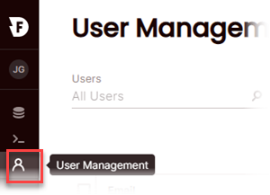
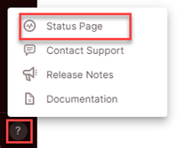
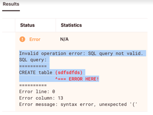

# Release notes archive
{: .no_toc}

We provide an archive of release notes for your historical reference.

* Topic ToC
{:toc}

## August 2022

* [Enhancements, changes, and new integrations](#enhancements-changes-and-new-integrations)
* [Resolved issues](#resolved-issues)

### Enhancements, changes, and new integrations

* **Firebolt .NET SDK now available**

  The Firebolt .NET SDK can be used to connect to Firebolt from .NET applications. The SDK supports .NET Core and is available at [NuGet FireboltNetSDK](https://www.nuget.org/packages/FireboltNetSDK/0.0.1).

* **Firebolt Go SDK now available**

  The Firebolt Go SDK can be used to connect to Firebolt from Go applications. The SDK implements the Go database/sql driver specification. For more details, see the package listing at [Firebolt Go SDK](https://pkg.go.dev/github.com/firebolt-db/firebolt-go-sdk).

* **Information schema updated**
  **(DB version 3.7.0)**

  query\_history and running\_queries views can now be queried via the information\_schema.

  For more information, see [Information schema for query history](information-schema/query-history-view.html) and [Information schema for running queries](information-schema/running-queries.md).

* **Added support for Multi-factor authentication (MFA)**
  **(Beta)**

  Firebolt now supports Multi-factor authentication. 
 
  You can enable MFA for users or groups with the Firebolt Manager which sends a link to enroll in MFA using a QR code. When a user enrolls in MFA from the email, the status in Firebolt updates to **MFA enabled**.

  **To enable MFA for a Firebolt user or group of users** choose the **User Management** icon in the navigation pane. If the icon isn't available, you don't have Account Admin permissions. 
    
  
  
  For more information, see [Configuring MFA for users (Beta)](../managing-your-account/managing-users.md#configuring-mfa-for-users-beta).

* **Added support for the hll\_count\_distinct(input, [, precision]) function**
  **(DB version 3.7.0)**

  Allows for precision control of the count(distinct <expr>) function with an optional precision parameter.
  
  Requires less memory than exact aggregation functions, like `COUNT(DISTINCT)`, but also introduces statistical uncertainty. The default precision is 12, with a maximum of 20.

* **Added new data type aliases**
  **(DB version 3.7.0)**

  Data type aliases have been added for `REAL`, `FLOAT4`, `FLOAT8`, `INT4`, `INT8`, and `FLOAT(p)`. For more information on data types and their aliases (synonyms), see [Data types](data-types.md).

* **Updated INFORMATION_SCHEMA.COLUMNS**
  **(DB version 3.8.0)** 

  Now includes more metadata on columns, as well as columns for views in a given database.

* **New script processing status in browser tab**

  Added a status indicator in the browser tab so when multiple tabs are open in the browser, you can switch to a different tab and still track the status of your running script. The status adds a color coded indicator dot to the Firebolt icon in the tab. A green dot indicates the script completed successfully. The status remains in the tab for one minute after the script completes running. 
  
  For more information about this new status indicator, and running scripts, see [Running scripts and working with results](../using-the-sql-workspace/using-the-sql-workspace.md#running-scripts-and-working-with-results).

  

* **Added dark mode**

  Firebolt now supports an additional color theme - dark mode. You can toggle between light and dark modes in the UI. Select the toggle at the bottom of the left navigation pane to turn dark mode on and off.   
 
  

* **Added support for IP allowed & blocked lists**
  **(Beta)**

  Allows access to your Firebolt account from specific IP addresses. For more information, see [Allowing and blocking source IP addresses for users (Beta)](../managing-your-account/managing-users.md#allowing-and-blocking-source-ip-addresses-for-users-beta)
  
* **Added support for server-side asynchronous querying on the Python SDK**

  Allows the connection to be closed while the query is still running in Firebolt.
  
* **Released JDBC 2.0**

  The Firebolt JBDC driver is now open-source under Apache 2. The new release also adds support for view tables in `getTables()`.
  
### Resolved issues

* <!--- FIR-11369 --> An error message is now displayed when too many partitions are added using a single `INSERT` statement.

## July 2022

* [Enhancements, changes, and new integrations](#enhancements-changes-and-new-integrations)
* [Resolved issues](#resolved-issues)

### Enhancements, changes, and new integrations

* **Added support for Airbyte**
 
  The Firebolt integration includes an [Airbyte Source](https://docs.airbyte.com/integrations/sources/firebolt/){:target="_blank"} connector as well as an [Airbyte Destination](https://docs.airbyte.com/integrations/destinations/firebolt){:target="_blank"} connector, which allow you to easily move data into and out of Firebolt. 
  
  For more information on Airbyte, see [Airbyte](https://airbyte.com/){:target="_blank"}.

* **New billing breakdown in engine dashboard**
  
  The billing breakdown in the engine dashboard can now show billing or running time.

  
 
* **Added an optional `<format>` parameter to the `TO_DATE` and `TO_TIMESTAMP` functions**
  
  The `<format>` parameter allows you to use a string literal, as shown in [DATE_FORMAT](../sql-reference/functions-reference/date-format.md), to specify the format of the string to convert. This hint helps the date-time parser to improve performance. For more information, see [TO_DATE](../sql-reference/functions-reference/to-date.md) and [TO_TIMESTAMP](../sql-reference/functions-reference/to-timestamp.md).

### Resolved issues

* Fixed an issue that prevented values from being set properly for a column with a `DEFAULT` constraint when an `INSERT INTO` statement ran without specifying the column value. 

  For example, consider the following fact table and `INSERT INTO` statement.   

  ```sql
  CREATE FACT TABLE t8
  (
       col1 INT  NULL ,
       col2 INT  NOT NULL UNIQUE,
       col3 INT  NULL DEFAULT 1,
       col4 INT  NOT NULL DEFAULT 3,
       col5 TEXT
  )
  PRIMARY INDEX col2;

  INSERT INTO t8 (col1,col2,col3,col5) VALUES (1,1,1,'a'); 
  ```
  
  Before the fix, `SELECT * FROM t8` would return `(1,1,1,0,'a')`. The statement now returns the expected values, `(1,1,1,3,'a')`.

* Fixed a case where the `APPROX_PERCENTILE` function returns an error when running over an expression derived from multiple tables. 

* `JSON_EXTRACT` now supports the `STRING` data type as the expected type in addition to the `TEXT` data type.

* Fixed an issue where a username that contained special alphabetical characters was not recognized when registering a Firebolt user. 

* Concatenating multiple arrays using the `||` operator now produces an array containing the input array values.

* Fixed an issue where an array of `LONG`s could be displayed as an array of `TEXT`s in the SQL Workspace.

* Fixed an issue that prevented a database without engines from being edited.

## May 31, 2022

* [New features](#new-features)
* [Enhancements, changes, and new integrations](#enhancements-changes-and-new-integrations)
* [Resolved issues](#resolved-issues)

### New features

*  You can now use the help menu to check the Firebolt service status page.  
  

* Added support for `CREATE AND GENERATE AGGREGATING INDEX IF NOT EXISTS`. For more information, see [CREATE AGGREGATING INDEX](../sql-reference/commands/create-aggregating-index.md).

* Added an information schema view for indexes. The view is available for each database and contains one row for each index. For more information, see [Information schema for indexes](../general-reference/information-schema/indexes.md).

* Added `ARRAY_AGG` as an alias of `NEST`. For more information, see [NEST](../sql-reference/functions-reference/nest.md).

* You can now concatenate strings, numbers, and arrays using the `||` operator without exlicitly casting elements.

* Added `TO_TEXT` as an alias of `TO_STRING`. For more information, see [TO_STRING](../sql-reference/functions-reference/to-string.md).

*  An improved approach to Window functions is available for Beta testing by request. For more information, contact Firebolt Support.


### Enhancements, changes, and new integrations

* Improved query execution on queries that read table data in Amazon S3. Firebolt now achieves greater read parallelization, which significantly speeds up queries that read many columns.

* **Cube.js integration**  
  You can now configure a Firebolt database as a data source for [Cube.js](https://cube.dev). Cube.js is an embedded BI platform that allows you to define a data model, manage security and multitenancy, accelerate queries, and expose data to your applications using SQL and APIs. For more information, see [Firebolt](https://cube.dev/docs/config/databases/firebolt) in Cube.js documentation.

* **Tableau connector**  
  An official Firebolt connector is now available in the [Tableau Exchange](https://exchange.tableau.com/products/650) so you can use Tableau more easily to analyze and visualize your Firebolt data.

* **Sifflet integration**  
  Firebolt now integrates with Sifflet to improve your visibility into data quality issues, data lineage, and data discovery. For more information, see [Firebolt](https://docs.siffletdata.com/docs/firebolt) in Sifflet documentation.

* **Looker symmetric aggregates**  
  Symmetric aggregates in Looker are now supported when connected to Firebolt. For more information, see [A Simple Explanation of Symmetric Aggregates](https://help.looker.com/hc/en-us/articles/360023722974) in the Looker Help Center.

* **dbt append-only incremental materializations**  
  The dbt-firebolt adapter now supports append-only incremental materializations. For more information, see [Firebolt configurations](https://docs.getdbt.com/reference/resource-configs/firebolt-configs) in dbt documentation.

### Resolved issues

* Fixed an issue that caused a `Type mismatch in joinGet` error when using a join index in table joins where columns are of different numeric types&mdash;for example, joining a column in a fact table defined as `DOUBLE` with a column defined as `BIGINT` in a dimension table.

* Fixed an issue that caused the `ARRAY_JOIN` function to fail with an array of numeric values.

* Fixed an issue in the `REGEXP_MATCHES` function that caused an error in some circumstances when a specified pattern didn't match the input string.

* Fixed an issue that caused a session to hang when trying to query an external table referencing an empty JSON file in Amazon S3.

* Fixed an issue that caused incorrect column names when using `COPY TO` with a `SELECT` statement that uses aliases.

## May 11, 2022

* [New features](#new-features)
* [Enhancements, changes, and new integrations](#enhancements-changes-and-new-integrations)
* [Resolved issues](#resolved-issues)

### New features

* **Added support for `CREATE OR REPLACE VIEW` statement**  
  The `IF NOT EXISTS` and `OR REPLACE` options are incompatible when creating a view. For more information, see [CREATE VIEW](../sql-reference/commands/create-view.md).

* **Added `ALTER DATABASE` statement**  
  Allows you to change the engine configuration and the database description. For more information, see [ALTER DATABASE](../sql-reference/commands/alter-database.md).

* **Added `TO_CHAR` function**   
  Converts a timestamp or a numeric type to strings in a format that you specify. For more information, see [TO_CHAR](../sql-reference/functions-reference/to-char.md).

* **Materialized CTEs (Beta)**  
  Added an optimization hint to support caching large, computationally expensive CTE results in memory for reuse to increase query performance. For more information, see [SELECT](../sql-reference/commands/select.md#materialized-common-table-expressions-beta).

* **Added support for SET statements passed via SQL in the Python SDK**  

### Enhancements, changes, and new integrations

* **Engine specs are now Firebolt-specific**  
  Firebolt engine spec names have changed from AWS EC2 names to Firebolt-specific names&mdash;for example, **M4**. This change simplifies engine specs and aligns them with Firebolt usage and deployment. This is the first step toward improving the overall engine selection and usage experience, allowing Firebolt to update underlying hardware more quickly and automatically. For more information, see [Working with engines](../working-with-engines/index.md).

* **Expanded application of aggregating indexes**  
  The query optimizer now uses aggregating indexes in more cases to improve performance.

* **Python SDK updates**  
  * Support added for `DECIMAL`, `DATE32`, and `DATETIME64` data types in the Python SDK.
  * Added the ability to disable caching of authentication tokens for use in read-only environments like AWS Lambda.

* **Added a materialization connector in Estuary for Firebolt**  
  For more information, see the [Firebolt materialization connector topic](https://docs.estuary.dev/reference/Connectors/materialization-connectors/Firebolt/) in Estuary documentation.

### Resolved issues

* Fixed an issue where complex join conditions could fail when evaluating `NULL` values.

* Fixed an issue that caused [dropping partitions by date extraction](../working-with-partitions.md#partition-and-drop-by-date-extraction) to fail.

* Fixed an issue that caused `DROP AGGREGATING INDEX` to run slower than expected.

* Fixed an issue with queries containing subqueries, where the outer query limit clause would override the inner query limit clause.

* Fixed an issue that could cause canceling a query to fail if the query was reading an external table.

* Fixed an issue that could prevent aggregating index creation on aggregations used with a few functions (for example, `SUM`, `LENGTH`, and `COUNT`).

* Fixed an issue that caused `NULL`s to be mishandled in some `CASE` statements.

* Fixed an issue that required non-reserved keywords to be enclosed in quotes.

* Fixed the data type for the `number_of_rows` column in `information_schema.tables` from `INT` to `BIGINT`.

## March 30, 2022

### Improved error message experience

In the SQL workspace, you can now select a portion of an error message to copy.



## March 15, 2022

* [New features](#new-features)
* [Enhancements, changes, and resolved issues](#enhancements-changes-and-resolved-issues)

### New features

* **Visual explain**  
  Use the new visual explain feature to analyze query execution plans. Different display formats and navigation options enhance your ability to quickly analyze and diagnose complex queries. For more information, see [Analyze query execution plans with visual explain](../using-the-sql-workspace/using-explain-to-analyze-query-execution.md).

* **COPY TO statement (Beta)**  
  Use the new `COPY TO (Beta)` statement to export query results to an Amazon S3 location in CSV, TSV, JSON, or Parquet file formats. Configuration options allow you to choose file output options. For more information, see [COPY TO (Beta)](../sql-reference/commands/copy-to.md).

* **Firebolt CLI now available**  
  Run SQL and manage databases and engines in Firebolt directly from the command line. Use interactive mode or invoke commands from scripts. For more information, see [firebolt-cli](https://pypi.org/project/firebolt-cli/) on PyPI.

* **Python SDK now supports parameterized queries and multiple statements**  
  * **Parameterized queries** &ndash; Allows parameters to be inserted dynamically into SQL. Handles sanitization to help prevent SQL injection attacks. For more information, see [.execute\(\)](https://www.python.org/dev/peps/pep-0249/#id15) in the Python Database API Specification and [firebolt.db.cursor module](https://python-sdk.docs.firebolt.io/en/latest/firebolt.db.html#module-firebolt.db.cursor) in the Firebolt Python SDK reference.
  * **Multiple statements** &ndash; Parses and separates multi-statement SQL, and then runs statements sequentially. For more information, see [.executemany\(\)](https://www.python.org/dev/peps/pep-0249/#executemany) and [.nextset\(\)](https://www.python.org/dev/peps/pep-0249/#nextset) in the Python Database API Specification, and [firebolt.db.cursor module](https://python-sdk.docs.firebolt.io/en/latest/firebolt.db.html#module-firebolt.db.cursor) in the Firebolt Python SDK reference.

* **Node.js SDK now available**  
  Provides a database driver for Node.js applications to connect to Firebolt and run queries more easily. For more information, see [Firebolt Node.js SDK](https://www.npmjs.com/package/firebolt-sdk) on npm.

* **Information schema for views**  
  For more information, see [Information schema for views](/information-schema/views.md).

* **Information schema for engines**  
  For more information, see [Information schema for engines](/information-schema/engines.md).

* **Added `ATAN2(<y_expr>,<x_expr>)`**  
  Added the two-argument arc tangent function [ATAN2](../sql-reference/functions-reference/atan2.md).

### Enhancements, changes, and resolved issues

* **Breaking change**  
  * Floating point data type columns are no longer supported in partition key definitions.

* **Enhanced Parquet support**  
  Firebolt now supports Parquet list fields with a period (`.`) in the name. In addition, Parquet nested lists are now supported.

* **catalog.query_history limited to 14 days**  
  Queries older than 14 days are no longer available when querying [catalog.query_history](/information-schema/query-history-view.md).

* **Firebolt dbt adapter**  
  * **Improved connection method** &ndash; The Firebolt dbt adapter now connects to Firebolt using the Python SDK instead of JDBC. JDBC and the JRE are no longer required.
  * **Upgraded to dbt 1.0.0** &ndash; The Firebolt dbt adapter has been upgraded to v1.0.0. For more information about new features available in 1.0.0, see [New features and changed documentation](https://docs.getdbt.com/guides/migration/versions/upgrading-to-v1.0#new-features-and-changed-documentation) in dbt documentation.

* **Resolved issues**  
  * Fixed an issue that caused inaccurate elapsed time for queries to be shown in the SQL workspace.
  * Fixed an issue during INSERT INTO operations that caused some engines to crash when reaching out of memory instead of failing gracefully.
  * Fixed an issue that caused the cached data ratio to be inaccurate for queries with a high `LIMIT` value.
  * Fixed an issue that could cause a `DROP AGGREGATING INDEX` statement to hang.
  * Fixed an issue that caused an engine crash when an unsupported function was used in a partition key definition.
  * Fixed an issue that allowed an aggregating index to be created with a window function, which is unsupported and caused unpredictable issues. Creating an aggregating index with a window function now fails with an error.

## February 16, 2022

* Fixed an issue where view creation could fail when the view depended on other views.

## January 31, 2022

### What’s new
{: .no_toc}

**UI**  

A new help button allows you to contact Support directly through a support form and access release notes and documentation on the web.

The **Contact Support** form pre-populates your contact information (Name, Company, and E-mail). It allows you to select the issue severity, provide details of the affected engine, and provide details about the issue or question.

## Jan 20, 2022

### What’s new
{: .no_toc}

**SQL and warehouse**

Added the following functions to handle NULL values:

* `IFNULL ( <expr1>, <expr2> )`. If `<expr1>` is `NULL`, returns `<expr2>`; otherwise, returns `<expr1>`.

* `ZEROIFNULL ( <expr> )`. If `<expr>` is `NULL`, returns `0`; otherwise, returns `<expr>`.

### Bug fixes
{: .no_toc}

* Fixed an issue that could cause a failure when canceling a query run on external tables.

* Fixed an issue that prevented using the `REPLACE` keyword within the `CREATE VIEW` statement.

## Dec 16th, 2021

### What’s new
{: .no_toc}

**SQL and database**  

* New `BTRIM`, `RTRIM`, and `LTRIM` functions support removing a specified string from both sides (`BTRIM`) the right side (`RTRIM`) or left side (`LTRIM`) of a source string.  

  Each of these functions accepts arguments in the form `(<source_string>[, <chars_to_trim>])`. If `<chars_to_trim> `is omitted, a space character is assumed.  

  For example, each of the following clauses returns the string ‘trim’.  
  `BTRIM('xyxtrimyyx', 'xy')`  
  `LTRIM('zzzytrim', 'xyz')`  
  `RTRIM('trimxxxx', 'x')`

* Query execution has been improved through faster query parsing and caching of query plans.

* `max_execution_time` is now available as a set parameter for controlling a timeout threshold for SQL statements.

**UI**

You can now use a keyboard shortcut to create a new script in the SQL workspace
(Windows &ndash; Ctrl+Alt+N, Mac &ndash; Cmd-Opt-N).

## Nov 23rd, 2021

### What’s new
{: .no_toc}

**UI**

* Added an indication of the active script in the browser tab and SQL workspace.

* Improved resizing behavior of the database panel in the SQL workspace.

* Added an option that allows you to filter query results by numeric and text values that you provide in addition to possible column values.

* Added a button that allows you to turn background filtering on or off. By default, background filtering is on—filtered results are affected by other filters. For example, if you filter by city “Stockholm”, then by customer name “Jones”, you see only query results for Joneses in Stockholm. You can now use this button to toggle background filters on and off.

## Nov 22nd, 2021

### What’s new
{: .no_toc}

**SQL & warehouse**

* Firebolt now optimizes semi-joins against dimension tables when row uniqueness is identified.

* Repeated SQL statements now reuse query plans, which improves parsing performance.

* You can now use GEN_RANDOM_UUID to generate a version 4 universally unique identifier (UUID) as a STRING data type.

* For engines that are always running, the catalog.query_history view now has a TTL of 14 days.

**Integrations and connectors**

* Released the new [Python SDK](https://pypi.org/project/firebolt-sdk/), which implements the [Python Database API v2.0 specification](https://www.python.org/dev/peps/pep-0249/) on top of the Firebolt REST API. The SDK makes it easier to connect and run SQL queries on Firebolt from a Python application.

* Released the new [SQLAlchemy adapter for Firebolt](https://pypi.org/project/firebolt-sqlalchemy/), which allows applications to connect and run SQL queries on Firebolt through the SQLAlchemy interface.

* Released the new [dbt adapter for Firebolt](https://github.com/firebolt-db/dbt-firebolt), which allows data analysts and data engineers to build and operationalize data transformations in Firebolt.

* Added integrations for Superset, Keboola, Hevo, and Nexla.

### Bug fixes
{: .no_toc}

* Fixed an issue that prevented views without a defined schema from being used in table creation via CTAS.

* Fixed an issue where queries could fail to run due to insufficient resources.

* Fixed an issue where engines with the warmup method set to preload all data could fail.

## Nov 10th, 2021

### What’s new
{: .no_toc}

* Added the `REGEXP_MATCHES` function, which returns an array of all of the captured substrings resulting from matching a given regular expression pattern.

* Added the `TO_WEEKISO` function that returns the week according to ISO rules.

* Added support for theta joins using interval data types.

* Improved query compile time. In some cases queries will compile 50% faster or more.

* Added natural join support.

### Bug fixes
{: .no_toc}

* Fixed an issue with APPROX_PERCENTILE where multiple uses within the same query could fail.

* Fixed an issue where a long list of values used with INSERT could fail.

* Fixed an issue where using S3 metadata columns in a subquery could fail.

## Sep 2nd, 2021

### What’s new
{: .no_toc}

* You can now see the percentage of warm data per query in the SQL workspace.

* You can now search for a table or column by its name in the database panel within the SQL workspace.

### Bug fixes
{: .no_toc}

* Fixed an issue where canceling an engine startup process required an initial warmup to complete.

* Fixed an issue where general-purpose engines with the **Preload all data** warmup method could fail to start.

## Aug 12th, 2021

### What’s new
{: .no_toc}

* You can now quickly investigate statistics for query results in the SQL Workspace. Statistics such as the number of unique values, number of empty values, min/max/median and other quartiles, data ranges, top/bottom numbers, and more are available. Click the expansion arrow to the left of the header row to see statistics. For more information, see [Viewing query statistics with results](../using-the-sql-workspace/using-the-sql-workspace.md#viewing-query-statistics-with-results) in Firebolt documentation.

* You can now sort and filter data values on any column in your query result-set in the SQL Workspace.

* The Firebolt Manager now displays when a database is being dropped.

* The Engines page has been discontinued. You can create and manage engines when you edit a database, and engines not has_toc: false
attached to a database are no longer supported.

### Bug fixes
{: .no_toc}

* Fixed an issue where using the JSON_EXTRACT function to extract arrays could fail.

* Fixed an issue where engines could take a long time to start due to an infrastructure failure.

* Fixed an issue where engines could fail to start due to corrupted views.

## July 29th, 2021

### What’s new
{: .no_toc}

* Firebolt now supports statements that contain `INSERT INTO` with `GROUP BY` on an engine with multiple nodes.

* The third parameter in `SUBSTR` is now optional. When omitted, the function returns the entire string to the right of the offset.

### Bug fixes
{: .no_toc}

* Fixed an issue where using the `SPLIT_PART` function without specifying all the mandatory parameters could cause an engine crash.

* Fixed an issue where returned rows & returned bytes columns in the `catalog.query_history` view could mistakenly contain zeros.

* Fixed an issue where canceled queries could be marked as failed in the `catalog.query_history` view.

* Fixed an issue where CTAS could fail to infer nullability correctly.

## June 24th, 2021

### What’s new
{: .no_toc}

* You can now upload a script file (*.sql or *.txt) from your computer to the SQL workspace

* Formatting scripts in the SQL workspace is now supported (Mac: CMD + OPT + L, PC: CTRL + ALT + L)

* Account admins can now perform bulk operations on users, making it easier to:  
  * Remove user(s)
  * Accept approval
  * Deny approval
  * Resend email
  * Cancel invitation

## May 27th, 2021

### What’s new
{: .no_toc}

* The boolean data type is now supported

* Extracting quarter, day of the week, day of the year, hour, and the week is now possible when using the `EXTRACT` function

### Bug fixes
{: .no_toc}

* In some cases, `%` at the beginning of the like value was ignored when an escape character was used.

* In some cases, ingested data took longer to propagate to analytic engines.

## May 5th, 2021

### What’s new
{: .no_toc}

**SQL & Warehouse enhancements**

* Firebolt engines have a new failover mechanism for nodes. Engines can repair failed cluster nodes automatically for increased reliability

* Configuring the warmup method is now supported when creating an engine using SQL.

* The CURRENT_DATE keyword is now supported.

* Using identical aliases across different sub-queries is now supported.

* Casting using the `::` notation is now supported.

**UI/UX enhancements**

* Easily reorder scripts in the SQL Workspace by dragging the script tab to the desired position

* Download SQL scripts from the SQL Workspace to your computer

* You can now clear all filters at once in the Databases page

* The Account & Billing page was updated, and it now contains a cost breakdown for compute and storage in addition to the AWS account ID

* Updated the design of the results table in the SQL Workspace

* Deleting a database now deletes the engines attached to it

* The SQL Workspace now lists corrupted tables in orange with a warning icon

### Bug fixes
{: .no_toc}

* Opening the engines drop-down menu when a script was running was not possible

* Numeric query results could have been mistakenly rounded in the UI

* Querying external tables with predicates on the virtual columns could fail

* Running the SHOW CACHE command could fail

* Using AWS role-based authentication in external tables could fail

* The ‘Inserted rows’ value in the query history table could be higher than expected

* Creating an engine using SQL could result in a general-purpose engine although a data analytics engine was requested

## Apr 22nd, 2021

### What’s new
{: .no_toc}

* Configuring the warmup method is now supported when creating an engine using SQL

* A new JDBC driver is now available with support for canceling a running query

* New window functions: `LAG`, `LEAD`, `AVERAGE`, `ROW_NUMBER`.

* Aliasing sub-queries is now optional

* Skipping header rows in files when loading data into Firebolt is now supported

* Implicit cast from text column with textual numeric values into numeric data types was added

### Bug fixes
{: .no_toc}

* Loading data into Firebolt tables could fail due to background network issues under some circumstances

* Running `COUNT(*)` and `COUNT(1)` on the same data set could result in different results

* An engine could crash when issuing a drop table command after a failed ingestion

* Using an aggregated value as a single predicate within the `WHERE` clause could fail

* Using the `COUNT` window function with the `NEST` function could fail

* Data loss could happen in some rare cases when loading data in async mode following by an engine restart

## Mar 25th, 2021

### What’s new
{: .no_toc}

* Create table as select (`CTAS`) is now available

* Added information schema for databases, tables, and columns

* AWS Glue can now be used with external tables to simplify schema creation

### Bug fixes
{: .no_toc}

* Loading data into Firebolt tables could fail due to network issues in some rare circumstances

* Aggregating indexes were not being used for queries containing a WITH clause

* Running `SHOW INDEXES` command contained N/A under the index size column for join indexes

* Creating a new database and removing the default engine could fail

* `WHERE` statements could sometimes be ignored when using views or CTEs (Common Table Expressions)

## Feb 25th, 2021

### What’s new
{: .no_toc}

**New databases page**

We’ve updated the databases page for a smoother experience:

* Easily find the databases and engines that you need with new elaborate search and sort options

* It is now possible to view the page in two modes: detailed and summarized

* Performing operations on engines quickly - start, stop or edit an engine directly from the database

* Quickly jump to the SQL workspace from a selected database

**Additional UI goodies**

* We added a query history script to the list of quick-start templates in the SQL Workspace

* The script results section has been enhanced to show the full query text with richer syntax highlighting, expand/collapse modes, and indentation

**New SQL functions**

* `MD5_NUMBER_LOWER64`
* `MD5_NUMBER_UPPER64`
- `REPEAT`

## Feb 11th, 2021

### What’s new
{: .no_toc}

**New functions**

* New window functions are now supported: MIN, MAX, RANK, DENSE_RANK

* The following DATE functions are now available:  
  * `TO_DAY_OF_WEEK`
  * `TO_DAY_OF_YEAR`
  * `TO_YEAR`
  * `TO_QUARTER`
  * `TO_MONTH`
  * `TO_WEEK`
  * `TO_HOUR`
  * `TO_MINUTE`
  * `TO_SECOND`

* Calculating the MD5 hash of a string is now supported using the `MD5` function

* The engine tooltip in the database editor was enhanced to include its specifications such as ec2 type, number of nodes, warmup method, etc

### Bug fixes
{: .no_toc}

* Join index creation could fail with an out-of-memory- error due to over allocation of RAM

* `SELECT DISTINCT` queries could fail

* When using `SHOW TABLES` the primary index column would show wrong results when an aggregating index was in place

* `COUNT DISTINCT` with `INNER JOIN` could return incorrect results

* Using the `TO_TIMESTAMP` function could fail when parsed with certain date formats

## Jan 26th, 2021

### What’s new
{: .no_toc}

**New database & engine creation experience**

We’ve updated the way engines and databases are created and edited, for a smoother experience:

* Engines and databases are now created and managed together in one fluent experience

* Engines can now only be created as part of a database

* When creating a new database, you can quickly add multiple engines to it

* Engine scale now supports any number between 1-128, not just fixed multiples of 2

* The EC2 type selection has been improved with a clearer categorization of EC2 family types

## Jan 21st, 2021

### What’s new
{: .no_toc}

* `OFFSET` clause is now supported

* New optimization for joins - When filtering on a dimension table in a fact-to-dim table join queries are now much faster thanks to optimized multi-predicate pushdowns

* SHOW CACHE now shows you detailed information on the engine’s SSD utilization

* Our JDBC driver has been updated with multiple bug fixes and improvements

### Bug fixes
{: .no_toc}

* A failed generate aggregating index command could be mistakenly reported as successful

* Aggregating index creation could fail due to ‘file name too long’ error

## Dec 31st, 2020

### What’s new
{: .no_toc}

**New functions:**

* INTERVAL is now supported for arithmetic operations on dates

* The following JSON functions were added: JSON_EXTRACT, JSON_EXTRACT_KEYS, and JSON_EXTRACT_VALUES

* The following array functions were added: ARRAY_MIN, ARRAY_MAX

**Performance and Engines:**

* The new AWS EC2 Graviton2 nodes (c6gd/r6gd/m6gd families) are now available for use in your engines

* Join indexes now boost your query performance even further

* GROUP BY queries have been improved to run faster through enhanced aggregate-pushdown utilization

**UX enhancements:**

* New look and feel for the application toolbar, introducing a lightweight skin that enables more work space with clear visibility

* Introducing a new database selection and script management panel in the SQL Workspace next to the application toolbar, including collapsed/expanded modes
    - The SQL Workspace database selection and script management panel can now be resized

### Bug fixes
{: .no_toc}

* An aggregating index could be accidentally dropped when recreating the same index sequentially

* Queries using the WHERE IN clause could run slower than expected

## Dec 16th, 2020

### What’s new
{: .no_toc}

* Engine selection is now available when using our JDBC driver

* Ingesting TSV files is now supported

*  Editing the engine’s warmup method is now supported using SQL

* New search boxes have been added to the engine and database pages for quick access

* Application state is now preserved between browser sessions, keeping the last page and client settings such as the SQL, active SQL tab, sort order, etc

### Bug fixes
{: .no_toc}

* Using the INSERT INTO VALUES statement could fail

*  Querying using the LIMIT clause could fail

* Long queries having query plan weighing more than 1MB could fail

* SQL error with long text can’t be scrolled to view the entire error description

## Dec 15th, 2020

The wonderful point in time in which a new product decides to start sharing release notes.
