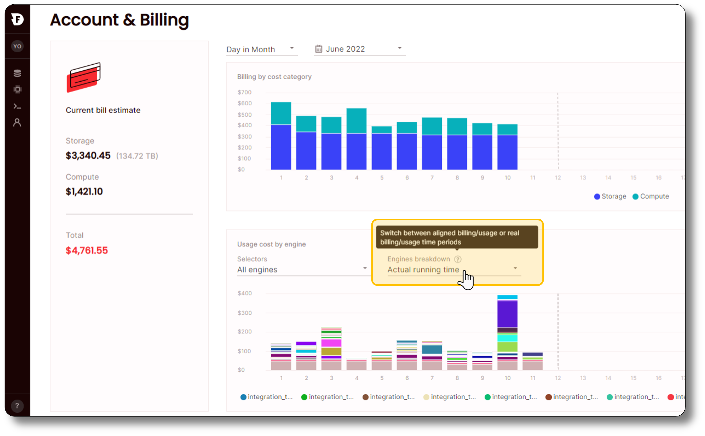

# Release notes

Firebolt continuously releases updates so that you can benefit from the latest and most stable service. These updates might happen daily, but we aggregate release notes to cover a longer time period for easier reference. The most recent release notes from the past month are below. See the [Release notes archive](release-notes-archive.md) for earlier-version release notes.

{: .note}
Firebolt might roll out releases in phases. New features and changes may not yet be available to all accounts on the release date shown.

## July 2022

* [Enhancements, changes, and new integrations](#enhancements-changes-and-new-integrations)
* [Resolved issues](#resolved-issues)

### Enhancements, changes, and new integrations

* #### Added support for Airbyte
 
  The Firebolt integration includes an [Airbyte Source](https://docs.airbyte.com/integrations/sources/firebolt/){:target="_blank"} connector as well as an [Airbyte Destination](https://docs.airbyte.com/integrations/destinations/firebolt){:target="_blank"} connector, which allow you to easily move data into and out of Firebolt. 
  
  For more information on Airbyte, see [Airbyte](https://airbyte.com/){:target="_blank"}.

* #### New billing breakdown in engine dashboard
  
  The billing breakdown in the engine dashboard can now show billing or running time.

  
 
* #### Added an optional `<format>` parameter to the `TO_DATE` and `TO_TIMESTAMP` functions
  
  The `<format>` parameter allows you to use a string literal, as shown in [DATE_FORMAT](../sql-reference/functions-reference/date-format.md), to specify the format of the string to convert. This hint helps the date-time parser to improve performance. For more information, see [TO_DATE](../sql-reference/functions-reference/to-date.md) and [TO_TIMESTAMP](../sql-reference/functions-reference/to-timestamp.md).

### Resolved issues

* Fixed an issue that prevented values from being set properly for a column with a `DEFAULT` constraint when an `INSERT INTO` statement ran without specifying the column value. 

  For example, consider the following fact table and `INSERT INTO` statement.   

  ```sql
  CREATE FACT TABLE t8
  (
       col1 INT  NULL ,
       col2 INT  NOT NULL UNIQUE,
       col3 INT  NULL DEFAULT 1,
       col4 INT  NOT NULL DEFAULT 3,
       col5 TEXT
  )
  PRIMARY INDEX col2;

  INSERT INTO t8 (col1,col2,col3,col5) VALUES (1,1,1,'a'); 
  ```
  
  Before the fix, `SELECT * FROM t8` would return `(1,1,1,0,'a')`. The statement now returns the expected values, `(1,1,1,3,'a')`.

* Fixed a case where the `APPROX_PERCENTILE` function returns an error when running over an expression derived from multiple tables. 

* `JSON_EXTRACT` now supports the `STRING` data type as the expected type in addition to the `TEXT` data type.

* Fixed an issue where a username that contained special alphabetical characters was not recognized when registering a Firebolt user. 

* Concatenating multiple arrays using the `||` operator now produces an array containing the input array values.

* Fixed an issue where an array of `LONG`s could be displayed as an array of `TEXT`s in the SQL Workspace.

* Fixed an issue that prevented a database without engines from being edited.