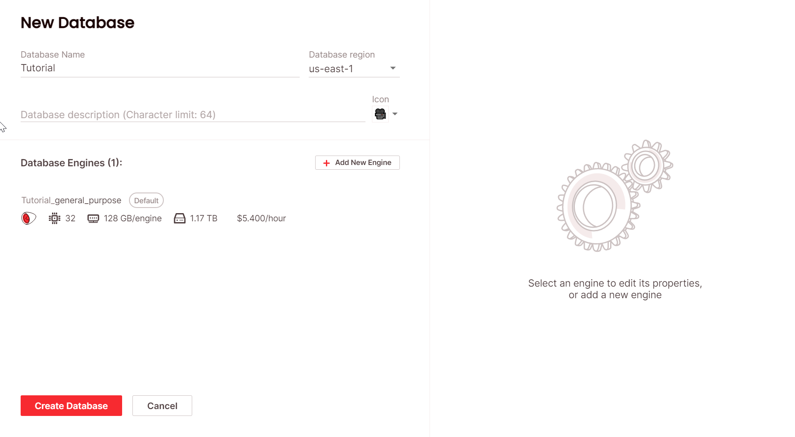
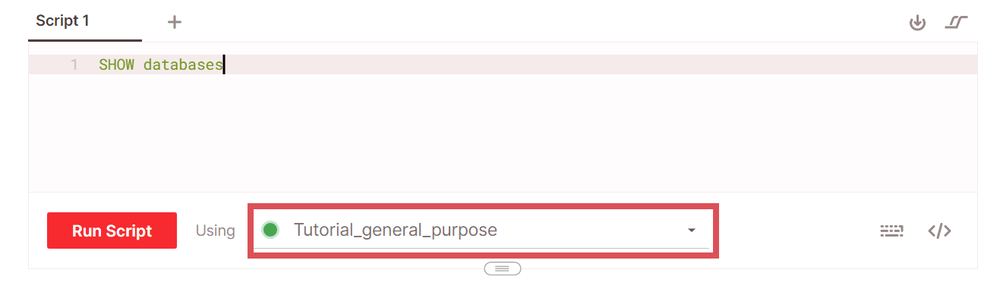
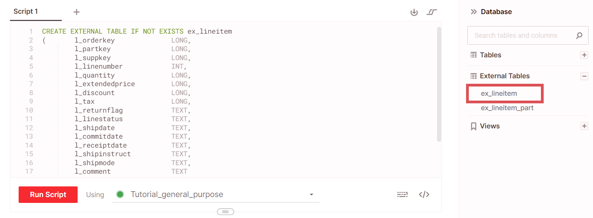
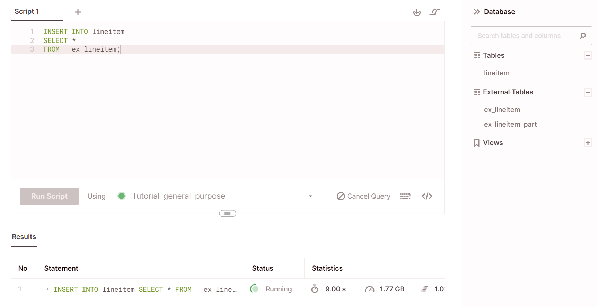
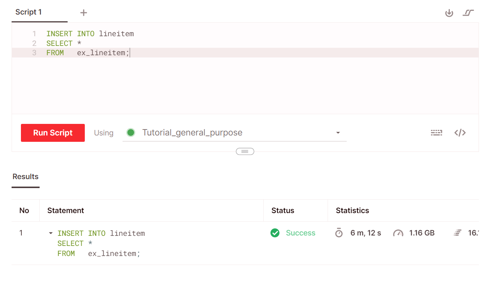

# Getting started tutorial
{:.no_toc}
This tutorial teaches you how to create a database, ingest a sample dataset from Amazon S3 into Firebolt, and run fundamenatl analytics queries over the data. To perform this tutorial, you need an active Firebolt account. Send email to `hello@firebolt.io` to create one.

1. Topic toC
{:toc}

## Create your first database
To start working with data, you first create a database and a *Firebolt engine*. An engine represents the compute resources that are attached to a database for a certain workload. A database always has one *general purpose engine* that can write to the Firebolt file format (F3) for data ingestion and run analytics queries. We use that single-engine set up in this tutorial. Many databases are set up with additional *analytics engines* that can only query, and are configured to optimize different query workloads. For more information, see [Working-with-engines](/working-with-engines/working-with-engines.md).

**To create a database and engine**
1. From the **Databases** page, choose **New Database**.  

2. Enter a **Database name** (we use *Tutorial* in this topic) and leave `us-east-1` selected as the **Database region**.  

3. Under **Database engines**, leave the default engine selected. Firebolt gave it the name *&#8249;your_db_name&#8250;_general_purpose*.  

4. Choose **Create database**.  
  
Firebolt adds your database to the **Databases** page.


## Run your first query
Before we ingest the sample data and run a query over it, we'll go to the SQL workspace for the database and run a simple query to demonstrate how to start an engine. For more information about the SQL workspace, see [Working with the SQL workspace](/work-with-our-sql-editor/working-with-the-sql-workspace.md).

**To open your database, start an engine, and run a query**
1. From the **Database** page, find the database that you created in the list, and then choose the **Open in SQL workspace icon** (**>_**) next to the **Database name**.  

2. In the **Script 1** tab, type the simple query below that returns a list of databases in your account.  
```sql
SHOW DATABASES;
```  

3. Choose **Run script** and note that the **Using** list indicates the engine that Firebolt uses to run the script, for example, `Tutorial_general_purpose`.  
  

4. When Firebolt prompts you to start the engine, choose **Start engine**.

## Ingest data
Ingesting data into Firebolt is a three-step process. You:

1. Create an external table.  

2. Create a fact or dimension table.  

3. Run an `INSERT INTO` command from the external table to the fact or dimension table.

### Create an external table
An *external table* is a special, virtual table that serves as a connector to your data source. After the external table is created, you ingest data by running an `INSERT INTO` command from that external table into a *fact table* or *dimension table*. The `INSERT INTO` command must run on a general purpose engine. After the data is available in fact and dimension tables, you can run analytics queries over those tables using any engine. Although it's possible, we don't recommend running analytics queries on external tables. For more information, see [CREATE EXTERNAL TABLE](/sql-reference/ddl-commands.md#create-external-table)

**To create an external table**
1. Choose the plus symbol (+) next to Script 1 to create a new script tab, **Script 2**, in the SQL workspace.

2. Copy and paste the query below into the **Script 2** tab.
```sql
CREATE EXTERNAL TABLE IF NOT EXISTS ex_lineitem (
-- Column definitions map to data fields
-- in the source data file and are specified
-- as sources in the INSERT INTO statement for ingestion.
  l_orderkey              LONG,
  l_partkey               LONG,
  l_suppkey               LONG,
  l_linenumber            INT,
  l_quantity              LONG,
  l_extendedprice         LONG,
  l_discount              LONG,
  l_tax                   LONG,
  l_returnflag            TEXT,
  l_linestatus            TEXT,
  l_shipdate              TEXT,
  l_commitdate            TEXT,
  l_receiptdate           TEXT,
  l_shipinstruct          TEXT,
  l_shipmode              TEXT,
  l_comment               TEXT
)
-- The URL specifies the data source in S3.
-- All files in the location that match the OBJECT_PATTERN
-- will be processed during ingestion.
URL = 's3://firebolt-publishing-public/samples/tpc-h/parquet/lineitem/'
-- These credentials specify a role or AWS key credentials
-- with permission to read from the S3 location.
-- These credentials are commented out for this tutorial because the bucket
-- is publicly accessible.
-- CREDENTIALS = ( AWS_KEY_ID = '******' AWS_SECRET_KEY = '******' )
OBJECT_PATTERN = '*.parquet'
TYPE = (PARQUET);
```  

3. Choose **Run script**.  
Firebolt creates the external table. When finished, the external table `ex_lineitem` appears on the object panel of the database.  
  

4. Choose the vertical ellipses next to Script 2, choose Save script, enter a name (for example, *MyExTableScript*) and then press ENTER to save the script.

### Create a fact table
In this step, you create a Firebolt fact table called `lineitem`, which you use in the next step as the target for an `INSERT INTO` command.

Every fact table in Firebolt must have a *primary index* specified when you create it. Firebolt uses the primary index when it ingests data so that it is saved to S3 for highly efficient pruning and sorting when the data is queried. The fact table that we create in this step specifies the `l_orderkey` and `l_linenumber` columns for the primary index. For more information about choosing columns for a primary index, see [Using indexes to accelerate query performance](/using-indexes/using-indexes-to-accelerate-query-performance.md).

**To create a fact table**
1. Create a new script tab.  

2. Copy and paste the query below into the script tab.  
```sql
CREATE FACT TABLE IF NOT EXISTS lineitem ()
-- In this example, these fact table columns
-- map directly to the external table columns.
  l_orderkey              LONG,
  l_partkey               LONG,
  l_suppkey               LONG,
  l_linenumber            INT,
  l_quantity              LONG,
  l_extendedprice         LONG,
  l_discount              LONG,
  l_tax                   LONG,
  l_returnflag            TEXT,
  l_linestatus            TEXT,
  l_shipdate              TEXT,
  l_commitdate            TEXT,
  l_receiptdate           TEXT,
  l_shipinstruct          TEXT,
  l_shipmode              TEXT,
  l_comment               TEXT
)
PRIMARY INDEX
  l_orderkey,
  l_linenumber;
```  

3. Choose **Run script**.  
Firebolt creates the fact table. When finished, the table `lineitem` appears on the object panel of the database.  


### Use INSERT INTO to ingest data
You can now use the `INSERT INTO` command to copy the data from the external table into the fact table. During the INSERT INTO operation, Firebolt ingests the data from your source into Firebolt.

**To run an `INSERT INTO` command that ingests data**
1. Create a new script tab.
2. Copy and paste the query below into the script tab.  
```sql
INSERT INTO
  lineitem
SELECT
  *
FROM
  ex_lineitem;
```
3. Choose **Run script**.  
The query results pane indicates a **Status** of **Running** as shown below.  
  
The **Status** changes to **Success** when the ingestion is complete as shown below.


## Query the ingested data
Now that the data has been ingested into the `lineitem` table, you can run analytics queries over the table that benefit from the speed and efficiency of Firebolt.

To verify that you inserted the data into the table, run a simple `SELECT` query like the one below.

```sql
SELECT
  *
FROM
  lineitem
LIMIT
  1000;
```
The values shown in the query results pane should be similar to those shown below.


### Configure an aggregating index

An aggregating index enables you to take a subset of a table's columns and configure aggregations on top of those columns. Many aggregations are supported from the simple sum, max, min to more complex ones such as count and count (distinct). For queries that use aggregations specified in the index, instead of calculating the aggregation on the entire table and scanning all the rows, Firebolt uses the pre-calculated values in the aggregating index. For more information, see [Using indexes to accelerate query performance](/using-indexes/using-indexes-to-accelerate-query-performance.md).

From the `lineitem` fact table you created in the previous step, assume you typically run queries to look at the `SUM(l_quantity)`, `SUM(l_extendedprice)`, and `AVG(l_discount)`, grouped by different combinations of `l_suppkey` and `l_partkey`. To help you speed up queries with these aggregations on this table, you can use the following statement in a script to create an aggregating index.

```sql
CREATE AND GENERATE AGGREGATING INDEX
  agg_lineitem
ON lineitem (
  l_suppkey,
  l_partkey,
  SUM(l_quantity),
  SUM(l_extendedprice),
  AVG(l_discount)
  );
```

If you run this script, you see the `agg_lineitem` index listed in the object pane. With the index created, queries over the `lineitem` table that combine any of these fields and aggregations now use the index instead of reading the entire table.
