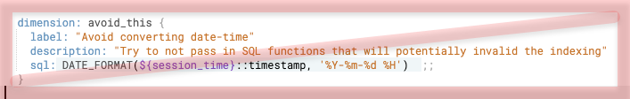
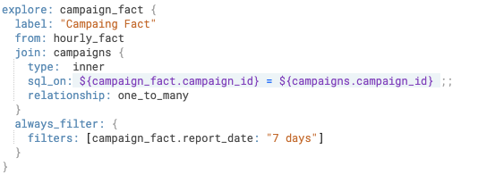

# Connecting to Looker

You can connect Firebolt and Looker version 21.10 or later by setting up a database connection in Looker. For more information, including supported features, see [Firebolt ](https://docs.looker.com/setup-and-management/database-config/firebolt) in the Looker documentation.

If you use a Looker version earlier than 21.10, please contact Firebolt support for connection instructions using the JDBC driver.

## Configuring basic settings

When specifying the **Username** and **Password** in Looker, we recommend that you use a Firebolt user with **Viewer** privileges that you create exclusively for Looker connections. This simplifies user management.

By default, Looker connects to the default engine for the database specified in the connection. Use **Additional Params** to specify a different engine.

**To specify a different engine for the Looker connection**

* For **Additional Params**, enter `engine=<engine-name>.`

## Configuration best practices

Looker can dynamically process your data in a number of ways. Following these best practices helps you configure Looker to take advantage of Firebolt’s features for accelerated query performance. You may not be able to implement all of these for your use case, but the more that you can implement these suggestions the better.

### Use Firebolt fact tables as base views in Looker Explores

The base view in a Looker Explore is the database table that is used in the `FROM` clause of the SQL query that Looker generates. Looker manifests other views joined into an Explore using a `JOIN` clause. Typically, base views are joined to other views in a many-to-one direction using `LEFT JOIN`, and most filters occur on the base view.

In Firebolt, fact tables are sharded across engine nodes. Dimension tables, which are typically smaller than fact tables, are replicated in each node. This helps optimize query performance. Firebolt typically performs best when you filter on the fact table and use it in the `FROM` clause in your SQL queries when using a `LEFT JOIN`.

These preferred patterns in Firebolt make it a best practice to use a Firebolt fact table as the base view of a Looker Explore. If you need multiple fact tables in an Explore, set the base view as the Firebolt fact table that is queried most frequently and join the others. Looker only joins tables when the analyitcal query needs them, and the `FROM` clause is static.

**To set a fact table as the base view for a Looker explore**

* Specify the Firebolt fact table name as the _**view\_name**_ in the LookML [from ](https://docs.looker.com/reference/explore-params/from-for-explore)parameter for a Looker Explore.

### Avoid transformations in commonly filtered dimensions

Filters on dimensions in Looker are translated to predicates in the `WHERE` clause of the SQL query that Looker generates. Firebolt performs best when these predicates are included in primary indexes and, if applicable, aggregating indexes.

If you use a functions such as `CAST `or `UPPER` that transform predicates, Firebolt must read all values to satisfy the conditions of comparison, which undermines the effectiveness of the index in accelerating query performance.

For this reason, avoid using transformations in the LookML [sql ](https://docs.looker.com/reference/field-params/sql)parameter for a Looker dimension, especially for dimensions that exist within Firebolt fact tables and are included in the primary indexes of those tables. An example of such a transformation is shown below.

If you need a transformation for an analytical use case, consider creating a virtual column in the fact table. The virtual column can receive a value that you transform from the original column when you ingest with `INSERT INTO`. You can then specify the virtual column in the primary index and also specify the virtual column in the LookML sql parameter for the Looker dimension.

### Force the usage of filters represented in Firebolt primary indexes

As indicated above, by defining indexes in Firebolt on columns that you use as dimensions in Looker Explores to filter results, you can accelerate the performance of queries that Looker builds for Firebolt. You can use the LookML [always_filter](https://docs.looker.com/reference/explore-params/always_filter) parameter to specify these columns and filters to help ensure that Looker users exploring data must add those filters on Firebolt’s primary index. This adds guard rails to prevent novice users from building slow queries in their first experience.

The example below shows a LookML `always_filter` defined for the `report_date` column in the Firebolt fact table named `campaign_fact`. In Firebolt, this fact table has a primary index definition that includes the `campaign_fact` column.

### Use join indexes

Join indexes in Firebolt can accelerate queries with joins. Looker is known to generate a lot of joins, especially if your data is relatively normalized. Evaluating the joins in the LookML for your Looker Explores can provide clues for the join indexes to create so that you can accelerate performance.

Join indexes that you define in Firebolt are beneficial when there is a many-to-one relationship between fact tables and a join table, when you typically filter queries using only a subset of available columns in the dimension table, and when the dimension table is large enough that it exceeds the RAM available in the engine spec. In addition, dimension tables that have a join index defined for them should have a column with unique values that is used as the join key. This column should have the `UNIQUE `parameter set when the dimension table is created.

For more information, see [Using indexes](../../using-indexes/using-indexes.md).

### Use system activity data to inform aggregating indexes

Use Looker dashboards and [system activity](https://docs.looker.com/admin-options/system-activity) data to identify the most common or impactful queries, and then create Firebolt aggregating indexes to optimize these queries. When looking at the queries in the system activity, try to group the queries to see if there are commonalities between some of them. If possible, create a single aggregating index that can handle multiple queries. A single aggregating index can contain multiple aggregations to handle a range of queries.

For more information, see [Using aggregating indexes](../../using-indexes/using-aggregating-indexes.md).
