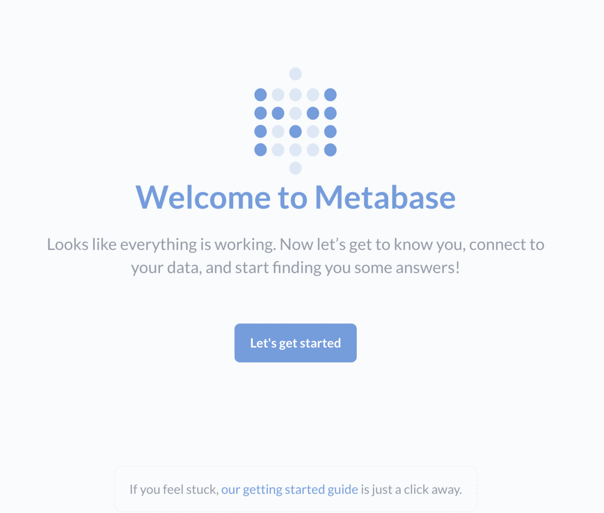

# Connecting to Metabase

Metabase is an open source business intelligence tool used for querying data sets and producing dashboards.

### Setting up Metabase

To get started with Metabase, please follow the [official guide](https://www.metabase.com/docs/latest/operations-guide/running-the-metabase-jar-file.html) for running Metabase with a JAR file. This guide will walk you through the following steps:

* Setting up a Java Runtime Environment (JRE) if you don't already have one installed.
* Creating a new directory and moving the downloaded [Metabase JAR](https://metabase.com/start/jar.html) into it.
* Launching Metabase by running `java -jar metabase.jar` from a terminal. This command will create a new `plugins` folder in the Metabase directory.

If any of these steps don't work correctly, please consult the [Metabase Troubleshooting documentation](https://www.metabase.com/docs/latest/troubleshooting-guide/running.html).

### Downloading Firebolt drivers for your Metabase instance

After Metabase is set up on your local drive, you need to download the files listed below before you can connect to your Firebolt database.

* Download the [Firebolt JDBC driver JAR](https://docs.firebolt.io/integrations/connecting-via-jdbc).
* Download the [Firebolt Metabase driver](https://drive.google.com/file/d/1r--_2oF_cdVjMrlf8zQqX0WE9jCzjg1A/view).

Both of these files should be placed in the `plugins` folder in the Metabase directory.

### Launching Metabase with Firebolt

You are now ready to run Metabase with your Firebolt databases.

1. Run `java -jar metabase.jar` again from the Metabase directory in a command terminal.
2. Use a web browser to naviagate to Metabase at [http://localhost:3000/](http://localhost:3000/) (alter the URL port number as necessary if you changed it).

    You should see a screen like this:

    

3. Select "Let's get started" and go through the Metabase account signup.

4. For now, you should skip the "Add your data" page. Instead, choose the "I'll add my data later" link.

5. When you are finished with the setup, you should see a screen like this:

    

6. To connect to your Firebolt database, click on the Admin link under the settings menu (located on the top right):

    

7. From the Admin page, select the "Databases" link at the top of the page. Then select "Add database".  

    

8. You should see Firebolt listed under the selections for "Database type". If you don't see Firebolt here, please revisit the previous steps and make sure you installed the Firebolt JDBC and Firebolt Metabase drivers in the correct folder.

9. Enter the rest of the parameters for your database:

    * **Database type**: Firebolt
    * **Name**: Use any name
    * **Host**: `api.app.firebolt.io`
    * **Port**: 8123
    * **Database name**: the name of your database in Firebolt
    * **Username**: your Firebolt username
    * **Password**: your Firebolt password
    * **Additional JDBC parameters**: you can leave this one blank for now. If you need to pass additional parameters to Firebolt, you can add them here. For example, specifying a Firebolt account to use a specific engine would look like this: `account=my_account_name&engine=my_database_engine_1`

Be sure to select "Save" after entering all your information.

After saving, you should get a message saying your Firebolt database was successfully added. If this connection fails, please recheck the information entered for your database to ensure it is accurate.
