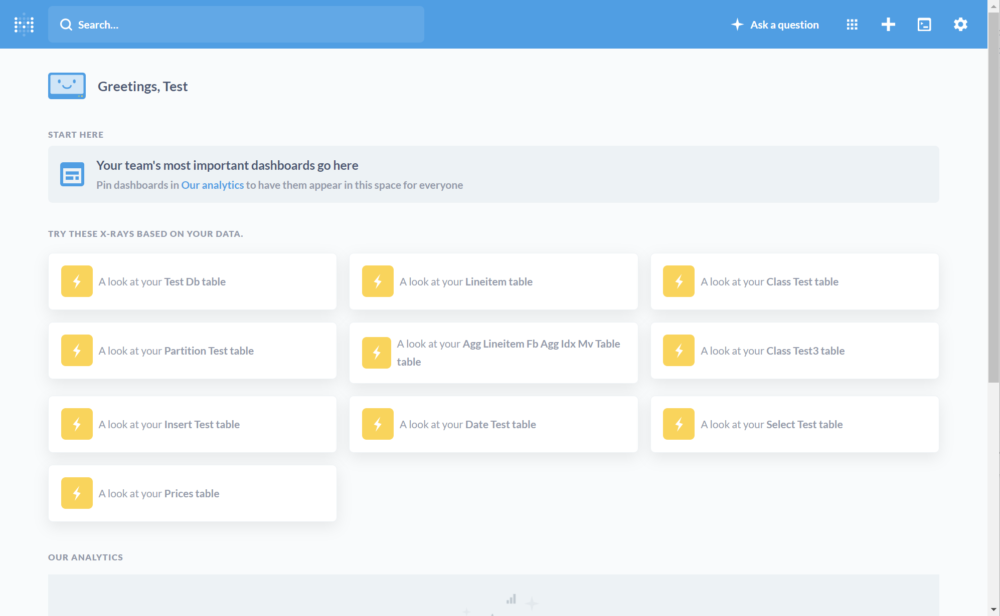
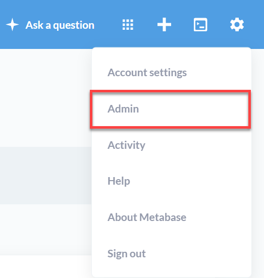
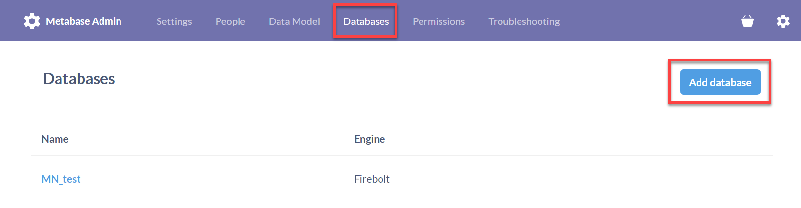

# Connecting to Metabase
{: .no_toc}

[Metabase](https://www.metabase.com/) is an open source business intelligence tool used for exploring data and producing dashboards.

If you are using Metabase Cloud, you can skip to [Creating a connection](#creating-a-connection) below; no download or installation is necessary. 

1. Topic ToC
{:toc}

### Setting up the Firebolt connector (on-premises only)

To set up the Firebolt connector on a self-hosted Metabase instance, download the following files and save them to the `/plugins` directory on your Metabase host system. By default, `/plugins` is a subdirectory of the directory where the `metabase.jar` file executes.

To set up the Firebolt connector on a self-hosted Metabase instance:
1. Download the latest Firebolt Metabase driver from its [GitHub Releases page](https://github.com/firebolt-db/metabase-firebolt-driver/releases).
2. Move the driver to the `/plugins` directory on your Metabase host system. By default, `/plugins` is a subdirectory of the directory where the `metabase.jar` file executes.

### Creating a connection

You are now ready to run Metabase with your Firebolt databases.

1. Use a web browser to navigate to the home page of your Metabase instance.

    

2. From the **Settings** menu, select the **Admin** link:

    

3. From the Metabase **Admin** page, select the **Databases** link at the top of the page. Then select **Add database**.  

    

4. Select **Firebolt** from the list under **Database type**.

5. Enter the rest of the connection parameters needed to connect to Firebolt as follows:

| Field                          | Description                                                                  | 
| ------------------------------ | ---------------------------------------------------------------------------- |
| **Display Name**               | A title to refer to your database in Metabase. For simplicity, we recommend using the same name as your Firebolt database. |
| **Database name**              | The name of the Firebolt database to connect to.                             |
| **Username**                   | The username to connect with, for example, `janedoe@mycompany.com`.          |
| **Password**                   | The password associated with the username above.                             |
| **Account name**               | The Firebolt account to log in to.                                           |
| **Engine name**                | The Firebolt engine to run queries with.                                     |
| **Additional JDBC options**    | Any additional JDBC parameters to pass along with the connection, such as `connection_timeout_millis=10000`. See [here](https://docs.firebolt.io/developing-with-firebolt/connecting-with-jdbc.html#available-connection-parameters) for a list of all available JDBC connection parameters. |

Be sure to select **Save** after entering all your information. After saving, you should get a message saying your Firebolt database was successfully added.
