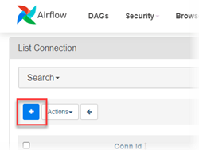

# Connecting to Airflow
{: .no_toc}

[Apache Airflow](https://airflow.apache.org/) is a data orchestration tool that allows you to programmatically author, schedule, and monitor workflows. You can use the Airflow provider package for Firebolt to integrate a Firebolt database into your data pipeline&mdash;for example, you can set up a schedule for automatic incremental data ingestion into Firebolt.

This topic covers the installation of the Airflow provider package for Firebolt using pip and the [airflow-provider-firebolt package on PyPI](https://pypi.org/project/airflow-provider-firebolt/). It then provides steps for setting up a connection to Firebolt resources from the Airflow UI. Finally, a sample Airflow Directed Acyclic Graph (DAG) Python script demonstrates common Firebolt tasks.

The source code for the Airflow provider package for Firebolt is available in the [airflow-provider-firebolt](https://github.com/firebolt-db/airflow-provider-firebolt) repository on GitHub.

* Topic ToC
{:toc}

## Prerequisites

* A user profile in a Firebolt account. For more information, see [Creating an account](../../managing-your-account/creating-an-account.md).

* A Firebolt database and engine.

* [Python](https://www.python.org/) version 3.7 or later.

* An installation of Airflow. For more information, see [Installation](https://airflow.apache.org/docs/apache-airflow/stable/installation/index.html) in Airflow documentation.


## Installing the Airflow provider package for Firebolt

These instructions are based on using pip to install the Airflow core package as demonstrated in the Airflow Quick Start for [Running Airflow locally](https://airflow.apache.org/docs/apache-airflow/stable/start/local.html). After you install Airflow, install the latest version of the Airflow provider package for Firebolt as shown below.

```bash
pip install airflow-provider-firebolt
```

After you install the Firebolt provider, **Firebolt** is available as a **Connection type** selection in the Airflow UI.

### Upgrading to the latest version
{: .no_toc}

We recommend running the latest version of the provider package. [Release history](https://pypi.org/project/airflow-provider-firebolt/#history) is available on PyPI. To upgrade to the most recent version, use the command below.

```bash
pip install airflow-provider-firebolt --upgrade
```

### Installing a specific version
{: .no_toc}

If your application requires a specific version of the package, use the command below, replacing `0.0.2` with the version you need.

```bash
pip install airflow-provider-firebolt==0.0.2
```

## Connecting Airflow to Firebolt

To configure a connection to Firebolt, you create an Airflow connection object. For more information, see [Managing Connections](https://airflow.apache.org/docs/apache-airflow/stable/howto/connection.html) in Airflow documentation.

The instructions below demonstrate how to use the Airflow UI to create a connection to a Firebolt database and engine.

**To configure an Airflow connection to Firebolt**

1. Start the Airflow UI and log in.

2. From the **Admin** menu, choose **Connections**.

3. Choose the **+** button to add a new connection.  
  

4. From the **Connection Type** list, choose **Firebolt**.

5. Provide connection parameters for Firebolt according to the following guidelines. These connection parameters correspond to built-in Airflow variables.  
   
   |   Parameter     |Description |Example value |
   |:--------------  |:---------- |:------------ |
   | Connection id   | The name of the connection. This appears in the list of connections in the Airflow UI. | `My_Firebolt_Connection` |
   | Description     | Self-explanatory. | `Connection to Firebolt database MyDatabase using engine MyEngine.`|
   | Host            | Optional. The API hostname for Firebolt. Always `api.app.firebolt.io`. | `api.app.firebolt.io` |
   | Database        | The name of the Firebolt database to connect to. | `MyFireboltDatabase` |
   | Username        | The username (email address) associated with the Firebolt user that Airflow will use to connect. | `me@mycompany.com` |
   | Password        | The password associated with the username provided. | `pass1234` |
   | Advanced Connection Properties | Specifies the Firebolt account name and engine within the specified database to use in the format `{"account_name":"<my_account_name>","engine_name":"<engine_name>"}`. | `{"account_name":"MyFbAccount","engine_name":"MyFireboltDatabase_general_purpose"}` |

6. Choose **Test** to verify that connection parameters are correct.  

   The engine that you specify in **Advanced Connection Properties** must be running for the test to complete successfully.
   {: .note}

7. After the test is successful, choose **Save**.

## Example&mdash;creating a DAG for data processing with Firebolt

A DAG file in Airflow is a Python script that defines the tasks and execution order for a data workflow. The DAG example in this section performs the following tasks in succession.

{: .note}
This DAG performs a variety of tasks in Firebolt for demonstration purposes only. It does not demonstrate a workflow or pipeline that would be typical of real-world applications.

1. Start an engine to perform subsequent tasks. For more information, see [Understanding engine fundamentals](../../working-with-engines/understanding-engine-fundamentals.md). This task fails if the engine is running.

2. Run SQL to create an external table in Firebolt connected to a data source in Amazon S3. For more information, see [Working with external tables](../../loading-data/working-with-external-tables.md).

3. Run SQL to create a fact table to receive ingested data. For more information, see [Working with tables](../../working-with-tables.md).

4. Run SQL that ingests the data using an `INSERT INTO` command. For more information, see [INSERT INTO](../../sql-reference/commands/insert-into.md).

In this example, the DAG is set up to run only when triggered (`schedule_interval=None`).

### Airflow variables

The DAG example uses two custom variables defined in Airflow. You can define key-value pairs for variables using the Airflow UI or JSON documents. For more information, see [Variables](https://airflow.apache.org/docs/apache-airflow/stable/concepts/variables.html) and [Managing Variables](https://airflow.apache.org/docs/apache-airflow/stable/howto/variable.html) in Airflow documentation.

* The variable key `firebolt_default_region` has a value that specifies the AWS Region of the Firebolt database&mdash;for example, `us-east-1`.

* The variable key `firebolt_sql_path` has a value that specifies a subdirectory of your airflow home directory where SQL files are stored&mdash;for example, `~/airflow/sql_store`. The example DAG uses a Python function to read SQL files that the DAG tasks run as scripts in Firebolt.

### DAG script example
The DAG script below creates a DAG named `firebolt_provider_trip_data`. It uses an Airflow connection to Firebolt named `my_firebolt_connection`. For the contents of the SQL scripts that the DAG runs, see [SQL script examples](#sql-script-examples) below. By changing connector values in Airflow, changing the `FIREBOLT_CONN_ID `value to point to your connector, and creating custom variables in Airflow, you can run this example using your own database and engine.

```python
import time
import airflow
from airflow.models import DAG
from airflow.models import Variable
from airflow.operators.python import PythonOperator
from firebolt.service.manager import ResourceManager
from firebolt_provider.operators.firebolt import FireboltOperator
from firebolt.common import Settings
default_args = {
    'owner': 'airflow',
    'start_date': airflow.utils.dates.days_ago(1)
}

### Function to connect to Firebolt
def connection_params(conn_opp, field):
    connector = FireboltOperator(firebolt_conn_id=conn_opp, sql="", task_id="CONNECT")
    return connector.get_db_hook()._get_conn_params()[field]

### Pull in the connection parameter settings using built-in Airflow variables.
### Change the value of FIREBOLT_CONN_ID to match the name of your connector.
FIREBOLT_CONN_ID = 'my_firebolt_connection'
FIREBOLT_USER = connection_params(FIREBOLT_CONN_ID, 'username')
FIREBOLT_PASS = connection_params(FIREBOLT_CONN_ID, 'password')
FIREBOLT_ENGINE_NAME = connection_params(FIREBOLT_CONN_ID, 'engine_name')
FIREBOLT_SERVER = connection_params(FIREBOLT_CONN_ID, 'api_endpoint')

### Pull in custom variables set using the Airflow Variables module.
FIREBOLT_DEFAULT_REGION = Variable.get("firebolt_default_region")
tmpl_search_path = Variable.get("firebolt_sql_path")

### Define a variable for the Firebolt SDK ResourceManager module that can access database resources.
### See https://python-sdk.docs.firebolt.io/en/latest/firebolt.service.html#module-firebolt.service.manager.
fb_rm = ResourceManager(Settings(
        server=FIREBOLT_SERVER,
        user=FIREBOLT_USER,
        password=FIREBOLT_PASS,
        default_region=FIREBOLT_DEFAULT_REGION
        )
    )

### Function to return the engine ID based on the engine name specified in
### the Airflow connector. Some Firebolt tasks required the engine ID.
def get_engine_by_name():
    engine = fb_rm.engines.get_by_name(name=FIREBOLT_ENGINE_NAME)
    return engine

### Function to start the engine using its engine ID.
def start_engine():
    engine = get_engine_by_name()
    engine.start()
    time.sleep(5)

### Function to open query files saved locally.
def get_query(query_file):
    return open(query_file, "r").read()

### Define a variable based on an Airflow DAG class.
### For class parameters, see https://airflow.apache.org/docs/apache-airflow/stable/_api/airflow/models/dag/index.html#airflow.models.dag.DAG.
dag = DAG('firebolt_provider_trip_data',
          default_args=default_args,
          template_searchpath=tmpl_search_path,
          schedule_interval=None,
          catchup=False,
          tags=["firebolt"])

### Define DAG tasks and task sequence.
### Where necessary, read local sql files using the Airflow variable.
task_start_engine = PythonOperator(
        dag=dag,
        task_id="START_ENGINE",
        python_callable=start_engine
)
task_trip_data__external_table = FireboltOperator (
        dag=dag,
        task_id="task_trip_data__external_table",
        sql=get_query(f'{tmpl_search_path}/trip_data__create_external_table.sql'),
        firebolt_conn_id=FIREBOLT_CONN_ID
        )
task_trip_data__create_table = FireboltOperator (
        dag=dag,
        task_id="task_trip_data__create_table",
        sql=get_query(f'{tmpl_search_path}/trip_data__create_table.sql'),
        firebolt_conn_id=FIREBOLT_CONN_ID
        )
task_trip_data__create_table.post_execute = lambda **x: time.sleep(10)
task_trip_data__process_data = FireboltOperator (
        dag=dag,
        task_id="task_trip_data__process_data",
        sql=get_query(f'{tmpl_search_path}/trip_data__process.sql'),
        firebolt_conn_id=FIREBOLT_CONN_ID
        )
( task_start_engine >> task_trip_data__external_table >> task_trip_data__create_table >> task_trip_data__process_data)
```

### SQL script examples

The contents of the SQL scripts that DAG tasks run are shown below.

#### trip_data__create_external_table.sql
{: .no_toc}

Creates a fact table, `ex_trip_data`, to connect to a public Amazon S3 data store.

```sql
create external table if not exists ex_trip_data(
   vendorid int,
   lpep_pickup_datetime timestamp,
   lpep_dropoff_datetime timestamp,
   passenger_count int,
   trip_distance float,
   ratecodeid int,
   store_and_fwd_flag varchar,
   pu_location_id int,
   do_location_id int,
   payment_type int,
   fare_amount float,
   extra float,
   mta_tax float,
   tip_amount float,
   tolls_amount float,
   improvement_surcharge float,
   total_amount float,
   congestion_surcharge float
)
url = 's3://firebolt-publishing-public/samples/taxi/'
object_pattern = '*yellow*2020*.csv'
type = (CSV SKIP_HEADER_ROWS = 1);
```

#### trip_data__create_table.sql
{: .no_toc}

Creates a fact table, `my_taxi_trip_data`, to receive ingested data.

```sql
drop table if exists my_taxi_trip_data;
create fact table if not exists my_taxi_trip_data(
   vendorid int,
   lpep_pickup_datetime timestamp,
   lpep_dropoff_datetime timestamp,
   passenger_count int,
   trip_distance float,
   ratecodeid int,
   store_and_fwd_flag varchar,
   pu_location_id int,
   do_location_id int,
   payment_type int,
   fare_amount float,
   extra float,
   mta_tax float,
   tip_amount float,
   tolls_amount float,
   improvement_surcharge float,
   total_amount float,
   congestion_surcharge float,
   source_file_name varchar,
   source_file_timestamp timestamp
) primary index vendorid;
```

#### trip_data__process.sql
{: .no_toc}

An `INSERT INTO` operation that ingests data into the `my_taxi_trip_data` fact table using the `ex_trip_data` external table. The example uses the external table metadata column, `source_file_timestamp`, to retrieve records only from the latest file.

```sql
insert into my_taxi_trip_data
select
   vendorid,
   lpep_pickup_datetime,
   lpep_dropoff_datetime,
   passenger_count,
   trip_distance,
   ratecodeid,
   store_and_fwd_flag,
   pu_location_id,
   do_location_id,
   payment_type,
   fare_amount,
   extra,
   mta_tax,
   tip_amount,
   tolls_amount,
   improvement_surcharge,
   total_amount,
   congestion_surcharge,
   source_file_name,
   source_file_timestamp
from ex_trip_data
where source_file_timestamp > (select max(source_file_timestamp) from my_taxi_trip_data);
```
