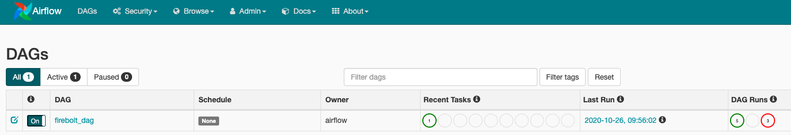
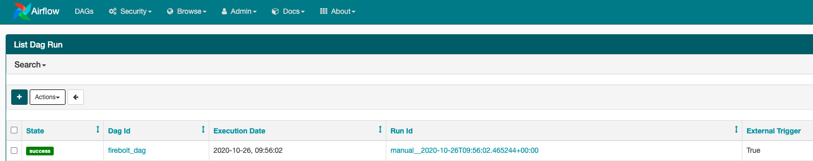
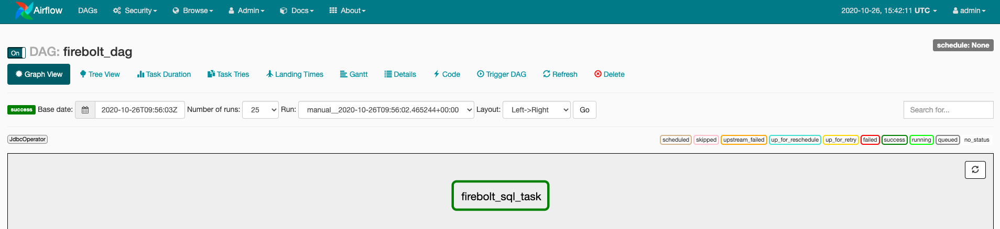

# Connecting to Airflow
{: .no_toc}

This topic provides an overview of setting up Airflow. For more information and step-by-step instructions for using Airflow see the [Continuously loading data tutorial](../../loading-data/continuously-loading-data.md).

1. Topic ToC
{:toc}

## Install the latest Firebolt JDBC Driver

Download Firebolt’s JDBC driver from [here](../connecting-via-jdbc.md#download-the-latest-jdbc-driver).

Put the JDBC jar file in the server which runs Airflow (we have placed it under `/airflow/jdbc`).

## Set up the JDBC connection in Airflow

Make sure you have:

* The name of the database you would like to connect to in Firebolt.
* The username and password used to log into Firebolt.
* Airflow version 1.10.12 or later.

**To configure the connection:**
1. Open Airflow. In the **Admin** tab, choose **Connections**.  

2. Choose **+** to create a new connection to Firebolt.  

3. Configure parameters according to the following guidelines, and then choose **Save**.  

| Parameter | Description | Value |
| :-------- | :---------- | :---- |
| `Conn Id` | The connection identifier | For example:`firebolt_jdbc`|
| `Conn Type` | The connection type | `JDBC Connection`|
| `Connection URL` | The connection String URL | `jdbc:firebolt://api.app.firebolt.io/<db_name>` <br> <br> Make sure to replace `<db_name>` with the name of your database in Firebolt. This enables you to query the database using its default engine. If you wish to use another engine, use the following URL:`jdbc:firebolt://api.app.firebolt.io/<db_name>?engine=engineName` <br> <br> Replace `engineName` with the name of the engine you would like to use. |
| `Login`| Your Firebolt username | |
| `Password`| Your Firebolt password| |
| `Driver Path`| The full path in your Airflow server where you saved the Firebolt JDBC driver | For example: `/airflow/jdbc/firebolt-jdbc-1.03-jar-with-dependencies.jar`|
| `Driver Class` | The class of the JDBC driver |`com.firebolt.FireboltDriver`|  

## Create a DAG

We will create a DAG that runs a script on top of a Firebolt table.

Below is the Python DAG program:

```python
from airflow import DAG
from airflow.operators.jdbc_operator import JdbcOperator

default_arg = {'owner': 'airflow', 'start_date': '2020-10-20'}

dag = DAG('firebolt_dag',
          default_args=default_arg,
          schedule_interval=None)

firebolt_task = JdbcOperator(dag=dag,jdbc_conn_id='firebolt_db',task_id='firebolt_sql_task',sql=['query_sample.sql'])                     

firebolt_task
```

You can save it as a Python file and place it under your dags folder to run it in Airflow. We use Airflow's JDBC operator to connect to Firebolt via JDBC and run a SQL script. The SQL script file contains a simple SELECT query. Feel free to use any query you want.

## Run the DAG

1. In Airflow's UI, go to the **DAGs** tab. Locate your DAG in the list (in our case we should look for `'firebolt_dag'`:  
  

2. Choose the trigger button under **Links** to manually trigger the DAG. Once the DAG has started to run, click on its **Run Id** to move to the graph view to track its progress. In our DAG we have a single step called `'firebolt_sql_task'`.  
  

3. In the DAG's graph view, the task should appear in green to confirm the DAG completed successfully. Choose the `'firebolt_sql_task'`.  
  

4. Choose **View Logs** to inspect the logs.
