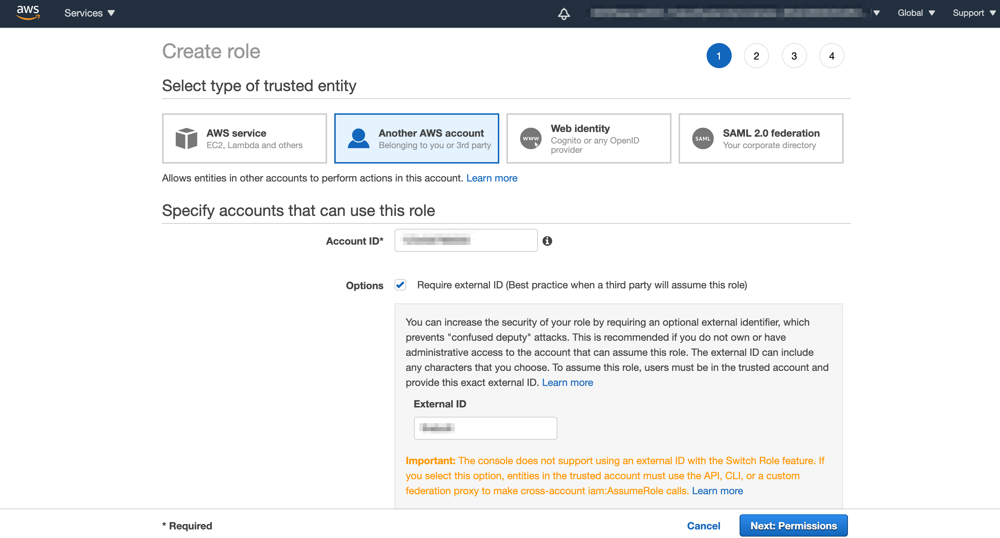

# Using AWS roles to access Amazon S3

Firebolt uses AWS Identity and Access Management \(IAM\) permissions to load data from Amazon S3 into Firebolt. This requires you to set up permissions using the AWS Management Console. This topic provides instructions for setting up AWS IAM permissions.

* [Create an IAM policy](configuring-aws-role-to-access-amazon-s3.md#Step-1:-Creating-an-IAM-policy)
* [Create the IAM role](configuring-aws-role-to-access-amazon-s3.md#Step-2:-Create-the-IAM-role-in-AWS)
* [Increase the max session duration of your role](configuring-aws-role-to-access-amazon-s3.md#Step-3:-Set-the-max-session-duration-for-your-AWS-Role)
* [Use the role to load your data into Firebolt](configuring-aws-role-to-access-amazon-s3.md#step-4-use-the-aws-role-for-loading-your-data-into-firebolt)

## Step 1: Create an IAM permissions policy <a id="Step-1:-Creating-an-IAM-policy"></a>

1. Log in to the [AWS Identity and Access Management \(IAM\) Console](https://console.aws.amazon.com/iam/home#/home).
2. From the left navigation panel, choose **Account settings**.
3. Under **Security Token Service \(STS\),** in the **Endpoints** list, find the **Region name** where your account is located. If the status is **Inactive**, choose **Activate**.
4. Choose **Policies** from the left navigation panel.
5. Click **Create Policy.**
6. Click the **JSON** tab.
7. Add a policy document that will allow Firebolt to access the S3 bucket and folder.

   The following policy \(in JSON format\) provides Firebolt with the required permissions to unload data using a single bucket and folder path. Copy and paste the text into the policy editor \(make sure to replace `<bucket>` and `<prefix>` with the actual bucket name and path prefix\).

   ```javascript
   {
      "Version": "2012-10-17",
      "Statement": [
          {
              "Effect": "Allow",
              "Action": [
                  "s3:GetObject",
                  "s3:GetObjectVersion"
              ],
              "Resource": "arn:aws:s3:::<bucket>/<prefix>/*"
          },
          {
              "Effect": "Allow",
              "Action": "s3:GetBucketLocation",
              "Resource": "arn:aws:s3:::<bucket>"
          },
          {
              "Effect": "Allow",
              "Action": "s3:ListBucket",
              "Resource": "arn:aws:s3:::<bucket>",
              "Condition": {
                  "StringLike": {
                      "s3:prefix": [
                          "<prefix>/*"
                      ]
                  }
              }
          }
      ]
   }
   ```

   * If you encounter the following error: `Access Denied (Status Code: 403; Error Code: AccessDenied)` - try to remove the following condition from the IAM policy:

   ```javascript
              "Condition": {
                  "StringLike": {
                      "s3:prefix": [
                          "<prefix>/*"
                      ]
                  }
              }
   ```

8. Choose **Review policy**, enter the policy **Name** \(for example, _firebolt-s3-access_\), enter an optional **Description**, and then choose **Create policy**.

{: .warning}
Setting the `s3:prefix` condition key to `*` grants access to all prefixes in the specified bucket for the action to which it applies.

## Step 2: Create the IAM role <a id="Step-2:-Create-the-IAM-role-in-AWS"></a>

In the AWS Management Console, create an AWS IAM role. The IAM role will assume the permissions you defined in step 1 to access the S3 locations where your data files are saved.

1. Log in to the [AWS Identity and Access Management \(IAM\) Console](https://console.aws.amazon.com/iam/home#/home).
2. From the left navigation panel, choose **Roles**, and then choose **Create role**.

   

3. Select **Another AWS account** as the trusted entity type.
4. In the **Account ID** field, enter your Firebolt **AWS Account ID**. Users with Account Admin privileges can view this value in the [Account & Billing window](https://app.firebolt.io/account-info).
5. If you select **Require external ID**, enter a value of your choosing and make a note of it.
6. Choose **Next**.
7. Begin typing the name of the policy you created in [step 1](configuring-aws-role-to-access-amazon-s3.md#Step-1:-Creating-an-IAM-policy) in the search box, select it from the list, and then choose **Next**.
8. Enter a **Name** and optional **Description** for the role, and then choose **Create role**.

   You have now created an IAM permissions policy, an IAM role for Firebolt access, and attached the permissions policy to the role.

9. Record the **Role ARN** listed on the role summary page.

## Step 3: Increase the max session duration for your AWS role <a id="Step-3:-Set-the-max-session-duration-for-your-AWS-Role"></a>

1. Log in to the [AWS Identity and Access Management \(IAM\) Console](https://console.aws.amazon.com/iam/home#/home).
2. From the left navigation panel, choose **Roles**.
3. Begin typing the name of the role that you created in [step 2](configuring-aws-role-to-access-amazon-s3.md#Step-2:-Create-the-IAM-role-in-AWS) and then select it from the list.
4. In the summary section, locate the **Maximum session duration** field. Click **Edit**
5. Choose _12 hours_ from the list, and then click **Save changes.**


## Step 4: Use the AWS Role for loading your data into Firebolt

Loading your data into Firebolt begins by creating an external table - full syntax can be found [here](../sql-reference/commands/ddl-commands.md#create-external-table).  
Make sure to specify both the role's ARN and the external ID you've recorded during [step 2](configuring-aws-role-to-access-amazon-s3.md#Step-2:-Create-the-IAM-role-in-AWS) in the external table's [CREDENTIALS](../sql-reference/commands/ddl-commands.md#credentials) specifier.

Keep on reading in our [getting started tutorial](../getting-started.html) for the full data load flow.
