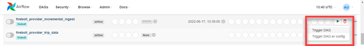

# Incrementally loading data using Airflow
{: .no_toc}

This tutorial describes a way to incrementally load data into Firebolt using [Apache Airflow](https://airflow.apache.org/docs/apache-airflow/stable/index.html) to schedule recurring runs of an `INSERT INTO` SQL script. The script works by loading only those records from Amazon S3 files with timestamps later than those already loaded.

## Prerequisites
{: .no_toc}

You need:

* An active Firebolt account.

* Apache Airflow up and running. The tutorial assumes a standalone installation.

* A Firebolt database and external table. This tutorial is based on the database and external table `ex_lineitem` created using the [Getting started tutorial](../getting-started.md).

## Steps
{: .no_toc}

1. ToC
{:toc}

## Create a fact table

In this tutorial, we load data into a fact table. Loading into a dimension table is similar. You define the target fact or dimension table with two columns that correspond to *metadata virtual columns*. You add column definitions for `source_file_name` of type`TEXT` and `source_file_timestamp` of type `TIMESTAMP`. These built-in columns store information about source files in Amazon S3. For more information about metadata virtual columns, see [Working with external tables](./working-with-external-tables.md).

Create a fact table using the `CREATE TABLE` statement shown below.

```sql
CREATE FACT TABLE IF NOT EXISTS lineitem_detailed
(       l_orderkey              BIGINT,
        l_partkey               BIGINT,
        l_suppkey               BIGINT,
        l_linenumber            INTEGER,
        l_quantity              BIGINT,
        l_extendedprice         BIGINT,
        l_discount              BIGINT,
        l_tax                   BIGINT,
        l_returnflag            TEXT,
        l_linestatus            TEXT,
        l_shipdate              TEXT,
        l_commitdate            TEXT,
        l_receiptdate           TEXT,
        l_shipinstruct          TEXT,
        l_shipmode              TEXT,
        l_comment               TEXT,
        source_file_name        TEXT, -- required for cont. loading data
        source_file_timestamp   TIMESTAMP -- required for cont. loading data
) PRIMARY INDEX l_orderkey, l_linenumber;
```

## Set up an Airflow connection to Firebolt

To get started connecting Airflow to Firebolt, use the Apache Airflow provider package for Firebolt, `airflow-provider-firebolt`. For more information, including requirements to set up the connection, see [Connecting to Airflow](../integrations/data-orchestration/airflow.md).

## Create and save an INSERT INTO script

An Airflow DAG consists of tasks, and tasks can run SQL in Firebolt. The DAG you create in the next step references the SQL script below, which you save locally as a file. The script uses the `source_file_name` and `source_file_timestamp` metadata virtual columns to determine the records to load from Amazon S3. The `WHERE` clause filters records so that Firebolt loads only those with file timestamps later than any already in the table.

Create a subdirectory of your Airflow home directory with a name of your choosing (for example, `sql_store`). Save the SQL file locally in that directory as `data_load.sql`, with the contents shown below. 

**Contents of data_load.sql**

```sql
INSERT INTO lineitem_detailed 
SELECT 
  *, 
  source_file_name, 
  source_file_timestamp
FROM ex_lineitem
WHERE source_file_timestamp > (SELECT MAX(source_file_timestamp) FROM lineitem_detailed);
```

## Create Airflow variables

The task in the DAG uses a Python function and an Airflow variable to refer to the local subdirectory where you saved the SQL file. Another variable sets the AWS Region of your database. Set the following variables in Airflow.

| Variable key            | Variable value                                                  | Value example |
| :---------------------  | :-------------------------------------------------------------- | :------------ |
| firebolt_sql_path       | The subdirectory of Airflow home where your SQL file is saved.  | `sql_store`   |
| firebolt_default_region | The AWS Region of your database.                                | `us-east-1`   |
 
For more information, see [Variables](https://airflow.apache.org/docs/apache-airflow/stable/concepts/variables.html) and [Managing Variables](https://airflow.apache.org/docs/apache-airflow/stable/howto/variable.html) in Airflow documentation. In the example, the variable key is `firebolt_sql_path`. Use Airflow to set the value of that variable to your fully qualified subdirectory name. The DAG also has functions to run Firebolt operations.

## Create and save the DAG

The DAG script shown below uses the `schedule_interval` DAG property to run the DAG periodically. The `schedule_interval` can be a cron expression or one of several pre-defined intervals. In this tutorial, we use the cron expression `* * * * *`. This runs the DAG every minute. The DAG defines a task `task__incremental_ingest`. This task runs the SQL script using the parameters defined in the Firebolt connection. 

Create a `dags` subdirectory of your Airflow home directory, and then save the DAG file below in that directory with a `*.py` file extension. 

```python
import time
import airflow
from airflow.models import DAG
from airflow.models import Variable
from airflow.operators.python import PythonOperator
from firebolt.service.manager import ResourceManager
from firebolt_provider.operators.firebolt import FireboltOperator
from firebolt.common import Settings
default_args = {
    'owner': 'airflow',
    'start_date': airflow.utils.dates.days_ago(1)
}

### Function to connect to Firebolt
def connection_params(conn_opp, field):
    connector = FireboltOperator(firebolt_conn_id=conn_opp, sql="", task_id="CONNECT")
    return connector.get_db_hook()._get_conn_params()[field]

### Pull in the connection parameter settings using built-in Airflow variables.
### Change the value of FIREBOLT_CONN_ID to match the name of your connector.
FIREBOLT_CONN_ID = 'my_firebolt_connection'
FIREBOLT_USER = connection_params(FIREBOLT_CONN_ID, 'username')
FIREBOLT_PASS = connection_params(FIREBOLT_CONN_ID, 'password')
FIREBOLT_ENGINE_NAME = connection_params(FIREBOLT_CONN_ID, 'engine_name')
FIREBOLT_SERVER = connection_params(FIREBOLT_CONN_ID, 'api_endpoint')

### Pull in custom variables set using the Airflow Variables module.
FIREBOLT_DEFAULT_REGION = Variable.get("firebolt_default_region")
tmpl_search_path = Variable.get("firebolt_sql_path")

### Define a variable for the Firebolt SDK ResourceManager module that can access database resources.
### See https://python-sdk.docs.firebolt.io/en/latest/firebolt.service.html#module-firebolt.service.manager.
fb_rm = ResourceManager(Settings(
        server=FIREBOLT_SERVER,
        user=FIREBOLT_USER,
        password=FIREBOLT_PASS,
        default_region=FIREBOLT_DEFAULT_REGION
        )
    )

### Function to return the engine ID based on the engine name specified in
### the Airflow connector. Some Firebolt tasks required the engine ID.
def get_engine_by_name():
    engine = fb_rm.engines.get_by_name(name=FIREBOLT_ENGINE_NAME)
    return engine

### Function to read the sql file saved locally. 
def get_query(query_file):
    return open(query_file, "r").read()

### DAG definition that specifies a per-minute schedule. 
dag = DAG('firebolt_provider_incremental_ingest',
          default_args=default_args,
          template_searchpath=tmpl_search_path,
          schedule_interval='* * * * *',
          catchup=False,
          tags=["firebolt"])

### Task definition that runs the SQL script saved in the data_load.sql file. 
task__incremental_ingest = FireboltOperator (
        dag=dag,
        task_id="task__incremental_ingest",
        sql=get_query(f'{tmpl_search_path}/data_load.sql'),
        firebolt_conn_id=FIREBOLT_CONN_ID
        )
( task__incremental_ingest )
```

## Trigger the DAG

Make sure that the Firebolt engine specified in your connection is running.

In the Airflow UI, choose **DAGs**. Find your DAG in the list (`firebolt_provider_incremental_ingest`), choose the play button, and then choose **Trigger DAG**.

