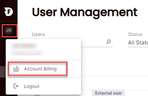

# Billing

Firebolt bills are based on the consumption of resources within your account. This includes the total amount of data stored and engine usage.

* **Data storage** usage is calculated on the daily average amount of data (in bytes) stored under your Firebolt account name for indexes and raw compressed data.

* **Engine resources** usage is calculated with **one-second granularity** between the time Firebolt starts to provision the engine and when the request to terminate the engine is submitted. Warmup time for caching indexes and raw data is counted in engine usage time.

## Invoices

Invoices for Firebolt engines and data are submitted through the AWS Marketplace. The final monthly invoice is available on the third day of each month through the AWS Marketplace. A billing cycle starts on the first day of the month and finishes on the last day of the same month.

## Viewing billing information

Users with the **Account Admin** role can monitor the cost history of an account.

**To view cost information for your account**

* Choose the user profile icon and then choose **Account Billing**.  

  

The **Accounts & Billing** page shows accrued charges for **Storage** and **Compute** for the most recent month to date. Choose the month for which you want to view billing history. To view a summary of daily charges, choose **Day in month** from the list. Choose **Month in year** to view a summary of monthly charges.

{: .caution}
The **AWS account id** on this page is your *Firebolt AWS account* ID. It is **not** the *customer AWS account* under which you are billed.
