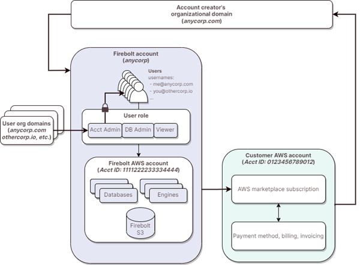
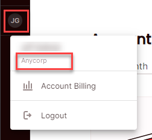
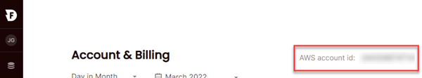

# Firebolt account concepts and terminology
{: .no_toc}

This topic covers concepts that are important to understand when you subscribe to Firebolt through the AWS Marketplace, and for Account Admins to understand account management, user management, and billing.

The illustration below shows a simplified overview of concepts related to account and user management.

* Topic ToC
{: toc}

## Account creator's organizational domain

When you create an account with Firebolt, you must provide an email address with an *organizational domain*, for example, `me@anycorp.com`. Firebolt uses the organizational domain to create a Firebolt account of the same name, for example `anycorp`.

## Customer AWS account

Your *customer AWS account* is the AWS account that you use to create the subscription request in the AWS Marketplace. After your Firebolt account is created, Firebolt uses this AWS account to send your company invoices and collect payments through the AWS Marketplace. This account must be in good standing with AWS and error free, or you may encounter issues accessing Firebolt.

Before you make changes to your customer AWS account&mdash;for example, linking your Firebolt account to a different customer AWS account&mdash;contact Firebolt Support through the Help menu support form. 

If you have issues with your existing customer AWS account, contact [AWS Support](https://console.aws.amazon.com/support/).

## Firebolt account

An *account name* identifies your Firebolt account. The account name is the same as the organizational domain name that you use in your email when you create your account. Firebolt supports only one account per organizational domain, and account names are globally unique&mdash;no accounts can have the same name. Accounts are not restricted to users in the same organizational domain. You can invite users from any organizational domain to your Firebolt account.

**To view the Firebolt account name for your current Firebolt session**

* Choose the user profile icon.

  The Firebolt account name appears just under your user name.

  

  {: .note}
  When you use the Firebolt account name programmatically or in scripts, the account name is always all lowercase and case-sensitive.

## Firebolt AWS account

The *Firebolt AWS account* is a customer-dedicated AWS account that is associated with your Firebolt account name. Firebolt uses this account to identify and isolate your database and engine endpoints, to provision engines, and to store your data within Firebolt. You specify the account ID of this Firebolt AWS account whenever you need Firebolt to interact with resources in AWS&mdash;for example, when you ingest Amazon S3 data or use `COPY TO` to write output to S3.

**To view the Firebolt AWS account ID for your current Firebolt session**

* Choose the user profile icon and then choose **Account Billing**.  

  

  The Firebolt AWS account ID is listed in the upper right of the **Account & Billing** screen.  

  

A single username can have access to any number of Firebolt accounts.

**To switch between multiple Firebolt accounts that you are allowed to access**

1. Choose the user profile icon and then choose **Account Billing**.

2. Choose **Switch Account** (available only if you have more than one account associated with the current login.)

3. Choose the account name to switch to from the list.

## Users and Firebolt usernames

Firebolt *users* are invited to join a Firebolt account by another user who is an Account Admin. When sending an invitation, the Account Admin chooses the user's *role*: Account Admin, DB Admin, or Viewer. The role determines the user's permission level throughout the account. A user who is an Account Admin can invite users with emails from different organizational domains to join an account.

Users can't have personal email addresses for their usernames (for example, `me@gmail.com` or `you@outlook.com`). The email address that the Account Admin uses to send an invitation becomes that user's Firebolt username. A single user with the same username can have access to multiple Firebolt accounts.

For more information, see [Managing users](managing-users.md).
