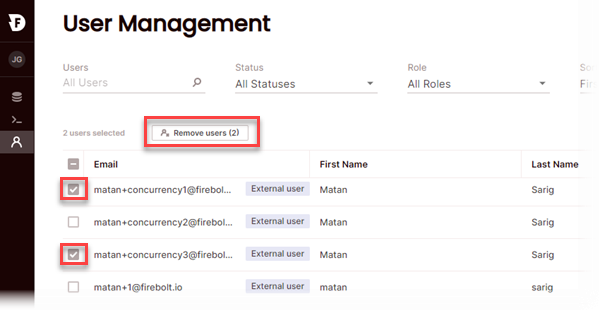

# Managing Firebolt users
{: .no_toc}

Each user in Firebolt has an email address that serves as the Firebolt username. Each user is also assigned a role that determines the user's permissions within the account. This topic explains the permissions associated with each user role, followed by instructions for Account Admins for adding and removing users.

* Topic ToC
{:toc}

## Firebolt roles and allowed actions

Each user in a Firebolt account is assigned one of the roles listed below.

* Viewer
* DB Admin
* Account Admin

Permissions apply throughout the account. The actions allowed for each role are listed below.

| Action                           | Viewer | DB Admin | Account Admin |
| :----------------------------    | :----- | :------- | :------------ |
| **Databases**                    |        |          |               |
| View all databases in account    | ✅     | ✅       | ✅            |
| Create databases                 | ❌     | ✅       | ✅            |
| Drop (delete) databases          | ❌     | ✅       | ✅            |
| **Engines**                      |        |          |               |
| View all engines in account      | ✅     | ✅       | ✅            |
| Create engines                   | ❌     | ✅       | ✅            |
| Drop (delete) engines            | ❌     | ✅       | ✅            |
| Update engines                   | ❌     | ✅       | ✅            |
| Start engines                    | ❌     | ✅       | ✅            |
| Stop engines                     | ❌     | ✅       | ✅            |
| **Tables and table data**        |        |          |               |
| Create tables                    | ✅     | ✅       | ✅            |
| Drop (delete) tables             | ✅     | ✅       | ✅            |
| Ingest (INSERT INTO)             | ❌     | ✅       | ✅            |
| Run analytics queries            | ✅     | ✅       | ✅            |
| **Accounts and users**           |        |          |               |
| View Firebolt AWS Account #      | ❌     | ❌       | ✅            |
| Invite, update, and remove users | ❌     | ❌       | ✅            |

## Adding users

An Account Admin invites a user to join a Firebolt account. The invitation is sent to the user's email address, which serves as the user's Firebolt username after the user accepts the invitation. Account Admins can only invite users with organizational domains, such as `you@anycorp.com`. Firebolt does not support usernames with personal email addresses, such as `me@gmail.com` or `you@outlook.com`. Before sending the invitation, the Account Admin chooses the role associated with the user.

**To add a Firebolt user or users to a Firebolt account**

1. In the Firebolt Manager, choose the **User Management** icon in the navigation pane. If the icon isn't available, you don't have Account Admin permissions.  
  

2. Choose **Invite Users**.

3. Under **Add emails**, enter the business email of the user to invite. Use commas to separate multiple email addresses.

4. Under assign roles, choose the role to associate with each user listed, and then choose **Invite**.  

  An invitation email is sent to the email address(es) that you entered. The invitation has a link to accept the invitation and log in to Firebolt for the first time.

## Configuring MFA for users (Beta)

Multi-factor authentication (MFA) reduces the likelihood that a bad actor can use stolen credentials to access Firebolt. MFA requires a user to provide two forms of authentication when accessing Firebolt. The first form is the username and password. The second is a one-time password (OTP). An MFA-enrolled user must have an OTP generator app that provides a unique OTP each time they log in.

### Considerations and limitations
{: .no_toc}

* Firebolt supports common OTP generator apps such as Google Authenticator, Microsoft Authenticator, Authy, and Auth0 Guardian.

* Voice and SMS authentication are not supported.

* Programmatic access using an MFA-enabled Firebolt user is not supported. When you use the Firebolt REST API, a Firebolt SDK, the Firebolt CLI, a driver, or an integration connector, specify credentials associated with a Firebolt user that is not MFA-enabled.

### Enabling and disabling MFA for users
{: .no_toc}

To enable MFA for users, you use the Firebolt Manager to send an enrollment message to the users' email addresses with a link to enroll in MFA using a QR code. When a user enrolls in MFA from the email, the status in Firebolt updates to **MFA enabled**.

**To enable MFA for a Firebolt user or group of users**

1. In the Firebolt Manager, choose the **User Management** icon in the navigation pane. If the icon isn't available, you don't have Account Admin permissions.    
  

2. From the list of users, select the user or users to enable for MFA.

3. Choose the **Enable MFA** button.  
  Firebolt prompts you to confirm.

4. Choose **Send enrollment**.  
  Each MFA-enabled user is updated with **Send Enrollment** in the **MFA** column. 

**To send another enrollment mail**

* After you enable MFA, you might need to send a user another enrollment mail. To do this, choose **Send Enrollment** in the **MFA** column. 

**To disable MFA for a Firebolt user**

1. In the Firebolt Manager, choose the **User Management** icon in the navigation pane. If the icon isn't available, you don't have Account Admin permissions.    
  

2. From the list of users, select the user or users to disable for MFA.

3. Choose the **Disable MFA** button.  
  Firebolt prompts you to confirm.

4. Choose **Disable MFA**.

## Allowing and blocking source IP addresses for users (Beta)

By default, Firebolt accepts traffic from authenticated Firebolt users from any IP address. As an additional layer of security, you can configure each Firebolt user so that their traffic must originate only from IP addresses that you specify. For each user, you can specify a list of IP addresses from which traffic is allowed (the allow list) and a list of IP addresses from which traffic is denied (the blocked list).

The IP allow lists and blocked lists for users are comma-separated IPv4 addresses and IPv4 address ranges in CIDR format. You can apply the same list to one or many users, and each user can have unique lists. You can specify lists manually or import lists of addresses and ranges from a CSV file saved locally.

**To configure IP lists for Firebolt users**

1. In the Firebolt Manager, choose the **User Management** icon in the navigation pane. If the icon isn't available, you don't have Account Admin permissions.    
  

2. From the list of users, select the user or users to configure.

3. Choose the **Create IP lists** button.  

4. In the lists to grant and block access, enter the list of IP addressess and/or CIDR ranges separated by commas, or choose **Import file** to read IP addresses from a CSV file.

5. Choose **Save**.  
  For each user, the **Allowed IPs** and **Blocked IPs** updates to reflect the total number of IP addresses from each list that you specified for that user.

**To edit the IP lists for a Firebolt user**

* Choose the ellipses to the right of the user in the **User Management** list and then choose **Edit IP lists**.

## Changing a user's role

Account Admins can edit a user's role. 

**To change a user's role**

1. To the far right of a user in the User Management list, select the ellipses and then choose **Edit User Details**.

2. Choose the role to assign, and then choose **Update user details**.

## Removing users

The **Remove users** button appears when you select a user from the list in the **User Management** screen.

**To remove users**

1. In the Firebolt Manager, choose the **User Management** icon in the navigation pane. If the icon isn't available, you don't have Account Admin permissions.

2. Select a user or users from the list, and then choose **Remove users**.  
  

3. When prompted to confirm, review the usernames to remove, and then choose **Remove**.
