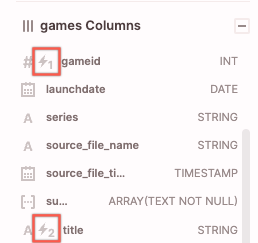

# Release notes archive
{: .no_toc}

We provide an archive of release notes for your historical reference.

* Topic ToC
{:toc}

## DB version 3.21.0 
**March 2023**

* [New features](#new-features)
* [Enhancements, changes, and new integrations](#enhancements-changes-and-new-integrations)
* [Resolved issues](#resolved-issues)
  
### New features

* **Data manipulation commands now available** (Beta release)

  Beta support is now available for data manipulation commands [UPDATE](../sql-reference/commands/update.md) and [DELETE](../sql-reference/commands/delete.md). A [VACUUM](../sql-reference/commands/vacuum.md) has also been added to optimize frequently updated tables.

  For more information and known limitations in the beta release, please see linked documentation. 

### Enhancements, changes, and new integrations

* <!--- FIR-18674 —--> **Updates to data types**

  Firebolt now uses the following built-in type names in `INFORMATION_SCHEMA.COLUMNS` and in auto-generated aliases for `CAST` operations:

    | Standard type | Synonyms |
    | :-------------- | :------- | 
    | `TEXT`          | `STRING`, `VARCHAR` |
    | `INTEGER`       | `INT`, `INT4` |
    | `BIGINT`        | `LONG`, `INT8` |
    | `REAL`          | `FLOAT`, `FLOAT4` |
    | `DOUBLE PRECISION` | `DOUBLE`, `FLOAT8` |
    | `NUMERIC`       | `DECIMAL` |

* <!---FIR-21575---> **Parquet, Avro and ORC support added for new data types**

  These file types can now be used to ingest new `PGDATE`, `TIMSTAMPNTZ` and `TIMESTAMPTZ` data types. For more information see [data type documention](../general-reference/data-types.md#date-and-time).

  Starting in the next version, you will have the option to use the type names `DATE` and `TIMESTAMP` instead of new type names `PGDATE` and `TIMESTAMPNTZ`, but data must be reingested using the new types before this option is enabled. `TIMESTAMPTZ` will remain the same, as that is a new type added. See [here](release-notes-archive.md#db-version-3200) for instructions to reingest. Please raise any questions or feedback with your Customer Success team. 

### Resolved issues

* <!--- FIR-20551 —-->Fixed an error `Cannot parse input: expected <END OF LINE>` on ingest of large CSV files.

## DB version 3.20.0 
**March 2023**

* [Enhancements, changes, and new integrations](#enhancements-changes-and-new-integrations)
* [Resolved issues](#resolved-issues)
  
### Enhancements, changes, and new integrations

* <!--- FIR-20900 —--> **Function support added for new `PGDATE`, `TIMESTAMPTZ`, and `TIMESTAMPNTZ` data types**

  The following new and updated functions can now be used with new data types `PGDATE`, `TIMESTAMPTZ`, and `TIMESTAMPNTZ`.

  * [TO_CHAR](../sql-reference/functions-reference/to-char-new.md)
  * [CURRENT_PGDATE](../sql-reference/functions-reference/current-pgdate.md)
  * [LOCALTIMESTAMPNTZ](../sql-reference/functions-reference/localtimestampntz.md)
  * [CURRENT_TIMESTAMPTZ](../sql-reference/functions-reference/current-timestamptz.md)
  * [TO_TIMESTAMPTZ](../sql-reference/functions-reference/to-timestamptz.md)

{: .warning}
  >**To use the new data types, new external and dimension/fact tables must be created. Reingest will be required to recognize new precision.**
  >* To ingest from an existing table into a new table using the new types, simply cast a column of type `DATE` to `PGDATE` and a column of type >`TIMESTAMP` to `TIMESTAMPNTZ`. 
  >* To ingest into a new table using the new types from external data, create an external table with the new types.
  >
  >In a future version, you will have the option to use the type names `DATE` and `TIMESTAMP` instead of new type names `PGDATE` and `TIMESTAMPNTZ`, but data must be reingested using the new types before this option is enabled. `TIMESTAMPTZ` will remain the same, as that is a new type added. Please raise any questions or feedback with your Customer Success team. 

* <!--- FIR-18850 —--> **Changed NULL behavior of `CONCAT` function**

  NULL inputs to [the `CONCAT` function](../sql-reference/functions-reference/concat.md) are now treated as empty strings, therefore any NULL inputs are ignored. When all inputs are NULL, the result will be an empty string. When using `||`, any NULL input still results in a NULL output.

{: .warning}
  >If you are using the `CONCAT` function on strings with NULL inputs and you don't want NULL values to be ignored, you will need to use the `||` function instead.
  
* <!--- FIR-21015 —--> **Additional syntax for ARRAY data type names**

  Syntax options for defining columns with [the `ARRAY` data type](../general-reference/data-types.md#array) have been updated to include `<data-type>[]` and `<data-type> ARRAY`. Array element type is nullable when using the new syntax options. 

  For example, the following three queries will create tables with the same `demo_array` column of type `ARRAY` of nullable `TEXT`.

  ```sql
  CREATE DIMENSION TABLE demo1 (
  demo_array ARRAY(TEXT NULL)
  );
  
  CREATE DIMENSION TABLE demo2 (
  demo_array TEXT[]
  );

  CREATE DIMENSION TABLE demo3 (
  demo_array TEXT ARRAY
  );
  ```
 To specify the constraint for an array element to be not nullable, you must then use `ARRAY(<data-type> NOT NULL)` syntax.

* <!--- FIR-20822 —--> **Added flag support for `REGEXP_LIKE`**

  The [`REGEXP_LIKE` function](../sql-reference/functions-reference/regexp-like.md) now supports an optional `<flag>` input, to allow additional controls over the regular's expression matching behavior.

  For example, the `i` flag causes the regular expression matching in the following query to be case-insensitive. Without this flag, the query would not find a match and would return `0`.

  ```sql
  SELECT
	  REGEXP_LIKE('ABC', '[a-z]', 'i'); ---> 1
  ```

* <!--- FIR-20808 —--> **Parquet and ORC support added for binary data type**

  Binary type data from external Parquet or ORC file types will now be ingested directly with [the data type `BYTEA`](../general-reference/bytea-data-type.md#importing-bytea-from-external-source). Previously, data were ingested as type `TEXT` and then converted to data type `BYTEA`. 

* <!--- FIR-21179 —--> **Export all results from the SQL Workspace**  (UI release)

  [Exporting the entire results section](../using-the-sql-workspace/using-the-sql-workspace.md#exporting-results-to-a-local-hard-drive) from the SQL Workspace in CSV or JSON format is now supported.

* <!--- FIR-19287 —--> **Renamed column from `information_schema.tables`**

  Renamed the `number_of_segments` column from `information_schema.tables` to `number_of_tablets` to better reflect Firebolt's data structure.

* <!--- FIR-21118 —--> **Added support for empty statements**

  Empty statements containing comments only are now supported and will run without error. 

  ```sql
  SELECT
	  REGEXP_LIKE('ABC', '[a-z]', 'i'); ---> 1
  ```

* <!--- FIR-20808 —--> **Parquet and ORC support added for binary data type**

  Binary type data from external Parquet or ORC file types will now be ingested directly with the data type `BYTEA`. Previously, data were ingested as type `TEXT` and then converted to data type `BYTEA`. 

* <!--- FIR-21118 —--> **Added support for empty statements**

  Empty statements containing comments only are now supported and will run without error. 

* <!--- FIR-21179 —--> **Export all results from the SQL Workspace**

  [Exporting the entire results section](../using-the-sql-workspace/using-the-sql-workspace.md#exporting-results-to-a-local-hard-drive) from the SQL Workspace in CSV or JSON format is now supported.

* <!--- FIR-19287 —--> **Renamed column from `information_schema.tables`**

  Renamed the `number_of_segments` column from `information_schema.tables` to `number_of_tablets` to better reflect Firebolt's data structure.

* <!--- FIR-21118 —--> **Added support for empty statements**

  Empty statements containing comments only are now supported and will run without error. 

### Resolved issues

* <!--- FIR-20808 —-->Fixed an issue where `AVG` and `SUM` functions performed on large `DECIMAL` columns produced an error; results now use the same precision and scale as the input type. 

## DB version 3.19.0 
**February 2023**

* [New features](#new-features)
* [Enhancements, changes, and new integrations](#enhancements-changes-and-new-integrations)

### New features

* <!--- FIR-16297 —--> **New date and time data types**

  Added support for new date and timestamp data types:

  * [PGDATE](../general-reference/date-data-type.md)
  * [TIMESTAMPNTZ](../general-reference/timestampntz-data-type.md)
  * [TIMESTAMPTZ](../general-reference/timestamptz-data-type.md)

  The new data types use an improved memory layout providing a much higher supported range, now extending from `0001-01-01[ 00:00:00.000000]` to `9999-12-31[ 23:59:59.999999]`. This change also extends the syntax for specifying intervals used for arithmetic with dates and timestamps. In addition to the previously supported interval syntax, you can now also write `interval 'N' unit`, where `N` is a possibly signed integer, and `unit` is one of `year`, `month`, `day`, `hour`, `minute`, or `second`, matched case-insensitively.

  The previously supported `DATE` and `TIMESTAMP` data types are planned for deprecation in the future. New features and functionality will be built to support the new date and timestamp data types, rather than these legacy types. 
  
  **To use the new data types, new external and dimension/fact tables must be created. Reingest will be required to recognize new precision.**
  * To ingest from an existing table into a new table using the new types, simply cast a column of type `DATE` to `PGDATE` and a column of type `TIMESTAMP` to `TIMESTAMPNTZ`. 
  * To ingest into a new table using the new types from external data, create an external table with the new types.

  {: .warning}
  The new syntax can break the semantics of existing SQL queries. Previously, the `unit` part of the expression was treated as a column alias, and now it's treated as part of the interval literal. For example, if you wrote `SELECT DATE '2023-01-10' + interval '42' day;`, you would get back a table with one column called `day` and the value `2023-01-10 00:00:42`. Now, you will get a back a table with one column (unspecified name) and the value `2023-02-21 00:00:00`.<br>If you want to retain the old behavior, use `AS`, for example: `SELECT DATE '2023-01-10' + interval '42' AS day;`.

* <!--- ---> **New setting for time zone**

  [New setting](../general-reference/system-settings.md#set-time-zone) `time_zone` controls the session time zone. The default value of the `time_zone` setting is UTC.

* <!--- FIR-13488, FIR-20666 ---> **New keyboard shortcuts** (UI release)

  Use new [keyboard shortcuts](../using-the-sql-workspace/keyboard-shortcuts-for-sql-workspace.md) in the SQL workspace to cancel a query, or go to a specific line in your script.  

    * Cancel a running script with **Ctrl + Alt + k** for Windows & Linux, or **⌘ + Option + k** for Mac
    * Go to a desired line with **Ctrl + l** for Windows & Linux, or **⌘ + l** for Mac
  
### Enhancements, changes, and new integrations

* <!--- FIR-16389 —--> **Improved join index performance**

  [Join indexes](../using-indexes/using-join-indexes.md) just got better: profit from their extreme performance benefits without any configuration. Moreover, there is no more need to manually create or refresh – the results are always up to date even if the underlying data changed.  With this optimization, we've seen real-world, production queries run 200x faster.

  To see how this works, let’s look at an example. Say we have the following query pattern which is run hundreds of times per second with different values for `l.player_id` and `l.date`:

  ```sql
  SELECT r.name, SUM(l.score) 
  FROM   game_plays as l
  JOIN   player_info as r 
  ON     l.player_id = r.player_id
  WHERE  l.player_id = XXX AND l.date = YYY
  GROUP  BY r.name;
  ```

  On the first run of this query, the relevant data from the right-hand side table `player_info` is read and stored in a specialized data structure, which is cached in RAM. This can take tens of seconds if the `player_info` table is large (e.g., contains millions of rows). However, on subsequent runs of the query pattern, the cached data structure can be reused - so all subsequent queries will only take a few milliseconds (if the left-hand side with potential field restrictions is small, as here).

  **Requirements for query optimization**
    * The right side of the join in the query must be directly a table. Subselects are not supported.
    * Restrictions on fields from the right side of the join need to be applied in an `OUTER SELECT`, wrapping the query.
    * Since the join index data structure is cached in RAM, the right side table may not be too large (by default the size of the cache is limited to 20% of the RAM).
    * All types of joins (INNER, LEFT, RIGHT, …) are supported.
    * The right table in the join can be a FACT or DIMENSION table.  

* <!--- FIR-11922 —-->**Improved cache eviction**

  Cache eviction process and stability has been improved. Tablet eviction is now managed by a Least Recently Used (LRU) algorithm, which provides smarter eviction and keeps the data that is most likely to be accessed in the engine cache.

* <!--- FIR-17198 —-->**Added syntax option for setting TYPE options in CREATE EXTERNAL TABLE**
  
  Added the option to set type options for S3 source files at the same level as `TYPE` is set. [Type option](../sql-reference/commands/create-external-table.md#type) can now be defined as in the example below:

  ```sql
  CREATE EXTERNAL TABLE ex_table( ... )
  TYPE=(CSV)
  ALLOW_COLUMN_MISMATCH=true
  ...
  ```

  as well as with the original syntax: 

  ```sql
  CREATE EXTERNAL TABLE ex_table(...)
  TYPE=(CSV ALLOW_COLUMN_MISMATCH=true)
  ...
  ```

* <!--- FIR-20566 —-->**Default DECIMAL scale changed**

  The default scale for the `DECIMAL` [data type](../general-reference/decimal-data-type.md) has been updated from 0 to 9. 


## DB version 3.17.0
February 2023

* [New features](#new-features)
* [Enhancements, changes, and new integrations](#enhancements-changes-and-new-integrations)
* [Resolved issues](#resolved-issues)

### New features

* <!--- FIR--17030 --->**Added support for GROUP BY ALL**

  Instead of explicitly listing all grouping elements in the `GROUP BY` clause, [use `GROUP BY ALL`](../sql-reference/commands/select.md#group-by-all) to automatically infer them from the `SELECT` list.

* <!--- FIR-16795 —-->**New BYTEA data type**

  Use the new [`BYTEA` data type](../general-reference/bytea-data-type.md) to store binary data, like images, other multimedia files, or raw bytes of information.

* <!--- FIR-16922 —-->**New functions [ENCODE](../sql-reference/functions-reference/encode.md) and [DECODE](../sql-reference/functions-reference/decode.md)**

  Use [these functions](../sql-reference/functions-reference/index.md#bytea-functions) with the new `BYTEA` data type to encode binary data into a SQL expression of type `TEXT`, and decode from type `TEXT` to type `BYTEA`.

* <!--- FIR-17196 --->**Added support for EXCLUDE columns in SELECT * **


  [Added support for `EXCLUDE` columns in SELECT *](../sql-reference/commands/select.md#select-wildcard) to define which columns to exclude from a SELECT wildcard expansion. 

* <!--- FIR-16745 --->**New setting for parsing literal strings**

  [New setting](../general-reference/system-settings.md#enable-parsing-for-literal-strings) `standard_conforming_strings` controls whether strings are parsed without escaping, treating backslashes literally.

* <!--- FIR-13489 --->**New keyboard shortcuts** (UI release)

  Use new [keyboard shortcuts](../using-the-sql-workspace/keyboard-shortcuts-for-sql-workspace.md) in the SQL workspace to save and close scripts, and expand or collapse the results pane. 

    * Close the current script in the SQL workspace with **Ctrl + Alt + x** for Windows & Linux, or **⌘ + Option + x** for Mac
    * Close all scripts in the SQL workspace with **Ctrl + Alt + g** for Windows & Linux, or **⌘ + Option + g** for Mac
    * Close all scripts except the one you are working on in the SQL workspace with **Ctrl + Alt + o** for Windows & Linux, or **⌘ + Option + o** for Mac
    * Save the current script in the SQL workspace with **Ctrl + Alt + s** for Windows & Linux, or **⌘ + Option + s** for Mac
    * Expand or collapse the results pane in the SQL workspace with **Ctrl + Alt + e** for Windows & Linux, or **⌘ + Option + e** for Mac

### Enhancements, changes, and new integrations

* <!--- FIR-12244 —-->**Added support for CREATE TABLE as an alias for CREATE FACT TABLE**

  [Added support for `CREATE TABLE` syntax](../sql-reference/commands/create-fact-dimension-table.md), with the default as fact table. `PRIMARY INDEX` is now also optional for fact tables.

* <!--- FIR-17189 --->**Added support for the DECIMAL data type with the ARRAY\_SORT function**

  [ARRAY_SORT](../sql-reference/functions-reference/array-sort.md) has been added as a function supporting the [DECIMAL data type](../general-reference/decimal-data-type.md#supported-functions-beta-release).

* <!--- FIR-11888 --->**Minimize results in the SQL workspace** (UI release)

  The results pane in the SQL workspace can now be minimized. Expand or collapse by double-clicking on the "Results" pane header, using the height control button to drag and change the size of the pane as desired, or using the keyboard shortcut **Ctrl + Alt + e**  for Windows & Linux, or **⌘ + Option + e** for Mac.

  

* <!--- FIR-10855 --->**Primary index columns highlighted in columns object viewer** (UI release)

  The columns pane in the object viewer now highlights columns that are part of a table's primary index, making it easier to identify primary indexes and the order of the columns in the primary index. 

  

### Resolved issues

* <!--- FIR-9797 —-->Fixed an issue where `COPY TO` export file size was limited to 2GB.

* <!--- FIR-14828 --->Fixed an issue that allowed more than one argument in `CONCAT`.

* <!--- FIR-11381 —-->Returns an error when dynamic functions are used in aggregating indexes. 

## December 2022

* [New features](#new-features)
* [Enhancements, changes, and new integrations](#enhancements-changes-and-new-integrations)

### New features

*  <!--- FIR-3917 —-->**Added support for CSV TYPE options on ingest** (DB version 3.14.0)

  Added support for additional TYPE options for the [CREATE EXTERNAL TABLE command](../sql-reference/commands/create-external-table.md#type), to allow configuration for ingesting different CSV file formats. Some of these options may be available in previous versions. 

  * `[ALLOW_DOUBLE_QUOTES = {TRUE|FALSE}]`, `[ALLOW_SINGLE_QUOTES = {TRUE|FALSE}]`: Define that unescaped double or single quotes in CSV input file will not cause an error to be generated on ingest. 

  * `[ALLOW_COLUMN_MISMATCH = {TRUE|FALSE}]`: Defines that the number of delimited columns in a CSV input file can be fewer than the number of columns in the corresponding table. 

  * `[ALLOW_UNKNOWN_FIELDS = {TRUE|FALSE}]`: Defines that the number of delimited columns in a CSV input file can be more than the number of columns in the corresponding table. 

  * `[ESCAPE_CHARACTER = {‘<character>’|NONE}`: Defines which character is used to escape, to change interpretations from the original. 

  * `[FIELD_DELIMITER = '<field_delimeter>']`: Defines a custom field delimiter to separate fields for ingest. 

  * `[NEW_LINE_CHARACTER = '<new_line_character>']`: Defines a custom new line delimiter to separate entries for ingest. 

  * `[NULL_CHARACTER = '<null_character>']`: Defines which character is interpreted as `NULL`. 

  * `[SKIP_BLANK_LINES {TRUE|FALSE}]`: Defines that any blank lines encountered in the CSV input file will be skipped. 

### Enhancements, changes, and new integrations

* <!--- FIR-16182 —--> **Added support for nullable arrays** (DB version 3.11.0)

  Nullable type is now generally available for arrays, enabled for DB version 3.11 and above. 

## November 2022

* [New features](#new-features)
* [Enhancements, changes, and new integrations](#enhancements-changes-and-new-integrations)
* [Resolved issues](#resolved-issues)

### New features

* <!--- FIR-15968, FIR-15744 —-->**Added support for functions** (DB version 3.13.0)

  * [FIRST_VALUE](../sql-reference/functions-reference/first-value.md): Returns the first value evaluated in the specified window frame.
  * [NTH_VALUE](../sql-reference/functions-reference/nth-value.md): Returns the value evaluated of the nth row of the specified window frame (starting at the first row).
  * [NTILE](../sql-reference/functions-reference/ntile.md): Divides an ordered data set equally into a specified number of buckets.
  * [CUME\_DIST](../sql-reference/functions-reference/cume-dist.md): Calculates the relative rank (cumulative distribution) of the current row in relation to other rows in the same partition within an ordered data set.
  * [PERCENT\_RANK](../sql-reference/functions-reference/percent-rank.md): Calculates the relative rank of the current row within an ordered data set.
  * [PERCENTILE\_CONT (aggregation function)](../sql-reference/functions-reference/percentile-cont.md): Calculates a percentile, assuming a continuous distribution of values.
  * [PERCENTILE\_CONT (window function)](../sql-reference/functions-reference/percentile-cont-window.md): Calculates a percentile over a partition, assuming a continuous distribution of values.
  * [PERCENTILE\_DISC (aggregation function)](../sql-reference/functions-reference/percentile-disc.md): Returns a percentile for an ordered data set, equal to a specific column value.
  * [PERCENTILE\_DISC (window function)](../sql-reference/functions-reference/percentile-disc-window.md): Returns a percentile over a partition for an ordered data set, equal to a specific column value.


* <!--- FIR-15007 —-->**Added support for TRUNCATE TABLE command** (DB version 3.11.0)
  
  Use the [TRUNCATE TABLE](../sql-reference/commands/truncate-table.md) command to remove all rows from a table. 

* <!--- FIR-12587 —-->**Added support for DECIMAL data type** (DB version 3.13.0)

  Beta support for the [DECIMAL](decimal-data-type.md) data type is coming in version 3.13. 

  {: .warning}
  In previous versions, DECIMAL type columns are stored as DOUBLE type. Therefore, this change may require your action. Restart analytics engines before general purpose engines to use this new feature, and see below for additional actions. 
  
  **If your existing data model contains tables defined with DOUBLE type columns:**
  * If you want to preserve the DOUBLE data type going forward, no change is required. The DECIMAL data type can be used for new tables/columns.
   
  **If your existing data model contains tables defined with DECIMAL type columns:**
   * If you do not want to change your tables, no action is required. These columns will just show up as type DOUBLE. You can safely use the DECIMAL type for new tables/columns.

   * If your table defined with columns as DECIMAL are recreated periodically (by your ELT process), new columns will be defined as DECIMAL(38,0) – default precision and scale. If you don’t want to switch to the DECIMAL data type for the existing data flows, you can change your ELT flows and replace the DECIMAL keyword with DOUBLE.

   * If you are using a function with a DECIMAL type in your ELT process, ensure that function is [supported for the DECIMAL data type](decimal-data-type.md#supported-functions-beta-release).  

   * To change the data type of columns defined as DECIMAL but stored as DOUBLE, you will need to recreate the table with the new definition (column defined as DECIMAL(p,s)). To avoid precision loss, we highly recommend re-ingesting the data from the source (i.e., via external table) rather than casting values to decimal from the existing table (i.e., `INSERT INTO new_table(d) SELECT CAST(d as DECIMAL(38,9)) FROM old_table;`).
   
   * To avoid any downtime for the end-users in scenarios involving re-creating and re-ingesting the table, we suggest creating a view that reads from the existing table (`old_table`). After the new table (`new_table`) is created and data is ingested, repoint the view to the new table name (`new_table`) using the `CREATE OR REPLACE VIEW` command. 
 
  **Examples of changes in behavior**
 
  * Comparing two values that differ by a small offset yields different results when stored as DECIMAL vs. DOUBLE, because DOUBLE is a variable-precision data type, whereas DECIMAL is exact with fixed precision:
  ```sql
      SELECT '1.00000000000000000000000005'::DECIMAL(38,30) = '1.00000000000000000000000004999'::DECIMAL(38,30); -- false
      SELECT '1.00000000000000000000000005'::DOUBLE = '1.00000000000000000000000004999'::DOUBLE;  --true
  ```

  * Expressions involving DECIMAL data types with different precision and scale will yield an error:
  ```sql
    SELECT 3::DECIMAL + 2::DECIMAL(3,1); -- Invalid operation error: Operations between decimals with different precision and scale is not supported at the moment. Explicitly cast one of the decimals to other decimal precision and scale.
  ```

  * Functions `ROUND`, `TO_STRING`, and `TO_TEXT` applied on DECIMAL will return the data type matching the input data type. 

### Enhancements, changes, and new integrations

* <!--- FIR-16295 —-->**Information schema updated** (DB version 3.13.0)

  Added `cpu_usage_us` and `cpu_delay_us` columns to the [information_schema.query_history view](../general-reference/information-schema/query-history-view.md) view.
  
### Resolved issues

* Fixed an issue that caused degraded performance of the cache evictor. (DB version 3.13.0)


## October 2022

* [New features](#new-features)
* [Enhancements, changes, and new integrations](#enhancements-changes-and-new-integrations)

### New features

* <!--- FIR-15853 —-->**Added support for functions REGEXP\_REPLACE and REGEXP\_REPLACE\_ALL**
**(DB version 3.11.0)**

  Use these functions to replace matching patterns in the input with a replacement. The [REGEXP\_REPLACE](../sql-reference/functions-reference/regexp-replace.md) function replaces the first match only (from the left), [REGEXP\_REPLACE\_ALL](../sql-reference/functions-reference/regexp-replace.md) function replaces all the matches.

### Enhancements, changes, and new integrations

* <!--- FIR-14886 —-->**Added support for “OR” operator for JOIN**
**(DB version 3.11.0)**

  Allows performing JOINs with multiple join conditions linked via the “OR” operator

* <!--- FIR-15683 —-->**Updated syntax to generate an aggregating index**
**(DB version 3.11.0)**

  The [CREATE AGGREGATING INDEX](../sql-reference/commands/create-aggregating-index.md) command will now generate the aggregating index, without using the additional AND GENERATE clause. 

* <!--- FIR-15452 —-->**Added support for window function frame definitions**
**(DB version 3.11.0)**

  Add support for n PRECEDING, n FOLLOWING, and CURRENT ROW when defining the frame start and end in window functions.

* <!--- FIR-15022 —-->**VERSION() function now available**
**(DB version 3.8.0)**

  Query the engine version using the new [VERSION()](../sql-reference/functions-reference/version.md) function. Engine version is also now available as a column in the [information\_schema.engines](../general-reference/information-schema/engines.md) view. 

* <!--- FIR-15152 —--> **Information schema updated**
**(DB version 3.8.0)**

  System-defined tables metadata can now be queried via the [information\_schema.tables](../general-reference/information-schema/tables.md) view.

## August 2022

* [Enhancements, changes, and new integrations](#enhancements-changes-and-new-integrations)
* [Resolved issues](#resolved-issues)

### Enhancements, changes, and new integrations

* **Firebolt .NET SDK now available**

  The Firebolt .NET SDK can be used to connect to Firebolt from .NET applications. The SDK supports .NET Core and is available at [NuGet FireboltNetSDK](https://www.nuget.org/packages/FireboltNetSDK/0.0.1).

* **Firebolt Go SDK now available**

  The Firebolt Go SDK can be used to connect to Firebolt from Go applications. The SDK implements the Go database/sql driver specification. For more details, see the package listing at [Firebolt Go SDK](https://pkg.go.dev/github.com/firebolt-db/firebolt-go-sdk).

* **Information schema updated**
  **(DB version 3.7.0)**

  query\_history and running\_queries views can now be queried via the information\_schema.

  For more information, see [Information schema for query history](../general-reference/information-schema/query-history-view.md) and [Information schema for running queries](../general-reference/information-schema/running-queries.md).

* **Added support for Multi-factor authentication (MFA)**
  **(Beta)**

  Firebolt now supports Multi-factor authentication. 
 
  You can enable MFA for users or groups with the Firebolt Manager which sends a link to enroll in MFA using a QR code. When a user enrolls in MFA from the email, the status in Firebolt updates to **MFA enabled**.

  **To enable MFA for a Firebolt user or group of users** choose the **User Management** icon in the navigation pane. If the icon isn't available, you don't have Account Admin permissions. 
    
  
  
  For more information, see [Configuring MFA for users (Beta)](../managing-your-account/managing-users.md#configuring-mfa-for-users-beta).

* **Added support for the hll\_count\_distinct(input, [, precision]) function**
  **(DB version 3.7.0)**

  Allows for precision control of the count(distinct <expr>) function with an optional precision parameter.
  
  Requires less memory than exact aggregation functions, like `COUNT(DISTINCT)`, but also introduces statistical uncertainty. The default precision is 12, with a maximum of 20.

* **Added new data type aliases**
  **(DB version 3.7.0)**

  Data type aliases have been added for `REAL`, `FLOAT4`, `FLOAT8`, `INT4`, `INT8`, and `FLOAT(p)`. For more information on data types and their aliases (synonyms), see [Data types](data-types.md).

* **Updated INFORMATION_SCHEMA.COLUMNS**
  **(DB version 3.8.0)** 

  Now includes more metadata on columns, as well as columns for views in a given database.

* **New script processing status in browser tab**

  Added a status indicator in the browser tab so when multiple tabs are open in the browser, you can switch to a different tab and still track the status of your running script. The status adds a color coded indicator dot to the Firebolt icon in the tab. A green dot indicates the script completed successfully. The status remains in the tab for one minute after the script completes running. 
  
  For more information about this new status indicator, and running scripts, see [Running scripts and working with results](../using-the-sql-workspace/using-the-sql-workspace.md#running-scripts-and-working-with-results).

  

* **Added dark mode**

  Firebolt now supports an additional color theme - dark mode. You can toggle between light and dark modes in the UI. Select the toggle at the bottom of the left navigation pane to turn dark mode on and off.   
 
  

* **Added support for IP allowed & blocked lists**
  **(Beta)**

  Allows access to your Firebolt account from specific IP addresses. For more information, see [Allowing and blocking source IP addresses for users (Beta)](../managing-your-account/managing-users.md#allowing-and-blocking-source-ip-addresses-for-users-beta)
  
* **Added support for server-side asynchronous querying on the Python SDK**

  Allows the connection to be closed while the query is still running in Firebolt.
  
* **Released JDBC 2.0**

  The Firebolt JBDC driver is now open-source under Apache 2. The new release also adds support for view tables in `getTables()`.
  
### Resolved issues

* <!--- FIR-11369 --> An error message is now displayed when too many partitions are added using a single `INSERT` statement.

## July 2022

* [Enhancements, changes, and new integrations](#enhancements-changes-and-new-integrations)
* [Resolved issues](#resolved-issues)

### Enhancements, changes, and new integrations

* **Added support for Airbyte**
 
  The Firebolt integration includes an [Airbyte Source](https://docs.airbyte.com/integrations/sources/firebolt/){:target="_blank"} connector as well as an [Airbyte Destination](https://docs.airbyte.com/integrations/destinations/firebolt){:target="_blank"} connector, which allow you to easily move data into and out of Firebolt. 
  
  For more information on Airbyte, see [Airbyte](https://airbyte.com/){:target="_blank"}.

* **New billing breakdown in engine dashboard**
  
  The billing breakdown in the engine dashboard can now show billing or running time.

  
 
* **Added an optional `<format>` parameter to the `TO_DATE` and `TO_TIMESTAMP` functions**
  
  The `<format>` parameter allows you to use a string literal, as shown in [DATE_FORMAT](../sql-reference/functions-reference/date-format.md), to specify the format of the string to convert. This hint helps the date-time parser to improve performance. For more information, see [TO_DATE](../sql-reference/functions-reference/to-date.md) and [TO_TIMESTAMP](../sql-reference/functions-reference/to-timestamp.md).

### Resolved issues

* Fixed an issue that prevented values from being set properly for a column with a `DEFAULT` constraint when an `INSERT INTO` statement ran without specifying the column value. 

  For example, consider the following fact table and `INSERT INTO` statement.   

  ```sql
  CREATE FACT TABLE t8
  (
       col1 INT  NULL ,
       col2 INT  NOT NULL UNIQUE,
       col3 INT  NULL DEFAULT 1,
       col4 INT  NOT NULL DEFAULT 3,
       col5 TEXT
  )
  PRIMARY INDEX col2;

  INSERT INTO t8 (col1,col2,col3,col5) VALUES (1,1,1,'a'); 
  ```
  
  Before the fix, `SELECT * FROM t8` would return `(1,1,1,0,'a')`. The statement now returns the expected values, `(1,1,1,3,'a')`.

* Fixed a case where the `APPROX_PERCENTILE` function returns an error when running over an expression derived from multiple tables. 

* `JSON_EXTRACT` now supports the `STRING` data type as the expected type in addition to the `TEXT` data type.

* Fixed an issue where a username that contained special alphabetical characters was not recognized when registering a Firebolt user. 

* Concatenating multiple arrays using the `||` operator now produces an array containing the input array values.

* Fixed an issue where an array of `LONG`s could be displayed as an array of `TEXT`s in the SQL Workspace.

* Fixed an issue that prevented a database without engines from being edited.

## May 31, 2022

* [New features](#new-features)
* [Enhancements, changes, and new integrations](#enhancements-changes-and-new-integrations)
* [Resolved issues](#resolved-issues)

### New features

*  You can now use the help menu to check the Firebolt service status page.  
  

* Added support for `CREATE AND GENERATE AGGREGATING INDEX IF NOT EXISTS`. For more information, see [CREATE AGGREGATING INDEX](../sql-reference/commands/create-aggregating-index.md).

* Added an information schema view for indexes. The view is available for each database and contains one row for each index. For more information, see [Information schema for indexes](../general-reference/information-schema/indexes.md).

* Added `ARRAY_AGG` as an alias of `NEST`. For more information, see [NEST](../sql-reference/functions-reference/nest.md).

* You can now concatenate strings, numbers, and arrays using the `||` operator without exlicitly casting elements.

* Added `TO_TEXT` as an alias of `TO_STRING`. For more information, see [TO_STRING](../sql-reference/functions-reference/to-string.md).

*  An improved approach to Window functions is available for Beta testing by request. For more information, contact Firebolt Support.


### Enhancements, changes, and new integrations

* Improved query execution on queries that read table data in Amazon S3. Firebolt now achieves greater read parallelization, which significantly speeds up queries that read many columns.

* **Cube.js integration**  
  You can now configure a Firebolt database as a data source for [Cube.js](https://cube.dev). Cube.js is an embedded BI platform that allows you to define a data model, manage security and multitenancy, accelerate queries, and expose data to your applications using SQL and APIs. For more information, see [Firebolt](https://cube.dev/docs/config/databases/firebolt) in Cube.js documentation.

* **Tableau connector**  
  An official Firebolt connector is now available in the [Tableau Exchange](https://exchange.tableau.com/products/650) so you can use Tableau more easily to analyze and visualize your Firebolt data.

* **Sifflet integration**  
  Firebolt now integrates with Sifflet to improve your visibility into data quality issues, data lineage, and data discovery. For more information, see [Firebolt](https://docs.siffletdata.com/docs/firebolt) in Sifflet documentation.

* **Looker symmetric aggregates**  
  Symmetric aggregates in Looker are now supported when connected to Firebolt. For more information, see [A Simple Explanation of Symmetric Aggregates](https://help.looker.com/hc/en-us/articles/360023722974) in the Looker Help Center.

* **dbt append-only incremental materializations**  
  The dbt-firebolt adapter now supports append-only incremental materializations. For more information, see [Firebolt configurations](https://docs.getdbt.com/reference/resource-configs/firebolt-configs) in dbt documentation.

### Resolved issues

* Fixed an issue that caused a `Type mismatch in joinGet` error when using a join index in table joins where columns are of different numeric types&mdash;for example, joining a column in a fact table defined as `DOUBLE` with a column defined as `BIGINT` in a dimension table.

* Fixed an issue that caused the `ARRAY_JOIN` function to fail with an array of numeric values.

* Fixed an issue in the `REGEXP_MATCHES` function that caused an error in some circumstances when a specified pattern didn't match the input string.

* Fixed an issue that caused a session to hang when trying to query an external table referencing an empty JSON file in Amazon S3.

* Fixed an issue that caused incorrect column names when using `COPY TO` with a `SELECT` statement that uses aliases.

## May 11, 2022

* [New features](#new-features)
* [Enhancements, changes, and new integrations](#enhancements-changes-and-new-integrations)
* [Resolved issues](#resolved-issues)

### New features

* **Added support for `CREATE OR REPLACE VIEW` statement**  
  The `IF NOT EXISTS` and `OR REPLACE` options are incompatible when creating a view. For more information, see [CREATE VIEW](../sql-reference/commands/create-view.md).

* **Added `ALTER DATABASE` statement**  
  Allows you to change the engine configuration and the database description. For more information, see [ALTER DATABASE](../sql-reference/commands/alter-database.md).

* **Added `TO_CHAR` function**   
  Converts a timestamp or a numeric type to strings in a format that you specify. For more information, see [TO_CHAR](../sql-reference/functions-reference/to-char.md).

* **Materialized CTEs (Beta)**  
  Added an optimization hint to support caching large, computationally expensive CTE results in memory for reuse to increase query performance. For more information, see [SELECT](../sql-reference/commands/select.md#materialized-common-table-expressions-beta).

* **Added support for SET statements passed via SQL in the Python SDK**  

### Enhancements, changes, and new integrations

* **Engine specs are now Firebolt-specific**  
  Firebolt engine spec names have changed from AWS EC2 names to Firebolt-specific names&mdash;for example, **M4**. This change simplifies engine specs and aligns them with Firebolt usage and deployment. This is the first step toward improving the overall engine selection and usage experience, allowing Firebolt to update underlying hardware more quickly and automatically. For more information, see [Working with engines](../working-with-engines/index.md).

* **Expanded application of aggregating indexes**  
  The query optimizer now uses aggregating indexes in more cases to improve performance.

* **Python SDK updates**  
  * Support added for `DECIMAL`, `DATE32`, and `DATETIME64` data types in the Python SDK.
  * Added the ability to disable caching of authentication tokens for use in read-only environments like AWS Lambda.

* **Added a materialization connector in Estuary for Firebolt**  
  For more information, see the [Firebolt materialization connector topic](https://docs.estuary.dev/reference/Connectors/materialization-connectors/Firebolt/) in Estuary documentation.

### Resolved issues

* Fixed an issue where complex join conditions could fail when evaluating `NULL` values.

* Fixed an issue that caused [dropping partitions by date extraction](../working-with-partitions.md#partition-and-drop-by-date-extraction) to fail.

* Fixed an issue that caused `DROP AGGREGATING INDEX` to run slower than expected.

* Fixed an issue with queries containing subqueries, where the outer query limit clause would override the inner query limit clause.

* Fixed an issue that could cause canceling a query to fail if the query was reading an external table.

* Fixed an issue that could prevent aggregating index creation on aggregations used with a few functions (for example, `SUM`, `LENGTH`, and `COUNT`).

* Fixed an issue that caused `NULL`s to be mishandled in some `CASE` statements.

* Fixed an issue that required non-reserved keywords to be enclosed in quotes.

* Fixed the data type for the `number_of_rows` column in `information_schema.tables` from `INT` to `BIGINT`.

## March 30, 2022

### Improved error message experience

In the SQL workspace, you can now select a portion of an error message to copy.


## March 15, 2022

* [New features](#new-features)
* [Enhancements, changes, and resolved issues](#enhancements-changes-and-resolved-issues)

### New features

* **Visual explain**  
  Use the new visual explain feature to analyze query execution plans. Different display formats and navigation options enhance your ability to quickly analyze and diagnose complex queries. For more information, see [Analyze query execution plans with visual explain](../using-the-sql-workspace/using-explain-to-analyze-query-execution.md).

* **COPY TO statement (Beta)**  
  Use the new `COPY TO (Beta)` statement to export query results to an Amazon S3 location in CSV, TSV, JSON, or Parquet file formats. Configuration options allow you to choose file output options. For more information, see [COPY TO (Beta)](../sql-reference/commands/copy-to.md).

* **Firebolt CLI now available**  
  Run SQL and manage databases and engines in Firebolt directly from the command line. Use interactive mode or invoke commands from scripts. For more information, see [firebolt-cli](https://pypi.org/project/firebolt-cli/) on PyPI.

* **Python SDK now supports parameterized queries and multiple statements**  
  * **Parameterized queries** &ndash; Allows parameters to be inserted dynamically into SQL. Handles sanitization to help prevent SQL injection attacks. For more information, see [.execute\(\)](https://www.python.org/dev/peps/pep-0249/#id15) in the Python Database API Specification and [firebolt.db.cursor module](https://python-sdk.docs.firebolt.io/en/latest/firebolt.db.html#module-firebolt.db.cursor) in the Firebolt Python SDK reference.
  * **Multiple statements** &ndash; Parses and separates multi-statement SQL, and then runs statements sequentially. For more information, see [.executemany\(\)](https://www.python.org/dev/peps/pep-0249/#executemany) and [.nextset\(\)](https://www.python.org/dev/peps/pep-0249/#nextset) in the Python Database API Specification, and [firebolt.db.cursor module](https://python-sdk.docs.firebolt.io/en/latest/firebolt.db.html#module-firebolt.db.cursor) in the Firebolt Python SDK reference.

* **Node.js SDK now available**  
  Provides a database driver for Node.js applications to connect to Firebolt and run queries more easily. For more information, see [Firebolt Node.js SDK](https://www.npmjs.com/package/firebolt-sdk) on npm.

* **Information schema for views**  
  For more information, see [Information schema for views](/information-schema/views.md).

* **Information schema for engines**  
  For more information, see [Information schema for engines](/information-schema/engines.md).

* **Added `ATAN2(<y_expr>,<x_expr>)`**  
  Added the two-argument arc tangent function [ATAN2](../sql-reference/functions-reference/atan2.md).

### Enhancements, changes, and resolved issues

* **Breaking change**  
  * Floating point data type columns are no longer supported in partition key definitions.

* **Enhanced Parquet support**  
  Firebolt now supports Parquet list fields with a period (`.`) in the name. In addition, Parquet nested lists are now supported.

* **catalog.query_history limited to 14 days**  
  Queries older than 14 days are no longer available when querying [catalog.query_history](/information-schema/query-history-view.md).

* **Firebolt dbt adapter**  
  * **Improved connection method** &ndash; The Firebolt dbt adapter now connects to Firebolt using the Python SDK instead of JDBC. JDBC and the JRE are no longer required.
  * **Upgraded to dbt 1.0.0** &ndash; The Firebolt dbt adapter has been upgraded to v1.0.0. For more information about new features available in 1.0.0, see [New features and changed documentation](https://docs.getdbt.com/guides/migration/versions/upgrading-to-v1.0#new-features-and-changed-documentation) in dbt documentation.

* **Resolved issues**  
  * Fixed an issue that caused inaccurate elapsed time for queries to be shown in the SQL workspace.
  * Fixed an issue during INSERT INTO operations that caused some engines to crash when reaching out of memory instead of failing gracefully.
  * Fixed an issue that caused the cached data ratio to be inaccurate for queries with a high `LIMIT` value.
  * Fixed an issue that could cause a `DROP AGGREGATING INDEX` statement to hang.
  * Fixed an issue that caused an engine crash when an unsupported function was used in a partition key definition.
  * Fixed an issue that allowed an aggregating index to be created with a window function, which is unsupported and caused unpredictable issues. Creating an aggregating index with a window function now fails with an error.

## February 16, 2022

* Fixed an issue where view creation could fail when the view depended on other views.

## January 31, 2022

### What’s new
{: .no_toc}

**UI**  

A new help button allows you to contact Support directly through a support form and access release notes and documentation on the web.

The **Contact Support** form pre-populates your contact information (Name, Company, and E-mail). It allows you to select the issue severity, provide details of the affected engine, and provide details about the issue or question.

## Jan 20, 2022

### What’s new
{: .no_toc}

**SQL and warehouse**

Added the following functions to handle NULL values:

* `IFNULL ( <expr1>, <expr2> )`. If `<expr1>` is `NULL`, returns `<expr2>`; otherwise, returns `<expr1>`.

* `ZEROIFNULL ( <expr> )`. If `<expr>` is `NULL`, returns `0`; otherwise, returns `<expr>`.

### Bug fixes
{: .no_toc}

* Fixed an issue that could cause a failure when canceling a query run on external tables.

* Fixed an issue that prevented using the `REPLACE` keyword within the `CREATE VIEW` statement.

## Dec 16th, 2021

### What’s new
{: .no_toc}

**SQL and database**  

* New `BTRIM`, `RTRIM`, and `LTRIM` functions support removing a specified string from both sides (`BTRIM`) the right side (`RTRIM`) or left side (`LTRIM`) of a source string.  

  Each of these functions accepts arguments in the form `(<source_string>[, <chars_to_trim>])`. If `<chars_to_trim> `is omitted, a space character is assumed.  

  For example, each of the following clauses returns the string ‘trim’.  
  `BTRIM('xyxtrimyyx', 'xy')`  
  `LTRIM('zzzytrim', 'xyz')`  
  `RTRIM('trimxxxx', 'x')`

* Query execution has been improved through faster query parsing and caching of query plans.

* `max_execution_time` is now available as a set parameter for controlling a timeout threshold for SQL statements.

**UI**

You can now use a keyboard shortcut to create a new script in the SQL workspace
(Windows &ndash; Ctrl+Alt+N, Mac &ndash; Cmd-Opt-N).

## Nov 23rd, 2021

### What’s new
{: .no_toc}

**UI**

* Added an indication of the active script in the browser tab and SQL workspace.

* Improved resizing behavior of the database panel in the SQL workspace.

* Added an option that allows you to filter query results by numeric and text values that you provide in addition to possible column values.

* Added a button that allows you to turn background filtering on or off. By default, background filtering is on—filtered results are affected by other filters. For example, if you filter by city “Stockholm”, then by customer name “Jones”, you see only query results for Joneses in Stockholm. You can now use this button to toggle background filters on and off.

## Nov 22nd, 2021

### What’s new
{: .no_toc}

**SQL & warehouse**

* Firebolt now optimizes semi-joins against dimension tables when row uniqueness is identified.

* Repeated SQL statements now reuse query plans, which improves parsing performance.

* You can now use GEN_RANDOM_UUID to generate a version 4 universally unique identifier (UUID) as a STRING data type.

* For engines that are always running, the catalog.query_history view now has a TTL of 14 days.

**Integrations and connectors**

* Released the new [Python SDK](https://pypi.org/project/firebolt-sdk/), which implements the [Python Database API v2.0 specification](https://www.python.org/dev/peps/pep-0249/) on top of the Firebolt REST API. The SDK makes it easier to connect and run SQL queries on Firebolt from a Python application.

* Released the new [SQLAlchemy adapter for Firebolt](https://pypi.org/project/firebolt-sqlalchemy/), which allows applications to connect and run SQL queries on Firebolt through the SQLAlchemy interface.

* Released the new [dbt adapter for Firebolt](https://github.com/firebolt-db/dbt-firebolt), which allows data analysts and data engineers to build and operationalize data transformations in Firebolt.

* Added integrations for Superset, Keboola, Hevo, and Nexla.

### Bug fixes
{: .no_toc}

* Fixed an issue that prevented views without a defined schema from being used in table creation via CTAS.

* Fixed an issue where queries could fail to run due to insufficient resources.

* Fixed an issue where engines with the warmup method set to preload all data could fail.

## Nov 10th, 2021

### What’s new
{: .no_toc}

* Added the `REGEXP_MATCHES` function, which returns an array of all of the captured substrings resulting from matching a given regular expression pattern.

* Added the `TO_WEEKISO` function that returns the week according to ISO rules.

* Added support for theta joins using interval data types.

* Improved query compile time. In some cases queries will compile 50% faster or more.

* Added natural join support.

### Bug fixes
{: .no_toc}

* Fixed an issue with APPROX_PERCENTILE where multiple uses within the same query could fail.

* Fixed an issue where a long list of values used with INSERT could fail.

* Fixed an issue where using S3 metadata columns in a subquery could fail.

## Sep 2nd, 2021

### What’s new
{: .no_toc}

* You can now see the percentage of warm data per query in the SQL workspace.

* You can now search for a table or column by its name in the database panel within the SQL workspace.

### Bug fixes
{: .no_toc}

* Fixed an issue where canceling an engine startup process required an initial warmup to complete.

* Fixed an issue where general-purpose engines with the **Preload all data** warmup method could fail to start.

## Aug 12th, 2021

### What’s new
{: .no_toc}

* You can now quickly investigate statistics for query results in the SQL Workspace. Statistics such as the number of unique values, number of empty values, min/max/median and other quartiles, data ranges, top/bottom numbers, and more are available. Click the expansion arrow to the left of the header row to see statistics. For more information, see [Viewing query statistics with results](../using-the-sql-workspace/using-the-sql-workspace.md#viewing-query-statistics-with-results) in Firebolt documentation.

* You can now sort and filter data values on any column in your query result-set in the SQL Workspace.

* The Firebolt Manager now displays when a database is being dropped.

* The Engines page has been discontinued. You can create and manage engines when you edit a database, and engines not has_toc: false
attached to a database are no longer supported.

### Bug fixes
{: .no_toc}

* Fixed an issue where using the JSON_EXTRACT function to extract arrays could fail.

* Fixed an issue where engines could take a long time to start due to an infrastructure failure.

* Fixed an issue where engines could fail to start due to corrupted views.

## July 29th, 2021

### What’s new
{: .no_toc}

* Firebolt now supports statements that contain `INSERT INTO` with `GROUP BY` on an engine with multiple nodes.

* The third parameter in `SUBSTR` is now optional. When omitted, the function returns the entire string to the right of the offset.

### Bug fixes
{: .no_toc}

* Fixed an issue where using the `SPLIT_PART` function without specifying all the mandatory parameters could cause an engine crash.

* Fixed an issue where returned rows & returned bytes columns in the `catalog.query_history` view could mistakenly contain zeros.

* Fixed an issue where canceled queries could be marked as failed in the `catalog.query_history` view.

* Fixed an issue where CTAS could fail to infer nullability correctly.

## June 24th, 2021

### What’s new
{: .no_toc}

* You can now upload a script file (*.sql or *.txt) from your computer to the SQL workspace

* Formatting scripts in the SQL workspace is now supported (Mac: CMD + OPT + L, PC: CTRL + ALT + L)

* Account admins can now perform bulk operations on users, making it easier to:  
  * Remove user(s)
  * Accept approval
  * Deny approval
  * Resend email
  * Cancel invitation

## May 27th, 2021

### What’s new
{: .no_toc}

* The boolean data type is now supported

* Extracting quarter, day of the week, day of the year, hour, and the week is now possible when using the `EXTRACT` function

### Bug fixes
{: .no_toc}

* In some cases, `%` at the beginning of the like value was ignored when an escape character was used.

* In some cases, ingested data took longer to propagate to analytic engines.

## May 5th, 2021

### What’s new
{: .no_toc}

**SQL & Warehouse enhancements**

* Firebolt engines have a new failover mechanism for nodes. Engines can repair failed cluster nodes automatically for increased reliability

* Configuring the warmup method is now supported when creating an engine using SQL.

* The CURRENT_DATE keyword is now supported.

* Using identical aliases across different sub-queries is now supported.

* Casting using the `::` notation is now supported.

**UI/UX enhancements**

* Easily reorder scripts in the SQL Workspace by dragging the script tab to the desired position

* Download SQL scripts from the SQL Workspace to your computer

* You can now clear all filters at once in the Databases page

* The Account & Billing page was updated, and it now contains a cost breakdown for compute and storage in addition to the AWS account ID

* Updated the design of the results table in the SQL Workspace

* Deleting a database now deletes the engines attached to it

* The SQL Workspace now lists corrupted tables in orange with a warning icon

### Bug fixes
{: .no_toc}

* Opening the engines drop-down menu when a script was running was not possible

* Numeric query results could have been mistakenly rounded in the UI

* Querying external tables with predicates on the virtual columns could fail

* Running the SHOW CACHE command could fail

* Using AWS role-based authentication in external tables could fail

* The ‘Inserted rows’ value in the query history table could be higher than expected

* Creating an engine using SQL could result in a general-purpose engine although a data analytics engine was requested

## Apr 22nd, 2021

### What’s new
{: .no_toc}

* Configuring the warmup method is now supported when creating an engine using SQL

* A new JDBC driver is now available with support for canceling a running query

* New window functions: `LAG`, `LEAD`, `AVERAGE`, `ROW_NUMBER`.

* Aliasing sub-queries is now optional

* Skipping header rows in files when loading data into Firebolt is now supported

* Implicit cast from text column with textual numeric values into numeric data types was added

### Bug fixes
{: .no_toc}

* Loading data into Firebolt tables could fail due to background network issues under some circumstances

* Running `COUNT(*)` and `COUNT(1)` on the same data set could result in different results

* An engine could crash when issuing a drop table command after a failed ingestion

* Using an aggregated value as a single predicate within the `WHERE` clause could fail

* Using the `COUNT` window function with the `NEST` function could fail

* Data loss could happen in some rare cases when loading data in async mode following by an engine restart

## Mar 25th, 2021

### What’s new
{: .no_toc}

* Create table as select (`CTAS`) is now available

* Added information schema for databases, tables, and columns

* AWS Glue can now be used with external tables to simplify schema creation

### Bug fixes
{: .no_toc}

* Loading data into Firebolt tables could fail due to network issues in some rare circumstances

* Aggregating indexes were not being used for queries containing a WITH clause

* Running `SHOW INDEXES` command contained N/A under the index size column for join indexes

* Creating a new database and removing the default engine could fail

* `WHERE` statements could sometimes be ignored when using views or CTEs (Common Table Expressions)

## Feb 25th, 2021

### What’s new
{: .no_toc}

**New databases page**

We’ve updated the databases page for a smoother experience:

* Easily find the databases and engines that you need with new elaborate search and sort options

* It is now possible to view the page in two modes: detailed and summarized

* Performing operations on engines quickly - start, stop or edit an engine directly from the database

* Quickly jump to the SQL workspace from a selected database

**Additional UI goodies**

* We added a query history script to the list of quick-start templates in the SQL Workspace

* The script results section has been enhanced to show the full query text with richer syntax highlighting, expand/collapse modes, and indentation

**New SQL functions**

* `MD5_NUMBER_LOWER64`
* `MD5_NUMBER_UPPER64`
- `REPEAT`

## Feb 11th, 2021

### What’s new
{: .no_toc}

**New functions**

* New window functions are now supported: MIN, MAX, RANK, DENSE_RANK

* The following DATE functions are now available:  
  * `TO_DAY_OF_WEEK`
  * `TO_DAY_OF_YEAR`
  * `TO_YEAR`
  * `TO_QUARTER`
  * `TO_MONTH`
  * `TO_WEEK`
  * `TO_HOUR`
  * `TO_MINUTE`
  * `TO_SECOND`

* Calculating the MD5 hash of a string is now supported using the `MD5` function

* The engine tooltip in the database editor was enhanced to include its specifications such as ec2 type, number of nodes, warmup method, etc

### Bug fixes
{: .no_toc}

* Join index creation could fail with an out-of-memory- error due to over allocation of RAM

* `SELECT DISTINCT` queries could fail

* When using `SHOW TABLES` the primary index column would show wrong results when an aggregating index was in place

* `COUNT DISTINCT` with `INNER JOIN` could return incorrect results

* Using the `TO_TIMESTAMP` function could fail when parsed with certain date formats

## Jan 26th, 2021

### What’s new
{: .no_toc}

**New database & engine creation experience**

We’ve updated the way engines and databases are created and edited, for a smoother experience:

* Engines and databases are now created and managed together in one fluent experience

* Engines can now only be created as part of a database

* When creating a new database, you can quickly add multiple engines to it

* Engine scale now supports any number between 1-128, not just fixed multiples of 2

* The EC2 type selection has been improved with a clearer categorization of EC2 family types

## Jan 21st, 2021

### What’s new
{: .no_toc}

* `OFFSET` clause is now supported

* New optimization for joins - When filtering on a dimension table in a fact-to-dim table join queries are now much faster thanks to optimized multi-predicate pushdowns

* SHOW CACHE now shows you detailed information on the engine’s SSD utilization

* Our JDBC driver has been updated with multiple bug fixes and improvements

### Bug fixes
{: .no_toc}

* A failed generate aggregating index command could be mistakenly reported as successful

* Aggregating index creation could fail due to ‘file name too long’ error

## Dec 31st, 2020

### What’s new
{: .no_toc}

**New functions:**

* INTERVAL is now supported for arithmetic operations on dates

* The following JSON functions were added: JSON_EXTRACT, JSON_EXTRACT_KEYS, and JSON_EXTRACT_VALUES

* The following array functions were added: ARRAY_MIN, ARRAY_MAX

**Performance and Engines:**

* The new AWS EC2 Graviton2 nodes (c6gd/r6gd/m6gd families) are now available for use in your engines

* Join indexes now boost your query performance even further

* GROUP BY queries have been improved to run faster through enhanced aggregate-pushdown utilization

**UX enhancements:**

* New look and feel for the application toolbar, introducing a lightweight skin that enables more work space with clear visibility

* Introducing a new database selection and script management panel in the SQL Workspace next to the application toolbar, including collapsed/expanded modes
    - The SQL Workspace database selection and script management panel can now be resized

### Bug fixes
{: .no_toc}

* An aggregating index could be accidentally dropped when recreating the same index sequentially

* Queries using the WHERE IN clause could run slower than expected

## Dec 16th, 2020

### What’s new
{: .no_toc}

* Engine selection is now available when using our JDBC driver

* Ingesting TSV files is now supported

*  Editing the engine’s warmup method is now supported using SQL

* New search boxes have been added to the engine and database pages for quick access

* Application state is now preserved between browser sessions, keeping the last page and client settings such as the SQL, active SQL tab, sort order, etc

### Bug fixes
{: .no_toc}

* Using the INSERT INTO VALUES statement could fail

*  Querying using the LIMIT clause could fail

* Long queries having query plan weighing more than 1MB could fail

* SQL error with long text can’t be scrolled to view the entire error description

## Dec 15th, 2020

The wonderful point in time in which a new product decides to start sharing release notes.
