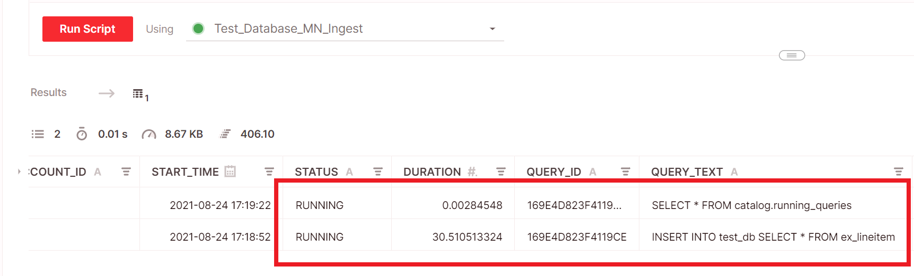

# INSERT INTO
{: .no_toc}

Inserts one or more values into a specified table. Specifying column names is optional.

{: .note}
The `INSERT INTO` operation is not atomic. If the operation is interrupted, partial data ingestion may occur. For more information, see [Checking and validating INSERT INTO status](#checking-and-validating-insert-into-status) below.

* Topic ToC
{:toc}

## Syntax

```sql
INSERT INTO <table_name> [(<column1>[, <column2>][, ...])]
{ <select_statement> | VALUES ([<value1>[, <value2>][, ...]) }
```

| Parameter | Description|
| :---------| :----------|
| `<table_name>`| The target table where values are to be inserted. |
| `(<column1>[, <column2>][, ...])]`| A list of column names from `<table_name>` for the insertion. If not defined, the columns are deduced from the `<select_statement>`. |
| `<select_statement>`<br>--OR--<br> `VALUES ([<value1>[, <value2>][, ...])]` | You can specify either a `SELECT` query that determines values to or an explicit list of `VALUES` to insert.|


## Extracting partition values using INSERT INTO

In some applications, such as Hive partitioning, table partitions are stored in Amazon S3 folders and files using a folder naming convention that identifies the partition. To extract partition information from the file path and store it with the data that you ingest, you can use the value that Firebolt automatically saves to the `source_file_name` metadata column for external tables. You can use a string operator in your `INSERT INTO` statement to extract a portion of the file path, and then store the result of the extraction in a virtual column in the fact table. For more information about metadata columns, see [Using metadata virtual columns](../../loading-data/working-with-external-tables.md#using-metadata-virtual-columns).

Using the `source_file_name` metadata column during an `INSERT INTO` operation is one method of extracting partition data from file paths. Another method is to use the `PARTITION` keyword for a column in the external table definition. For more information, see the [PARTITION](create-external-table.md#partition) keyword explanation in the `CREATE EXTERNAL TABLE` reference.

### Example
{: .no_toc}

Consider an example where folders and files in an S3 bucket have the following consistent pattern for partitions:

```
s3://my_bucket/xyz/2018/01/part-00001.parquet
s3://my_bucket/xyz/2018/01/part-00002.parquet
s3://my_bucket/abc/2018/01/part-00001.parquet
s3://my_bucket/abc/2018/01/part-00002.parquet
[...]
```

The `xyz` and `abc` portions of the S3 path above correspond to a value called `c_type`, which we want to store in the fact table alongside the values that we ingest from the parquet file in that partition.

In this example, the DDL statement below defines the external table that is used to ingest the data values for `c_id` and `c_name` from the Parquet files.

```sql
CREATE EXTERNAL TABLE my_ext_table (
  c_id    INTEGER,
  c_name  TEXT,
)
CREDENTIALS = (AWS_ROLE_ARN = 'arn:aws:iam::123456789012:role/MyRoleForFireboltS3Access1')
URL = 's3://my_bucket/'
OBJECT_PATTERN= '*.parquet'
TYPE = (PARQUET)
```

To use `source_file_name` to extract a portion of the folder name. The first step is to create an additional column, `c_type`, when we create the fact table that is the target of the `INSERT INTO` operation. The `c_type` column will store the values that we extract.

```sql
CREATE FACT TABLE my_table
(
    c_id    INTEGER,
    c_name  TEXT,
    c_type  TEXT
) PRIMARY INDEX c_id
```

The example below shows the `INSERT INTO` statement that performs the ingestion and populates `c_type` with a value extracted from the partition file path.

The `SELECT` clause uses the `SPLIT_PART` function on the external table's `source_file_name` metadata column, inserting the result into the   `c_type` column. The `source_file_name` metadata value contains the path and file name, without the bucket. For example, data values ingested from the `s3://my_bucket/xyz/2018/01/part-00001.parquet` file have a corresponding `source_file_name` value of `xyz/2018/01/part-00001.parquet`. The function shown in the example below returns `xyz` because the index is 1. For more information, see [SPLIT_PART](../functions-reference/split-part.md).

```sql
INSERT INTO my_table (c_id, c_name, c_type)
SELECT
    c_id,
    c_name,
    SPLIT_PART(source_file_name, '/', 1) AS c_type
FROM my_external_table
```

## Checking and validating INSERT INTO status

If an `INSERT INTO` statement fails or a client is disconnected, Firebolt might ingest an incomplete data set into the target table. Here are some steps you can use to determine the status of an ingestion operation and ensure it ran successfully. This may come in handy if you suspect your statement failed for any reason.

* Before running any queries, first check to make sure that the `INSERT INTO` query has completed. This can be done by viewing the information schema through the [`running_queries`](../../general-reference/information-schema/running-queries.md) view:

```sql
SELECT * FROM information_schema.running_queries
```

You should see results similar to those shown below.



If you see your `INSERT INTO` statement under the `QUERY_TEXT` column, the operation is still running. Wait for it to finish before attempting any other steps.

* If the `INSERT INTO` statement has finished, check that the external table and the target fact or dimension table have an equal number of rows.

The SQL statement below counts the rows in an external table, `my_extable`, and a fact or dimension table, `my_fact_table`. It compares the results and returns the comparison as `CountResult`. A `CountResult` of `1` is true, indicating that the row count is equal. A value of `0` is false, indicating the row count is not equal and ingestion might be incomplete. This statement assumes the fact or dimension table ingested all of the rows from the external table, and not a partial subset.

```sql
SELECT (SELECT COUNT(*) FROM my_extable)=(SELECT COUNT(*) FROM fact_or_dim_table) AS CountResult;
```

* If the counts are not equal, use [DROP TABLE](drop-table.md) to delete the incomplete target table, create a new target table, change the `INSERT INTO` query to use the new target, and then run the query again.
