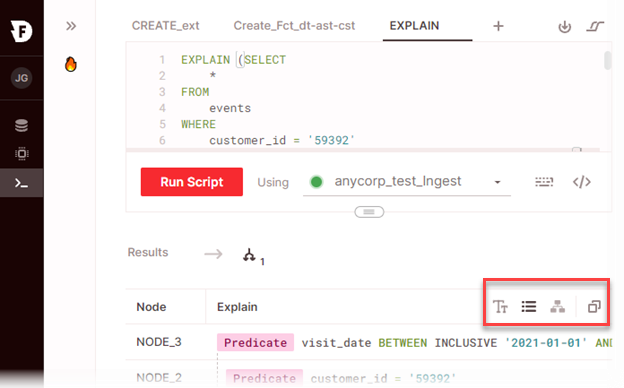

# Using explain to analyze query execution

The explain query features in Firebolt allow you to analyze query logic and execution steps in detail. You can use explain output to identify opportunities to improve query performance by changing index configurations, joins, or query structure.

There are two ways to explain a query in Firebolt:

* You can use the [EXPLAIN statement](../sql-reference/commands/explain.md) to show the query execution plan in detail without running the actual query.
* After you run a query, you can select the **Explain Query** button in the results pane of the SQL workspace to show the query execution steps.

**To use the EXPLAIN statement without running a query**
1. In a script tab, enter the `EXPLAIN `statement using the syntax below:  
`EXPLAIN <query_statement_to_analyze>;`  

2. Choose **Run Script**.  
The explain output appears in query results without running the query.  

3. To switch between views or copy output, choose the icons in the upper right of the query results pane.  
  

For more information, see [Viewing and copying EXPLAIN output](#viewing-and-copying-explain-output) below.

**To show the explain output for a query statement after you run it**

1. Choose **Results** in the query results pane.  

2. Choose the expand arrow next to the query **Statement**.  

3. Choose **Explain query**.  


4. If the script tab contains more than one query statement that you run at a time, repeat steps 1 and 2 for each query statement.  

5. After you view explain output for a query, icons appear so you can switch between viewing query results and explain output. Choose the explain output icon that corresponds to the query you want to view.  
  

6. To switch between views or copy output, choose the icons in the upper right of the query results pane.  
  

  For more information, see [Viewing and copying EXPLAIN output](#viewing-and-copying-explain-output) below.

### Viewing and copying explain output

Firebolt has three different views that you can use to analyze explain output.

#### List view (default)


Firebolt shows a list of query execution plan nodes (or steps) in descending order of execution. The last plan node to execute is shown at the top of the list.

This view is not available if you run the `EXPLAIN` statement with the `USING TEXT` parameter.

When you choose the copy icon, JSON for the explain output is copied to the clipboard. An example JSON document copied from a query is shown below.

```
{
  "id": "explain",
  "statistics": {
    "PrimaryKey": {
      "Initial Granules": 346,
      "Initial Parts": 3,
      "Selected Granules": 346,
      "Selected Parts": 3
    }
  },
  "steps": [{
    "children": [{
      "children": [{
        "children": [{
          "children": [{
            "children": [{
              "children": [{
                "node": {
                  "id": "FB_NODE_1"
                },
                "operation": {
                  "pruning": {
                    "columns": {
                      "total": 16,
                      "value": 11
                    }
                  },
                  "table": {
                    "name": "lineitem",
                    "primaryIndex": [{
                      "Condition": "true",
                      "Initial Granules": 346,
                      "Initial Parts": 3,
                      "Selected Granules": 346,
                      "Selected Parts": 3,
                      "Type": "PrimaryKey"
                    }],
                    "type": "FACT"
                  },
                  "type": "storedTable"
                }
              }],
              "node": {
                "id": "FB_NODE_2"
              },
              "operation": {
                "expression": "l_returnflag = 'N'",
                "type": "predicate"
              }
            }],
            "node": {
              "id": "FB_NODE_3"
            },
            "operation": {
              "expression": "l_shipdate >= '1996-01-01'",
              "type": "predicate"
            }
          }],
          "node": {
            "id": "FB_NODE_4"
          },
          "operation": {
            "aggregates": [{
              "items": [{
                "name": "l_discount"
              }],
              "value": "AVG(l_discount)"
            }],
            "groupBy": [{
                "name": "l_shipdate"
              },
              {
                "name": "l_linestatus"
              },
              {
                "name": "l_orderkey"
              }
            ],
            "type": "aggregate"
          }
        }],
        "node": {
          "id": "FB_NODE_5"
        },
        "operation": {
          "items": [{
              "expression": {
                "value": "FB_NODE_1.l_shipdate"
              }
            },
            {
              "expression": {
                "value": "FB_NODE_1.l_linestatus"
              }
            },
            {
              "expression": {
                "value": "FB_NODE_1.l_orderkey"
              }
            },
            {
              "expression": {
                "value": "CASE WHEN IS_FINITE(AVG(FB_NODE_1.l_discount)) OR IS_INFINITE(AVG(FB_NODE_1.l_discount)) THEN AVG(FB_NODE_1.l_discount) ELSE NULL END"
              }
            }
          ],
          "type": "projection"
        }
      }],
      "node": {
        "id": "FB_NODE_6"
      },
      "operation": {
        "items": [{
            "field": "l_shipdate",
            "order": "AscendingNullsLast"
          },
          {
            "field": "l_linestatus",
            "order": "AscendingNullsLast"
          },
          {
            "field": "l_orderkey",
            "order": "AscendingNullsLast"
          },
          {
            "field": "CASE WHEN IS_FINITE(AVG(l_discount)) OR IS_INFINITE(AVG(l_discount)) THEN AVG(l_discount) ELSE NULL END",
            "order": "AscendingNullsLast"
          }
        ],
        "type": "sort"
      }
    }],
    "id": "step1",
    "node": {
      "id": "FB_NODE_7"
    },
    "operation": {
      "items": [{
          "alias": "l_shipdate",
          "expression": "l_shipdate"
        },
        {
          "alias": "l_linestatus",
          "expression": "l_linestatus"
        },
        {
          "alias": "l_orderkey",
          "expression": "l_orderkey"
        },
        {
          "alias": "AVG(l_discount)",
          "expression": "CASE WHEN IS_FINITE(AVG(l_discount)) OR IS_INFINITE(AVG(l_discount)) THEN AVG(l_discount) ELSE NULL END"
        }
      ],
      "type": "alias"
    }
  }]
}
```

#### Diagram view

Diagram view is useful for seeing the execution of complex, multifaceted queries. You can click anywhere on the node diagram to move it within the output pane. Each node table has a line for each operation within that node.

This view is not available if you run the `EXPLAIN` statement with the `USING TEXT` parameter.

The control panel allows you to change the default resolution for viewing operations. **x3** is the default, showing up to three lines of operations for each node.


To view all operations for a node, choose the expansion arrow in the title bar for the node table.

When you choose the copy icon, JSON for the explain output is copied to the clipboard. An example JSON document copied from a query is shown in the list view example above.

#### Text view


Text view is a simplified representation of your execution stages that can be copied in an easily readable format. It is the only view available when you use the `EXPLAIN` statement with the `USING TEXT` option. When you choose the copy icon, the text is copied to the clipboard as you see it in the output pane.
