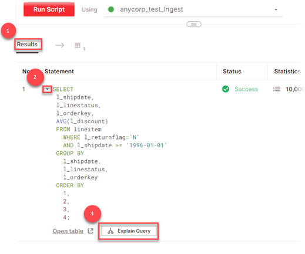
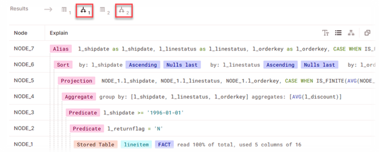
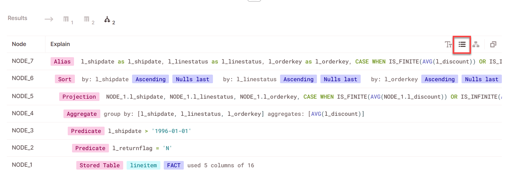
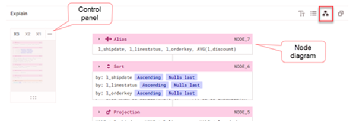
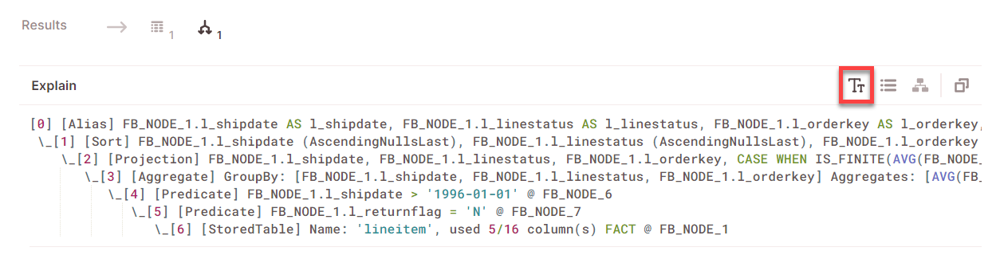

# Analyze query execution plans with visual explain
{: .no_toc}

* Topic ToC
{: toc}

You can use Firebolt *visual explain* in the SQL workspace to analyze query execution plans. Analyzing query plans helps you identify opportunities to improve query performance by changing index configurations, joins, query structure, and more.

You can use the [EXPLAIN statement](../sql-reference/commands/explain.md) to open visual explain without running the actual query. In the script tab, enter `EXPLAIN <query_statement_to_analyze>`, and then choose **Run script**.

You can also open visual explain after you run a query statement.

## Opening visual explain after you run a query

1. Run a query and then choose **Results** in the query results pane.  

2. Choose the expand arrow next to the query **Statement**.

3. Choose **Explain query**.  
 

4. If your script has a single statement, you can choose to explain your query from the results panel by clicking on the **Explain query icon**.
 . 

5. If your script runs more than one query statement, repeat steps 1&ndash;3 for each query statement.  
   After you choose to explain a query, an explain icon appears in addition to the results-table icon. Choose the explain icon to view explain output.  
  .  

## Viewing and copying explain output

Firebolt has three different views that you can use to analyze explain output:

* [List view](#list-view-default)
* [Diagram view](#diagram-view)
* [Text view](#text-view)

To switch between views or copy output, choose the icons in the upper right of the query results pane.  

{: .note} 
For some DB versions, only the text view is supported. 

### List view (default)

Firebolt shows a list of query execution plan nodes (or steps) in descending order of execution. The last plan node to execute is shown at the top of the list. This view is not available if you run the `EXPLAIN` statement with the `USING TEXT` parameter.

When you choose the copy icon, JSON for the explain output is copied to the clipboard. For an example of JSON output, see [EXPLAIN](../sql-reference/commands/explain.md).

### Diagram view

Diagram view is useful for seeing the execution of complex, multifaceted queries. You can click anywhere on the node diagram to move it within the output pane. Each node table has a line for each operation within that node. This view is not available if you run the `EXPLAIN` statement with the `USING TEXT` parameter.

The control panel allows you to change the default resolution for viewing operations. **x3** is the default, showing up to three lines of operations for each node.

To view all operations for a node, choose the expansion arrow in the title bar for the node table.

When you choose the copy icon, JSON for the explain output is copied to the clipboard. For an example of JSON output, see [EXPLAIN](../sql-reference/commands/explain.md).

### Text view

Text view is a simplified representation of your execution stages that can be copied in an easily readable format. It is the only view available when you use the `EXPLAIN` statement with the `USING TEXT` option. When you choose the copy icon, the text is copied to the clipboard as you see it in the output pane.

