# Using the SQL workspace
{: .no_toc}

* Topic ToC
{:toc}

The Firebolt Manager has a SQL workspace that you use to edit, run, and save SQL scripts and view query results. Each database in Firebolt has a SQL workspace. When you open the SQL workspace for a database, you see the saved scripts and state for that particular database.

## Dark mode

Select the toggle at the bottom of the left navigation pane to turn dark mode on and off.

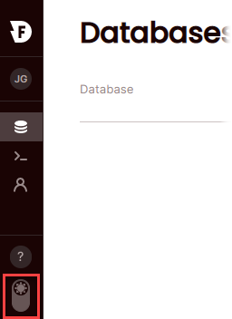

## Opening a SQL workspace

You can launch the SQL workspace for a database either from the left navigation pane or from the databases list.

**To start the SQL workspace for the last database you worked with**

1.  Choose the **>\_** icon from the left navigation pane.

    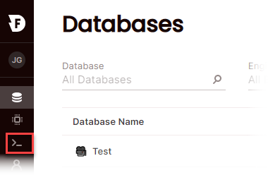

    The workspace for the database that you last worked with opens, and the database is selected from the list.

2. To switch to the workspace for a different database, choose it from the **Select a database** list.

**To start the SQL workspace from the Databases list**

*   From the Databases list, hover over the **Database name** and then choose the **>\_** icon.

    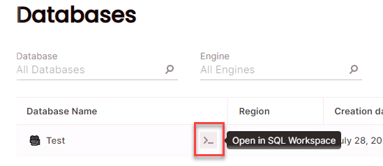

## Quick tour

The SQL workspace is organized into three panes.

* The left pane is the workspace navigation pane. Use it to navigate to different databases and to work with different scripts in your database.

* The center pane is the SQL editor. Use it to edit scripts, save them, and run scripts. When you run a script, results are shown in the bottom part of the pane.

* The right pane is an object viewer that shows you the tables, views, and indexes in your database. You must start an engine before objects are visible. You can select an object to view its attributes. For example, you can select a table from the list of tables to view columns and data types.  

  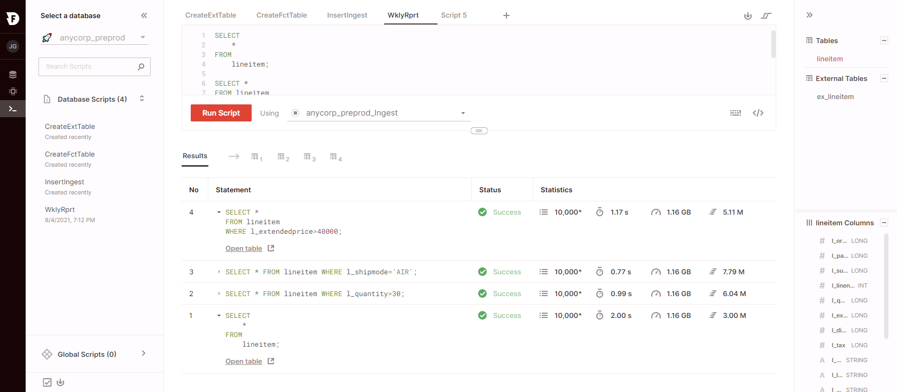

## Editing SQL scripts

The SQL editor uses tabs to help you organize your SQL scripts. You can switch tabs to work with different scripts and run them. You can have multiple query statements on the same tab. Each statement must be terminated by a semi-colon (`;`).

### Using auto-complete

As you enter your code in a script tab, Firebolt suggests keywords and object names. Press the tab key to quickly add the first suggestion in the list to your script, or use arrow keys to select a different item from the list and then press the tab key.

### Using keyboard shortcuts

You can click the keyboard icon to view available keyboard shortcuts, or you can view a full list on our [keyboard shortcuts page](keyboard-shortcuts-for-sql-workspace.md). You can also select an item from the list to perform that action.

### Using script templates

Script templates are available for common tasks, such as creating fact or dimension tables. Place the cursor in the editor where you want to insert code, choose the **\</>** icon, and then select a query template from the list.

### Using the CREATE EXTERNAL TABLE template to import data

To create an external table, which is the first step for ingesting data into Firebolt, choose the **Import Data** button from the object pane or choose the download icon and then choose **Import data** as shown in the example below.

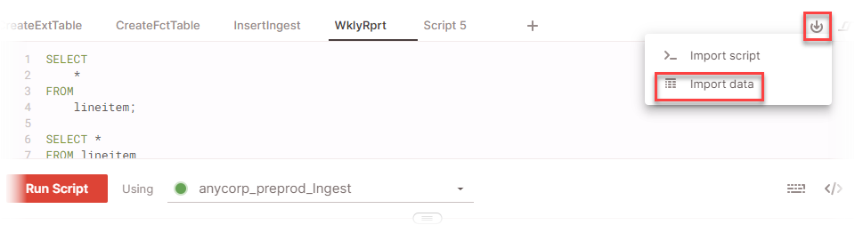

Firebolt creates a new tab with a `CREATE EXTERNAL TABLE` statement.

## Saving and managing scripts

Choose the vertical ellipses on the script tab to select options for saving a script, duplicating a script to a new tab, exporting a script to a file, and closing the script tab. Although scripts are saved automatically in this way, we recommend that you save your script from time to time and before closing your editor. Scripts that you save are available to you only. To share a script with other users, you can export it as described below.

* [To save a script](#scriptsave)
* [To make a script global (available in other databases)](#scriptglobal)
* [To rename a script](#scriptrename)
* [To copy a script](#scriptcopy)
* [To export a script and download it as a .sql file](#scriptexport)
* [To import a script from a file](#scriptimport)

{: .caution}
Firebolt uses cookies in your client to save the state of unsaved scripts automatically. A script is lost and can't be recovered if you close a script tab or clear your browser cache before saving. We recommend that you save scripts immediately when you start working. Saved scripts are saved to Firebolt automatically as you work.

**To save a script**

1.  Choose the vertical ellipses in the tab title and then select **Save script**.  
  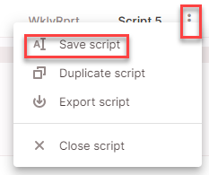

2.  Type a new name for the script and then press ENTER.  
  The script appears in the **Database scripts** list and is available to you in that database until you delete it. By default, saved scripts are available only in the database where you created them. To make them available in other databases, make them global as described below.  
  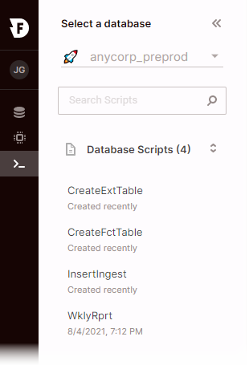

**To make a script global (available in other databases)**

* Choose the vertical ellipses next to the script in the left pane and then choose **Make script global**.  
  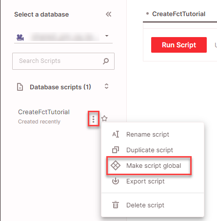  

  Firebolt moves the script to the **Global scripts** list.  
  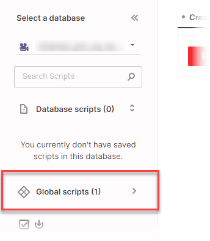
  
**To rename a script**

* Choose the vertical ellipses next to the script name in the left pane, choose **Rename script**, type a new name, and then press ENTER.

**To copy a script**

* Choose the vertical ellipses next to the script name in the left pane, choose **Duplicate script**, and then press ENTER. Firebolt saves a new script with the pattern `<original_script>_copy. If you copy a global script, the new script inherits the global setting.

**To export a script and download it as a .sql file**

*   Choose the vertical ellipses next to the script name in the left pane, and then choose **Export script**.

    Firebolt downloads the file to your browser's default download directory using the file pattern `<your_script_name>.sql`.

**To import a script from a file**

1. Choose the arrow icon and then choose **Import script**.  
  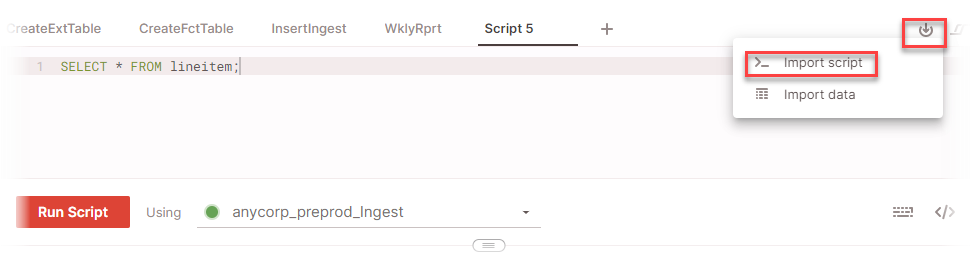

2. Browse your computer for a `.sql` file and select it, or drag and drop a file to upload it.  
  Firebolt creates a new tab with the contents of the script you imported.

## Running scripts and working with results

At the bottom of each script tab, you can choose **Run script** to execute SQL statements. SQL statements can only run on running engines. If an engine isn't running, you can select it from the list and then choose the **Start** button for that engine. For more information about engines, see [Working with engines](../working-with-engines/index.md).

You can run all statements in a script or select snippets of SQL to run.

**To run all SQL statements in a script**

* Position the cursor anywhere in the script editor and then choose **Run script**. All SQL statements must be terminated by a semi-colon (`;`) or an error occurs.

**To run a snippet of SQL as a statement**

* Select the SQL code you want to run as a statement and then choose **Run script**. Behind the scenes, Firebolt automatically appends a semi-colon to the selected SQL code so it can run as a statement.

### Viewing results

While your script is running, its status is displayed at the top of the browser tab so you can switch to other tabs in your browser and still track how your script is running. The Firebolt icon dislays a colored dot to indicate status, and updates the tab title with a description. For example, when a green dot displays, your script has completed successfully. The tab script status remains displayed in the tab for one minute after the script completes.

After you run a script or query statement, more results appear below the script editor, along with statistics about query execution.

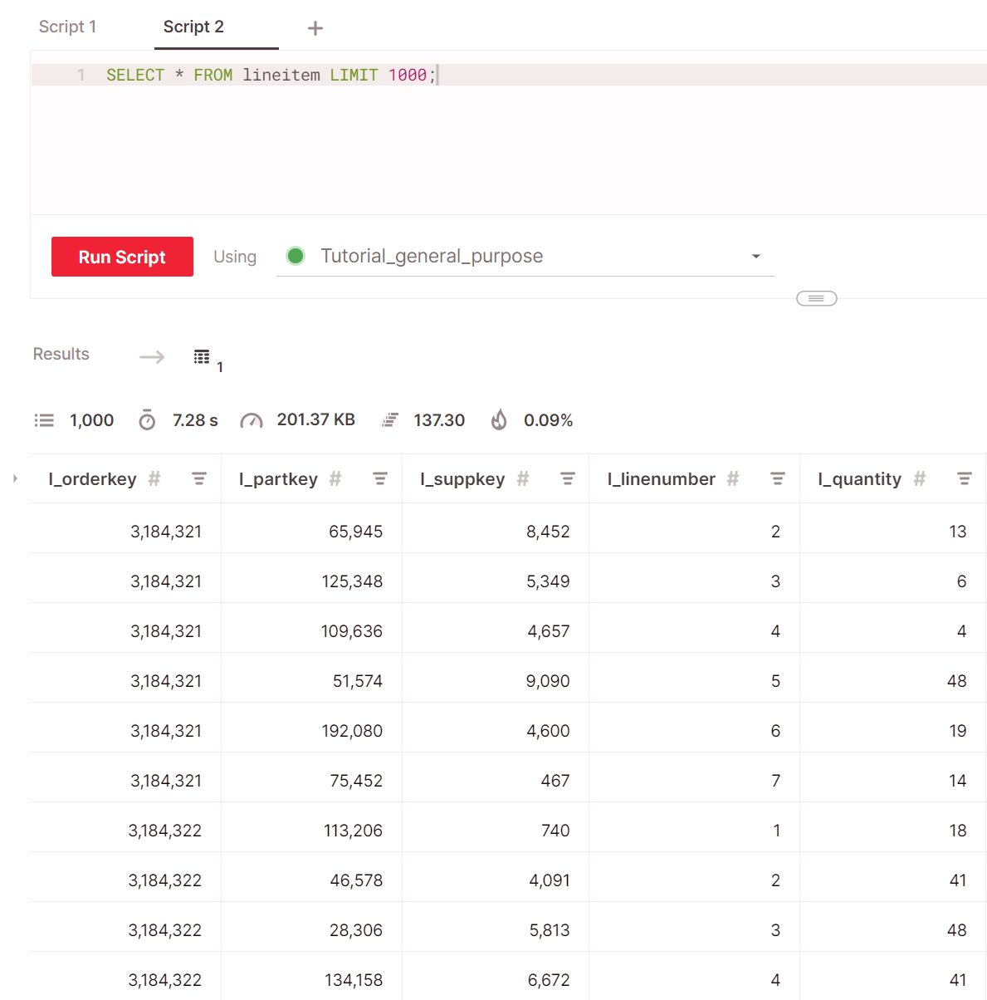

When running a query, Firebolt provides several statistics to help you understand and monitor the performance. These statistics can be viewed in the SQL workspace, just above the query results table. From left to right, these icons represent the following:

| Icon | Name  | Description |
| :--- | :---- | :---------- |
|      | **Row count**     | The total number of rows returned by a query. |
|   | **Elapsed Time**  | The total time needed to complete a query. |
|  | **Scanned Bytes** | The total amount of bytes scanned to complete a query. This includes scanned memory in the engine cache as well as the F3 storage. |
|    | **Rows / Second** | The number of rows scanned per second. |
|      | **Cached data ratio** | The percentage of data served from cache (engine SSD and RAM) rather than F3 storage. Equal to `<cached_bytes_scanned>`/`<total_bytes_scanned>`. Cached data is scanned very quickly. A high percentage indicates improved query response times. A low percentage indicates that query performance could be improved by [configuring indexes](../using-indexes/using-indexes.md), changing your [warmup method](../working-with-engines/understanding-engine-fundamentals.md#warmup-method), or [changing the spec of your engine](../working-with-engines/choosing-an-engine.md) to have a bigger cache. |

### Viewing query statistics with results

While viewing query results, you can choose to view a selection of prepared statistics to help you investigate data characteristics and identify anomalies more quickly.

To view query statistics, choose the expansion arrow to the left of a result table header row.

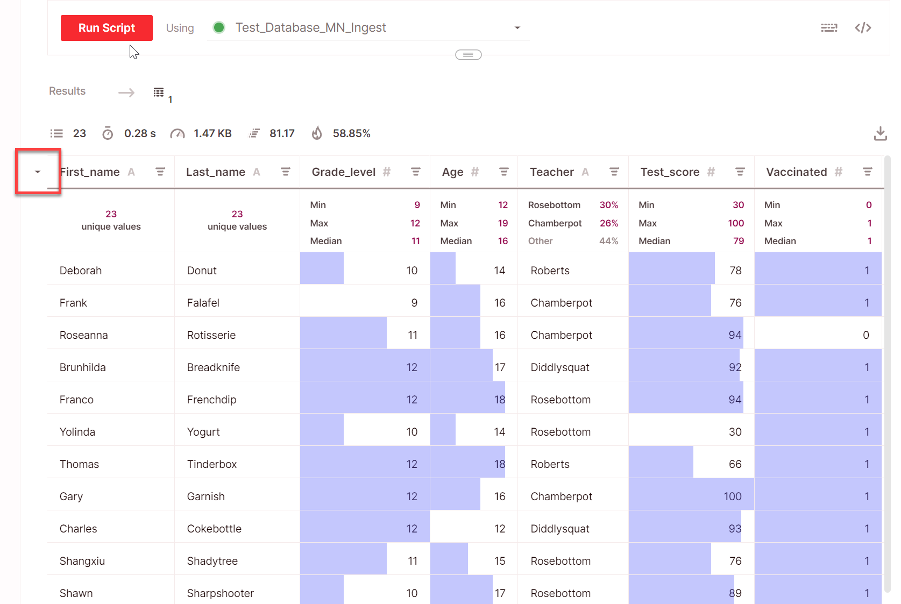

Each column expands to show statistics on a new row located just below the header. The statistics shown in each cell depend on the column’s [data type](../general-reference/data-types.md).

| Data type   | Statistics displayed in cell |
| :---------- | :--------------------------- |
| **Numeric** | Displays MIN, MAX, and MEDIAN values for that column. Each data field displays a horizontal data bar to indicate where that value lies in the range of values for that column. For a column with all positive numbers, the bar starts on the left at 0 and extends to the right toward 100% of maximum. If numbers are all negative, the data bar starts on the right at 0 and extends left to 100% of minimum. For mixed positive and negative numbers, the bar starts in the center and extends left and right toward minimum and maximum respectively. |
| **String**  | The statistics cell displays the most frequent values by percentage. If no single value is more frequent, the cell displays the number of unique values. |
| **Date**    | Displays the most frequent values by percentage. If no single value is more frequent, the cell displays the number of unique values. |
| **Array**   | Displays the percentage of empty, not empty, and NULL values. |

### Viewing more result statistics

You can view additional statistics and visualizations by selecting the expand icon that appears when you mouse over the bottom right of the statistics row cell. This opens up a side panel with a dashboard of more statistics detailing the selected column.

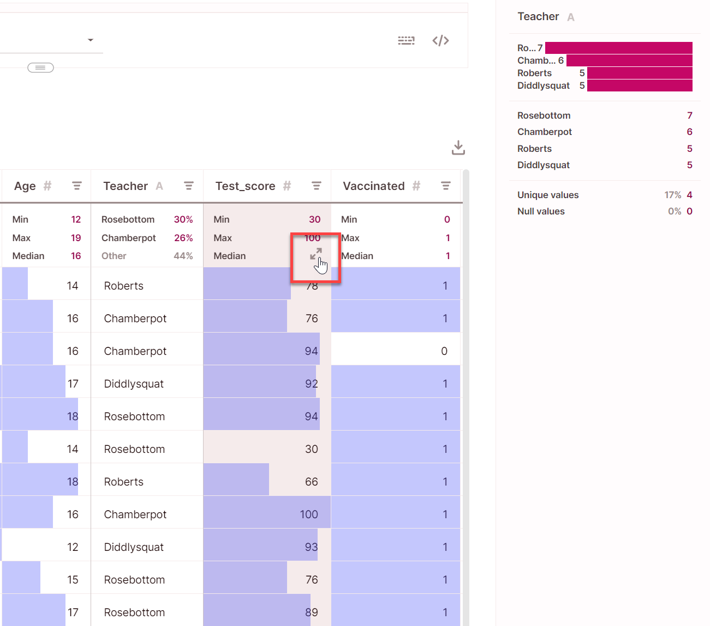

### Viewing multi-statement script results

When you run a script that has multiple SQL statements with result sets (`SELECT` statements), each result is shown on a separate line with statistics about statement execution. The first statement that ran is numbered 1 and at the bottom of the list.

To view the results table for a result set, choose the table icon corresponding to the numbered result set you want to view, or choose the expansion arrow next to the **Statement** and then choose **Open table** as shown in the example below.

### Exporting results to a local hard drive

You can export up to 10,000 rows of query results to your local hard drive after you run a query.

1. Choose the download icon (see image below).  

2. Choose **Export table as CSV** or **Export table as JSON**.  
Firebolt downloads the file type that you chose to the default download location for your browser.  
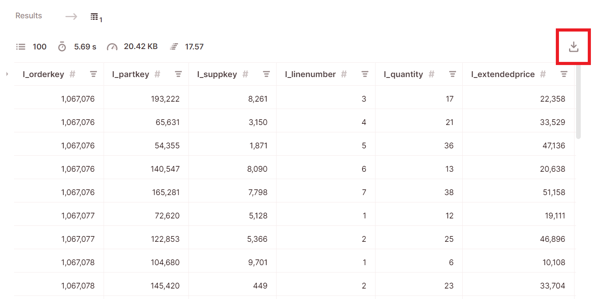
